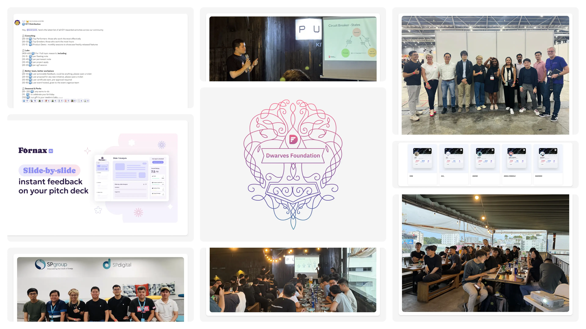
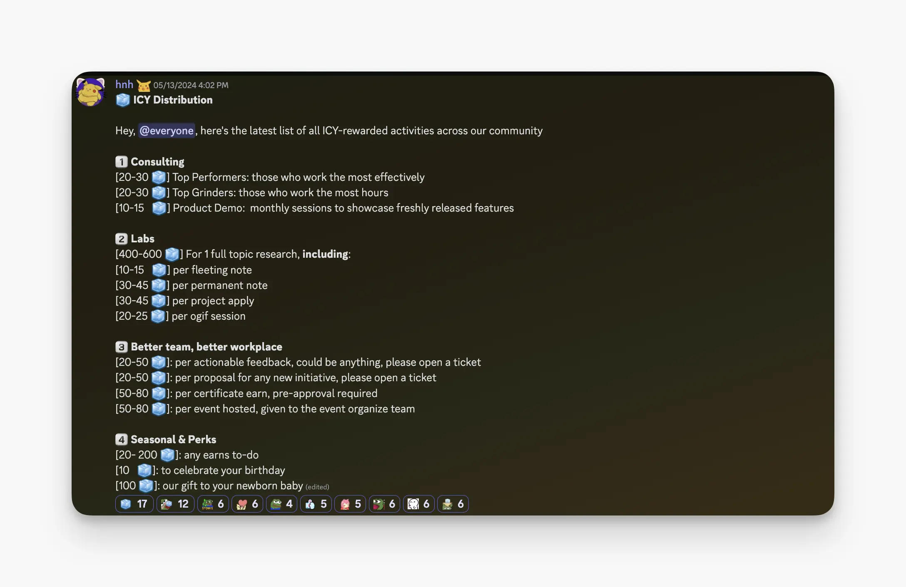
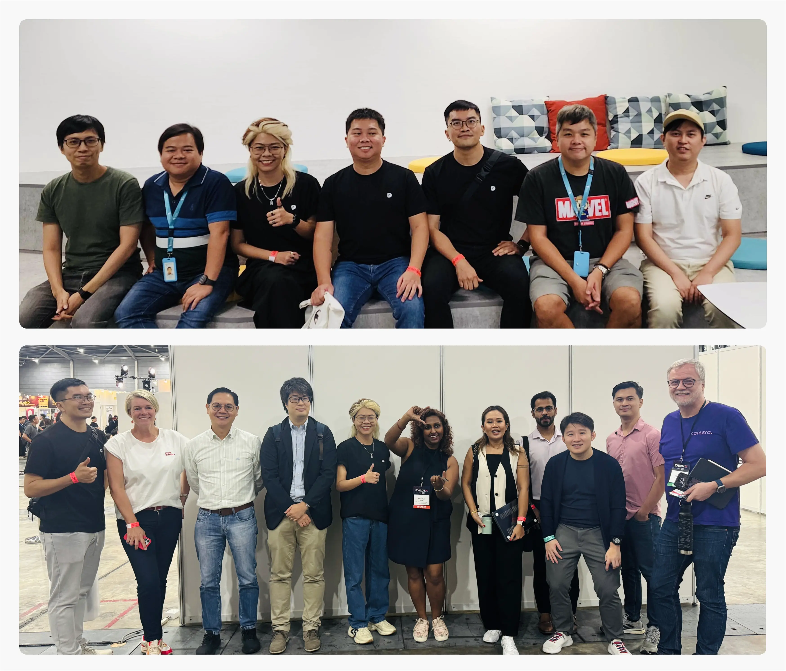
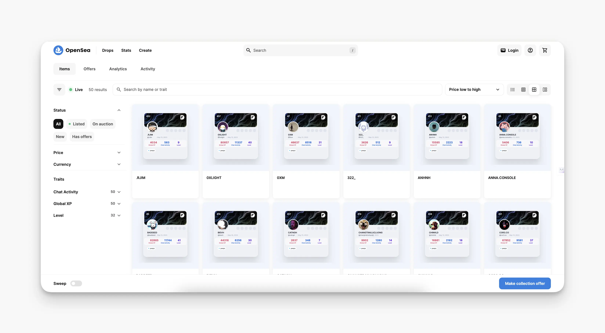

---
tags:
  - newsletter
  - meet-up
  - community
title: What's New in May 2024
date: 2024-06-13
description: May was our month for meetups, upgrading our monthly learning pool, launching NFT roles for our team members, onboarding new collaboration, recapping the SP Group visit & Echelon X 2024, and hosting an OGIF office hour.
authors:
  - innno_
---

- [**Dwarves offline meet-up:**](#dwarves-community-offline-meet-up-was-a-blast) Gathering over 50 members for networking, OGIF talks, and casual team dinner.
- [**ICY rewards:**](#icymi-leveling-up-icy-activities-for-a-learning-pool-of-up-to-1500) We've boosted the monthly ICY reward pool to a whopping $1,500. Get ready to earn even more by sharing your knowledge.
- [**SP Group visit & Echelon X 2024:**](#spgroup-wala-x-echelon-asia-summit-2024-new-tech-will-shape-the-future) Our team leaders attended the event and gained insights into the evolving SEA tech landscape, including AI's impact, investment trends, and digital transformation opportunities.
- [**New collaboration:**](#rolling-out-new-collaboration-fornax-ai-yololab) Fornax AI
- [**Exclusive Dwarves NFTs for our team:**](#dwarves-nfts-for-our-crew) Introducing new NFT roles for peeps.
- [**Dwarves office hour:**](#from-the-last-ogif-office-hour-building-a-resilient-system) Building a resilient system with Hieu Vu, Hoang Nguyen.

## Dwarves community offline meet-up was a blast
We had a great time hosting our second Ho Chi Minh City meetup on May 31st. Over 50 awesome folks joined us for a night of tech talks, mingling, and all-around good vibes.

We chatted about what's been happening with Dwarves and heard updates from the community. Everyone seemed to have an engaging time, and we couldn't be happier with how it turned out.

A big thanks to community members: @jack, @tannhatcmcs, and @congiomat for their participation. Details of our next gathering will be shared soon. We hope to have more fun things for everyone to take part in the part.

## ICYMI: Leveling up ICY activities for a learning pool of up to $1500
We're spicing up the way you earn ICY rewards. Now in May, the thing we are doing is so-called building a protocol reward activities across our community. Participating in server events is a certain way to amass ICY. 

Head on over to [**🧊・earn-icy**](https://discord.com/channels/462663954813157376/1006198672486309908/1239502938918096960) for all the deets on this exciting new chapter.

## SPGroup WALA x Echelon Asia Summit 2024: New tech will shape the future
Last month, our team leaders @tieubao, @nikki, and @huytq attended the Echelon Asia Summit held in Singapore on May 15-16. The event focused on the future of Southeast Asia's tech and startup ecosystem, highlighting merger and acquisition trends and high-growth industries.

We had a chance to observe how investors and startups are changing their approach to using money, the evolution of AI, and upcoming projects in the APAC tech startup landscape. 

The foremost is we want to stay true to our path and keep innovating in ways that help our company and positively impact the broader tech ecosystem.

[The full Echelon Recap can be found here.](https://memo.d.foundation/playground/01_literature/echelon-x-singapore-2024-where-innovations-meet-inspiration/)

## Rolling out new collaboration: Fornax AI
We're thrilled to share the exciting news of our latest collaboration kickstarted in May - [Fornax AI](https://fornax.ai/).

Fornax AI helps startup founders improve their pitch decks with detailed feedback using ChatGPT for content and visual enhancements. They also offer white-label products for pitch deck ratings, supporting digital product development. 

To enhance their offerings, Fornax is teaming up with us, integrating our advanced language models and AI-driven insights. 

## Dwarves NFTs for our crew
To show our appreciation, we've launched a special Dwarves NFT collection for peeps. These unique non-transferable tokens celebrate your contribution to the Dwarves community. Check out your NFT on OpenSea at https://opensea.io/collection/dwarves-4.

@Tono Bot will automatically grant the @peeps role to everyone with this NFT in their connected wallet. Connect your wallet to Tono and enjoy the @peeps role. For further information go to the ⁠🧊[**・earn-icy⁠**](https://discord.com/channels/462663954813157376/1006198672486309908/1228177919436918875) channel.

## From the last OGIF office hour: Building a resilient system
There have been many interesting discussions over the past two months since OGIF resumed. Topics ranged from new findings to techniques, software engineering, and industry insights. 

Notably, @hoangnguyen and @hieuthu2 gave an insightful talk on “Building a Resilient System.” They covered key aspects of system resilience, including designing for failure, implementing redundancy, and ensuring continuous availability.
