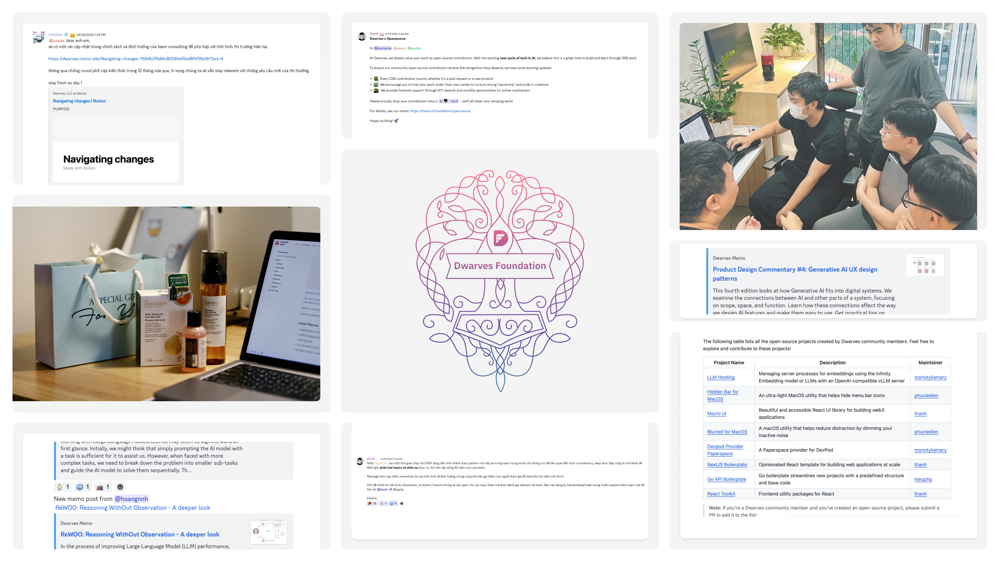
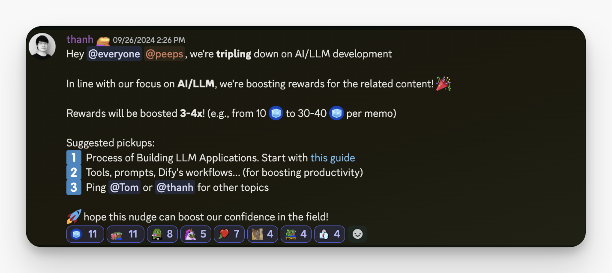
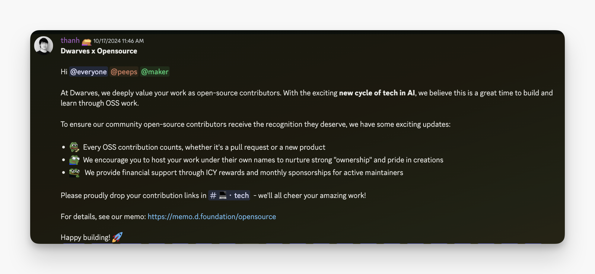
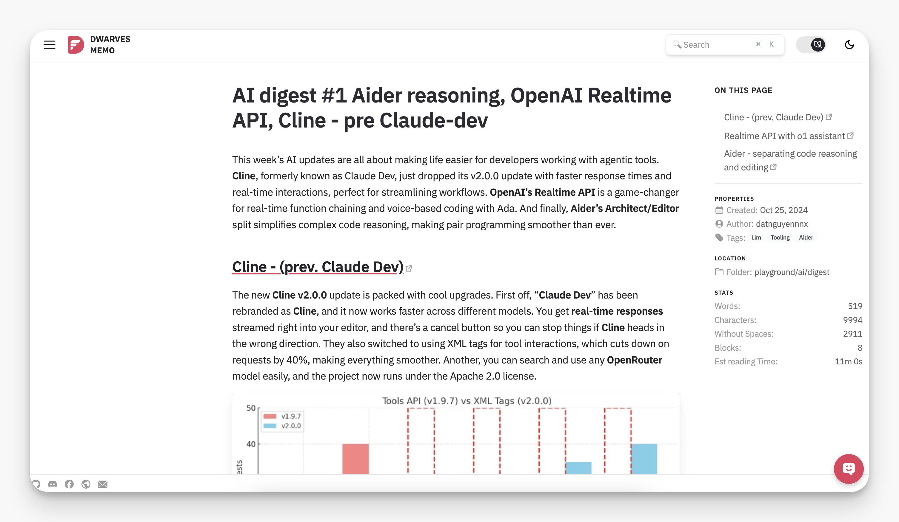
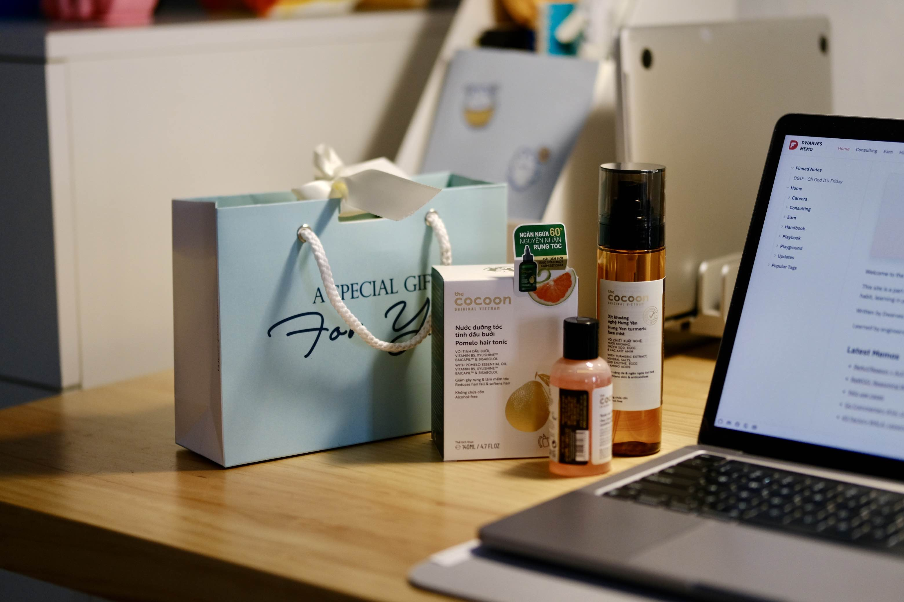

---
tags:
  - newsletter
  - memo
  - community
title: What's New in October 2024
date: 2024-11-15
description: Each month, we roll out a recap of our team and community’s progress. October's updates spotlight our open source initiative, boosted rewards for sharing knowledge, navigating market shifts, weekly tech insights, and a warm celebration of Vietnamese Women’s Day.
authors:
  - innno_
---

- [**We’re Hiring:**](#were-hiring) On the lookout for Full-stack Engineers, Biz Devs, and Marketing minds to join the team.
- [**Labs OGIF Office Hour - Building Core Knowledge:**](#labs-ogif-office-hour---building-core-knowledge) Weekly sessions diving deep into AI, Blockchain, Architecture, and Finance fundamentals.
- [**Join Dwarves Open Source,**](#dwarves-open-source---join-the-movement) a great time to build and learn through OSS work. From libraries to AI tools, every contribution counts.
- [**Navigating Market Shifts:**](#navigating-market-shifts) Adapting to client needs and honing in on AI, Blockchain, and Data for a sharper edge.
- [**Weekly Commentary - Product Design & AI Digest:**](#weekly-commentary---product-design--ai-digest) A new weekly series with fresh insights into product design and AI trends.
- [**Vietnamese Women’s Day Throwback:**](#throwback-to-vietnamese-womens-day) We celebrated with heartfelt gifts and a dinner to honor our talented women.

## We’re hiring
Our team is growing, and we’re scouting for driven talent to join us on the journey. We’re on the lookout for:

- [Full-stack Engineer](https://memo.d.foundation/careers/open-positions/full-stack-engineer/) (Project-based Contractor)
- [Business Development](https://memo.d.foundation/careers/open-positions/business-development/) (Fulltime)
- [Marketing & Communications](https://memo.d.foundation/careers/open-positions/marketing-and-communications-specialist/) (Fulltime)

Think you know someone who’s up for the challenge? Email us at spawn@d.foundation or ping [@nikki](https://memo.d.foundation/contributor/nikki) on Discord for more info.

## Labs OGIF office hour - Building core knowledge
We’re making knowledge-sharing worth it. AI/LLM contributions this month scored 3x-4x rewards, as a big thanks to everyone bringing in their insights.

October’s OGIF office hour? Think deeper discussions, a sharper focus. We’re using these sessions to dig into AI, Blockchain, Architecture, and Finance - getting the team solid on these core themes while still exploring emerging trends.

Every Friday, it’s about putting learning into practice. If you’ve got an idea or a topic to add to the mix, reach out to [@thanh](https://memo.d.foundation/contributor/thanh/), [@innno_](https://memo.d.foundation/contributor/innno_/).

## Dwarves open source - Join the movement
We’re leaning all the way into open source. Got a library, tool, or AI project you’re working on? Host it under your name, share it, and earn ICY rewards along the way. This is about fueling innovation from the ground up - one contribution at a time. Want to chip in? Check out our [**GitHub**](https://github.com/dwarvesf/opensource).

[Join us on Discord](https://discord.gg/dwarvesv) to get started.

## Navigating market shifts
We’re re-centering our focus to meet the moment. AI, blockchain, data - this is where we’re investing our time and talent, as we keep pace with client needs and market demands.

1. **Consulting Shift**: As client requirements change, so do our team’s. We’re doubling down on core contributors who are active, adaptable, and ready to take on high-impact projects. Others may need to pause or refocus to keep pace with where we’re going.
2. **Lab Team**: The Lab remains the heartbeat of our innovation. Expectations (and rewards) are higher for those pushing the boundaries, writing, exploring, and applying new ideas.
3. **Community Backbone**: Nine years in, our Discord stays strong - a space for learning, sharing, and connecting, whether you’re new, tenured, or an alumni. 

## Weekly commentary - Product design & AI digest
Rolling out two new series this month: a Product Design Weekly and an AI Digest. It’s insight meets action, with practical takes on where product design and AI are headed.

- **Product Design Weekly:** A no-nonsense look at what’s actually working in design. Real-world insights, practical UI/UX tips, and everything you need to create experiences that stick.
- **AI Digest:** Your weekly dose of AI, minus the hype. From useful tools to practical insights, it’s what you need to know to stay smart about where AI is headed.

### Throwback to Vietnamese Women’s day
We took a moment to celebrate to celebrate the women at Dwarves. We marked the occasion with a round of gifts and a cozy team dinner - just a simple way to say thanks to the incredible women who shape our team and bring heart to our work every day.

