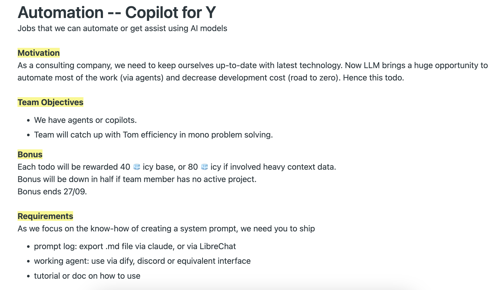
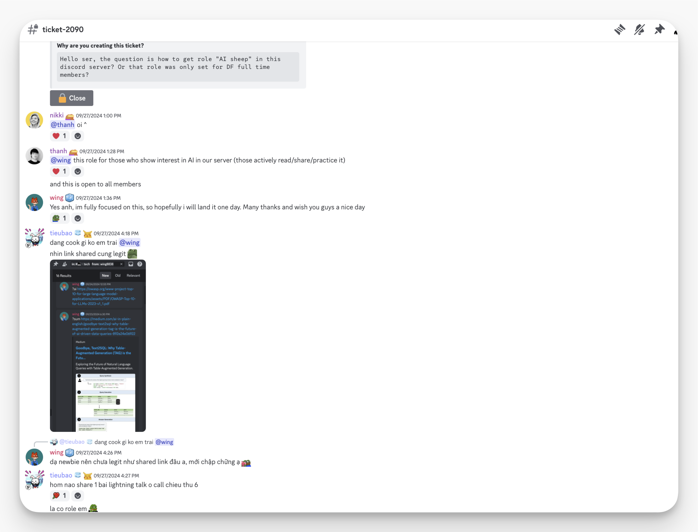
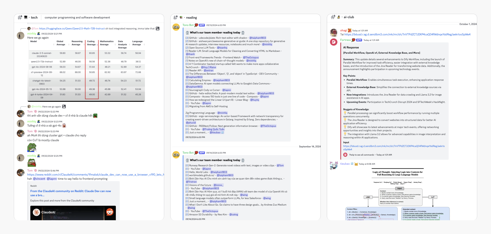
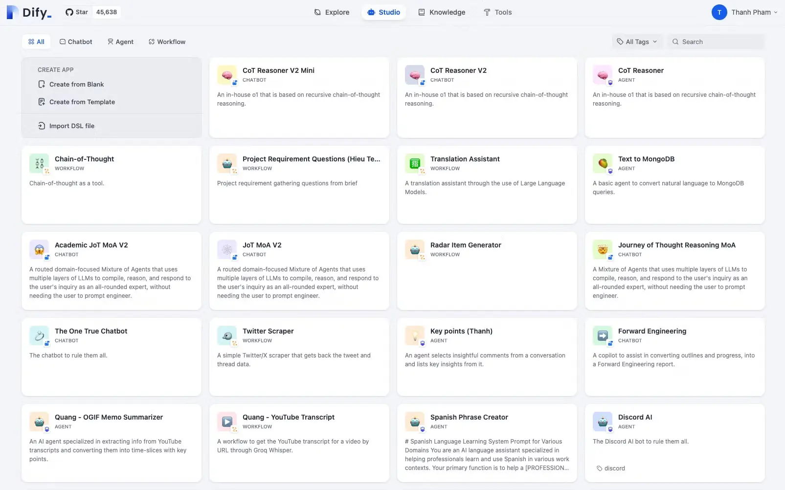
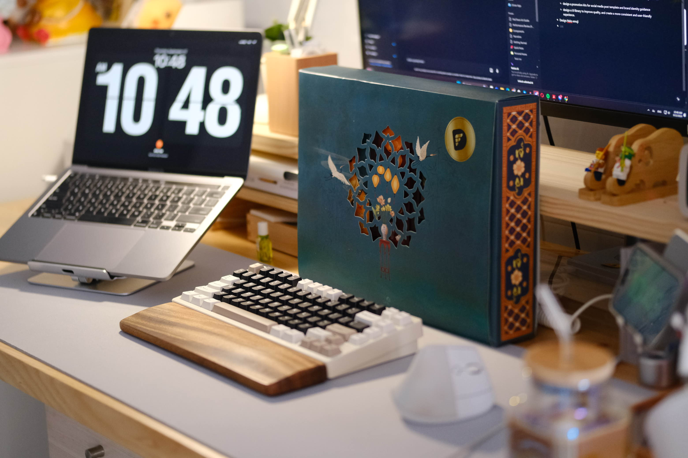

---
tags:
  - newsletter
  - memo
  - community
title: What's New in September 2024
date: 2024-10-01
description: Each month, we roll out a recap of our team and community's strides forward. September's updates spotlight the AI Club launch, rewards for our sharing culture, hybrid work check-ins, reporting tech trends in forward engineering, and our Mid-Autumn celebration.
authors:
  - innno_
---

- [**🧙・ai-club:**](#ai-club-building-ai-agents-ai-sheep-role--copilot-bounties) We launched the AI-Club, your go-to hub for diving into AI and LLMs, where curiosity sparks real projects and dynamic discussions.
- [**Record & Reward Sharing Culture:**](#record-and-reward-culture-with-a-monthly-pool-up-to-2500-icy) We’re putting real value behind shared knowledge. AI/LLM contributions earned 3x-4x rewards this month. Shoutout to those leading the charge.
- [**Hybrid Working & Auto Check-In:**](#return-to-the-office-auto-check-in--icy-perks) Stay in sync with the team and our learning culture. Check-in and earn 5 ICY—a simple nudge to keep us connected.
- [**Tech Report - Forward Engineering:**](#forward-engineering-q3-tech-roundup-experiments-insights-and-whats-next) This quarter, we cut through the noise, focusing on AI and what truly drives impact. The report highlights tools, insights, and trends shaping our engineering path.
- [**Mid-Autumn Festival:**](#mid-autumn-festival-recap) We celebrated with mooncakes and meaningful moments, keeping the hustle—honoring tradition without missing a step.

## AI Club: Building AI agents, AI-Sheep role & Copilot bounties
The AI-Club is officially live, becoming the go-to hub for anyone eager to dive into AI and LLM technologies. It’s where exploration turns into practical, productivity-boosting outcomes:

- **🧙・ai-club**: A collaborative space laser-focused on building AI agents that will turbocharge productivity across our projects. Think of it as your secret weapon—one that transforms your workday from grind to grand.
- **Copilot Bounties**: Get involved and get rewarded. We're putting bounties on the line for those who build and contribute impactful AI/LLM insights, projects, or solutions.

Here’s a thought – why not try out one of the AI tools we've built in the club or create something practical yourself? It could be fun, and you might even snag some extra ICY along the way.

**Q: How do I get the ai-sheep role?**

> The ai-sheep role is for those who actively show interest in AI within our server by reading, sharing lightning talk, and practicing it. It's open to everyone.
>

## Record and reward culture with a monthly pool up to 2500 ICY
We’re doubling down on creating a learning culture where knowledge isn't just shared—it's rewarded. Our aim? To push our learning culture even further.

**What It Means**

We're not just talking about learning; we’re making it a core part of how we grow as a team.

- **ICY Rewards**: A monthly pool of 2500 ICY (~$4000) is up for grabs. A solid 70% is earmarked for AI/LLM, Golang, Software Architecture, and Blockchain.
- **How to Join**: Share valuable links in **💻・tech**, join OGIFs, or contribute to open-source projects that boost team productivity.
- **Triple Rewards for AI/LLM Content**: We're boosting rewards 3-4x for AI/LLM-related contributions. Dive into topics like building LLM applications, tools, prompts, and workflows.

Feel free to ping @Tom or @thanh for more guidance. Check out [🚨・red-alert](https://discord.com/channels/462663954813157376/915941020968046612/1281097666809434184) for the details.

In September, 1054 ICY (~1581 USDC) were rewarded for all contributions, including:

- OGIF talks: 255 ICY (~382.5 USDC)
- 542 links shared: 542 ICY (~813 USDC)
- Memo notes: 81 ICY (~121.5 USDC)

Cheers to everyone who’s stepped up and contributed to the Dwarves community: @theoctopus, @wing, @tom, @minhlq, @ohagi, @lapnn, @taipham, @huytq, @datnguyen, @vincent, @antran, @tristran, @innno_, @catng, @Truongquoctuan, and @nam.

## Return to the office: Auto check-in & ICY perks
We're keeping the team sharp and connected with the latest in tech. That's why we're getting back into the groove of office life. Automation check-in is now live at 🏢・lobby, keeping us all in sync. Check-in and snag 5 ICY as a "Welcome Back" perk. A big nod to @Tom for making this seamless with his work on the system.

[Read our hybrid culture story.](https://memo.d.foundation/updates/digest/14-a-home-away-from-home/)

## Forward engineering Q3 tech roundup: Experiments, insights, and what’s next
Q3 was all about refining our tech approach. **Dify** speeds up LLM app prototyping, **LangGraph** is promising for multi-agent LLMs, and **RAG** enriches AI with external data. We're experimenting with **LangSmith** for production-grade LLMs, using **Cursor** in VSCode, and exploring **Devbox** for cleaner dev setups. **Shadcn/ui** is making UI work faster.

**Our Learnings:** AI & LLM structured outputs, weekly **Golang** insights on Go 1.23, revisiting GoF design patterns, and dove deep into **Solana** and **TON** in blockchain.

AI isn’t a fad—72% of YC’s latest batch says it all

[For a deeper dive, read the full report.](https://memo.d.foundation/playground/01_literature/engineering/forward-engineering-q3-2024/)

## Mid-Autumn festival recap
We had ourselves a proper little mooncake moment for the Mid-Autumn Festival. Nothing fancy, just a chance to pause, share a bit of tradition, and enjoy a sweet break together. Whether in the office or dialing in from afar, it was a reminder that it’s the little things that keep us connected.

