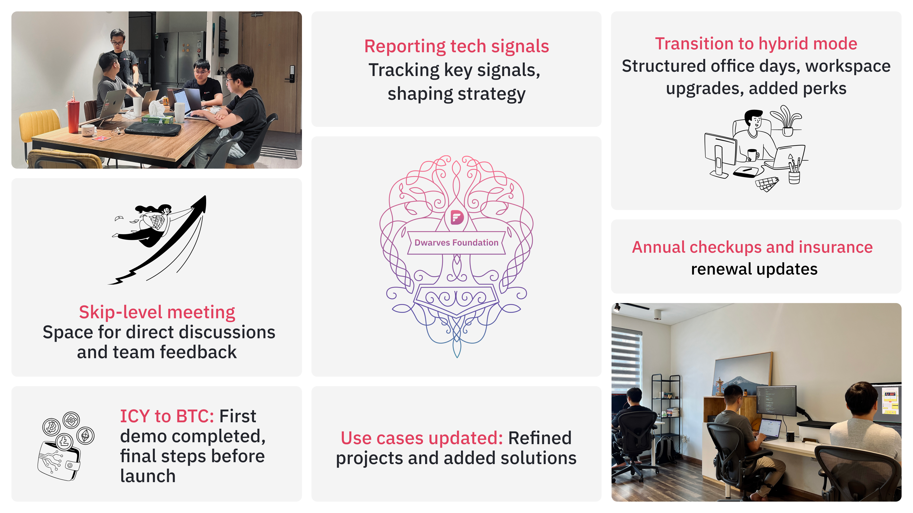
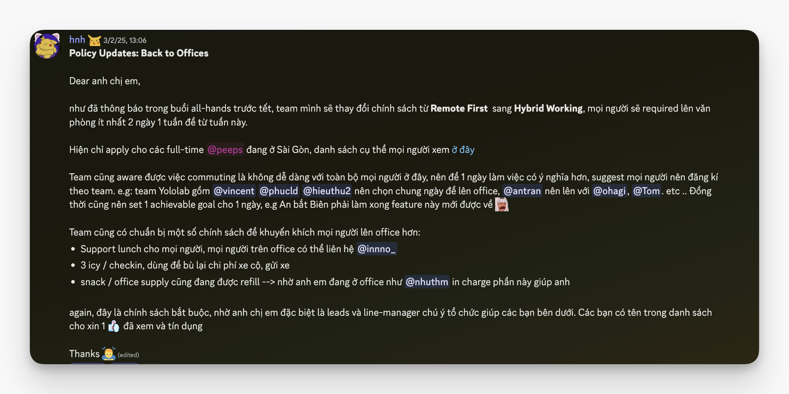
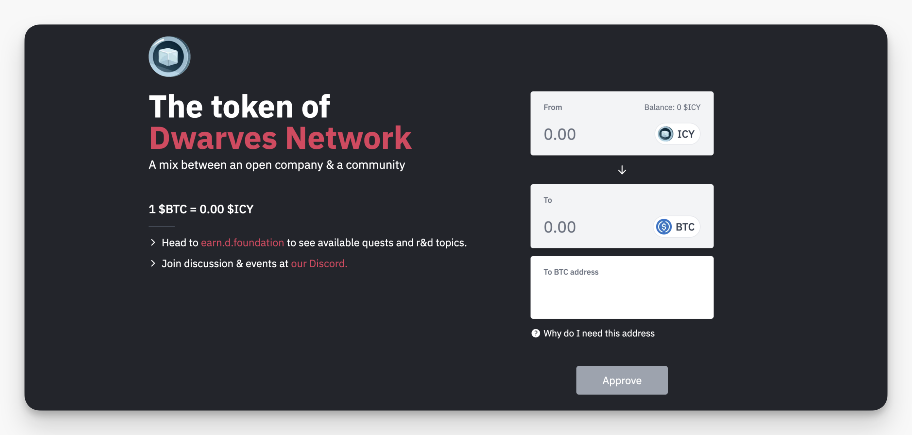
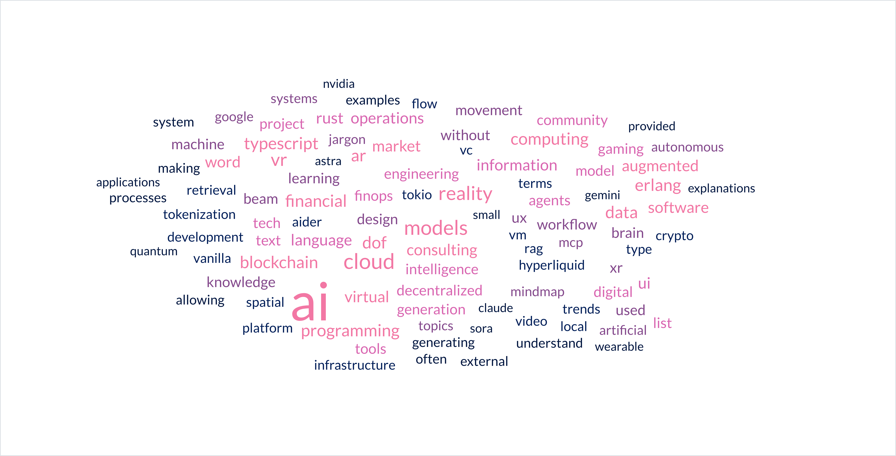
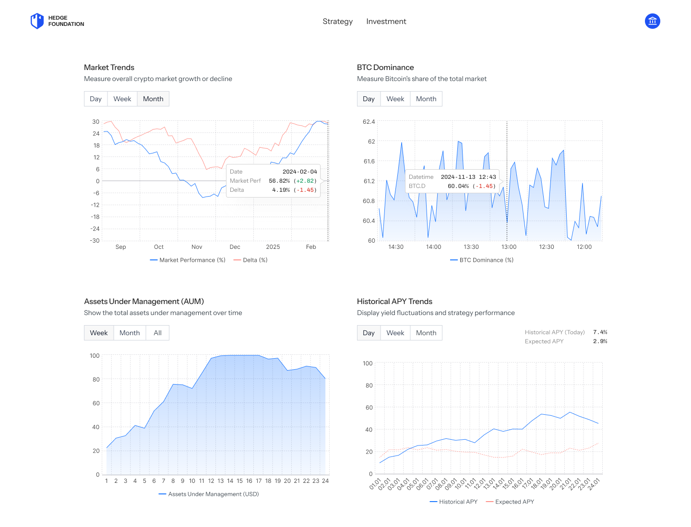

---
tags:
  - newsletter
  - memo
  - community
title: What's New in February 2025
date: 2025-03-04
description: Each month, we roll out a recap of our team and community's strides forward. February’s recap covers the hybrid mode shift, ICY-to-BTC swap testing, updated use cases with AI and trading solutions, skip-level meetings, and the New Year gathering kickoff.
authors:
  - innno_
---

- [**From remote-first to hybrid:**](#the-transition-to-hybrid-mode-strengthening-team-presence-with-coordination-and-perks) We’ve transitioned to a hybrid model, coordinated schedules, and rolled out perks like lunch support, transport coverage, and an Office Leaderboard to keep engagement high.
- [**ICY to BTC transition is in motion:**](#icy-to-btc-transition-from-experiment-to-the-next-chapter) ICY to BTC transition is in motion: We completed the first demo, proving the swap mechanism works. Now, we’re in the final testing phase before the official launch.
- [**Reporting tech signals:**](#reporting-tech-signal-forward-engineering-2024) Dwarves Forward Engineering 2024 with moving in AI agents, blockchain applications, and the evolving talent market, key trends we’re keeping an eye on.
- [**Engineering solutions in action:**](#technical-case-studies-updated-engineering-solutions-across-ai-data-and-trading-systems) We’ve updated case studies covering AI-powered project reporting, security enhancements, real-time trading analytics, and optimized data storage.
- [**Skip-level meeting with CEO:**](#skip-level-meeting-open-conversations-with-ceo) A space for direct, open discussions about challenges, new ideas, and improving how we operate.
- [**Annual health checkup:**](#annual-health-check-up-keeping-the-team-in-check) Routine screenings are scheduled for team members in HCM and Hanoi, with travel support for those in other locations.
- [**Health insurance renewal in progress:**](#health-insurance-renewal-in-progress) Bao Minh renewal process is underway, with details being finalized and updates coming in Basecamp.
- [**New Year gathering kicked off the year:**](#team-moments-new-year-gathering--tết-celebrations) We reunited to share stories and set the tone for 2025.

## The transition to hybrid mode: Strengthening team presence with coordination and perks
One month into the Hybrid Working model, and we’re picking up the pace. The shift from remote-first to hybrid means more structured office days, better team alignment, and a smoother workflow.

To keep things running efficiently, we’ve:

- Coordinated team schedules so office days are planned with purpose.
- Workspace upgrades: Apple Studio Displays and Herman Miller chairs are now in place, with more improvements on the way.
- Added perks: lunch support, transport coverage (3 ICY per check-in), and stocked office supplies.
- Launched the Office Leaderboard with the office-lover role: shoutout to [@quang](https://github.com/lmquang) and [@vincent](https://github.com/tuanddd) for topping the chart this month. They’ll enjoy a free drink for every office day next month as a reward.

More hands in, fewer blockers. Got ideas to make the workspace better? Drop them in 🏢・lobby or open a support ticket. We’re listening.

## ICY to BTC transition: From experiment to the next chapter
ICY started in 2020 as our first community experiment, evolving into a reward system by September 2022. Since then, it has powered engagement, rewarding contributions in discussions, research, and beyond.

Last month, we demoed the ICY-to-BTC swap, a major step toward transitioning to a more sustainable and future-proof reward system. The swap interface is in place, and the mechanics are working. Now, we’re fine-tuning the final details before the official launch.

What’s next?

- Final testing and security checks.
- Launch announcement with a step-by-step guide.
- Support for a smooth transition.

Stay tuned for the final rollout.

## Reporting tech signal: Forward engineering 2024
In 2024, we’ve mapped out key emerging technologies and their business impact to refine our technology roadmap and pinpoint the trends with the most potential across different markets.

Key highlights:

- AI agents are shifting from no-code to developer-driven workflows, with teams favoring self-hosted AI tools for better control.
- On the blockchain side, AI-powered on-chain actions are being explored for smart contract analysis and automated trading.
- Full-stack and AI/ML engineers remain the most sought-after roles, while AI automation is reshaping traditional software development. VC funding is leaning toward leaner, cost-efficient AI solutions.
- More to watch: AI governance, performance optimizations (DuckDB, WASM), and decentralized identity tech.

For the full read, [check out.](https://memo.d.foundation/updates/forward-engineering/2024-2025/) 

## Technical case studies updated: Engineering solutions across AI, data, and trading systems
In this cycle, we focused on refining systems, improving performance, and integrating AI across our projects. Here’s what the team has been working on:

- [Project reports system](https://memo.d.foundation/playground/use-cases/ai-powered-monthly-project-reports/) *([@tom](https://memo.d.foundation/contributor/tom)):* Structuring raw data into insights that power operations.
- [AI-powered Ruby travel assistant](https://memo.d.foundation/playground/use-cases/ai-ruby-travel-assistant-chatbot/) *([@tom](https://memo.d.foundation/contributor/tom)):* Leveraging Ruby + AWS Bedrock for a secure and maintainable AI assistant.
- [Binance transfer tracking](https://memo.d.foundation/playground/use-cases/binance-transfer-matching/) *([@bienvh](https://memo.d.foundation/contributor/bienvh)):* Transforming fragmented transaction logs into structured fund flow data.
- [BTC-altcoin hedging indicators](https://memo.d.foundation/playground/use-cases/bitcoin-alt-performance-tracking/) *([@bienvh](https://memo.d.foundation/contributor/bienvh)):* Visualizing performance metrics with Matplotlib & Seaborn.
- [AI chatbot for project management](https://memo.d.foundation/playground/use-cases/building-chatbot-agent-for-project-management-tool/) *([@thanh](https://github.com/zlatanpham)):* Automating workflows using LangChain, LangGraph & GPT-4.
- [Centralized monitoring for trading](https://memo.d.foundation/playground/use-cases/centralized-monitoring-setup-for-trading-platform/) *([@thanh](https://github.com/zlatanpham))* , *([@quang](https://github.com/lmquang)):* Implementing Grafana & Prometheus for real-time alerts and system integrity.
- [Crypto market visualization in Golang](https://memo.d.foundation/playground/use-cases/crypto-market-outperform-chart-rendering/) *([@bienvh](https://memo.d.foundation/contributor/bienvh)):* Interactive charts tracking BTC-Alt dynamics.
- [Data archival & recovery](https://memo.d.foundation/playground/use-cases/data-archive-and-recovery/) *([@bienvh](https://memo.d.foundation/contributor/bienvh)):* Long-term stability strategies for high-volume trading systems.
- [Database security hardening](https://memo.d.foundation/playground/use-cases/database-hardening-for-trading-platform/) *([@thanh](https://github.com/zlatanpham)):* Strengthening access control with RBAC, MFA, and network isolation.
- [Binance PNL analysis with Phoenix liveview](https://memo.d.foundation/playground/use-cases/implement-binance-future-pnl-analysis-page/) *([@minhtran](https://github.com/thminhVN)):* Real-time portfolio tracking using server-side rendering & WebSockets.
- [Migrating to TimescaleDB](https://memo.d.foundation/playground/use-cases/migrate-normal-table-to-timescale-table/) *([@minhtran](https://github.com/thminhVN)):* Boosting query performance with hypertables.
- [Hedge Foundation UI optimization](https://memo.d.foundation/playground/use-cases/optimizing-ui-for-effective-investment-experience/) *([@anna](https://memo.d.foundation/contributor/anhtran/)):* Improving investment dashboards for seamless decision-making.
- [Historical data persistence](https://memo.d.foundation/playground/use-cases/persist-history-using-data-snapshot-pattern/) *([@bienvh](https://memo.d.foundation/contributor/bienvh)):* Implementing data snapshots for efficient long-term storage.

## Skip-level meeting: Open conversations with CEO 
Last month, Skip Level Meetings kicked off, offering a direct space to raise blockers, no back-and-forths, just a space to bring up challenges, new directions, feedback, and talk about what’s working (or not).  

Whether it’s about team operations, roadblocks in projects, or simply sharing thoughts on where we’re headed, this is a chance to have real discussions that drive change.

If there’s something on your mind, this is the place to discuss it.

## Annual health check-up: Keeping the team in check
We are preparing for the annual health checkup, ensuring everyone gets their routine screening done. Team members in HCM and Hanoi will have designated locations, while those from other areas can arrange travel to complete theirs.

For any questions, reach out to [@innno_](https://github.com/innnotruong).

## Health insurance renewal in progress
The Ops Team is managing the renewal process for our Bao Minh health insurance to ensure continuous coverage for everyone. Details are being finalized, and updates will be shared in the Basecamp thread once the process is complete. Stay tuned.

## Team moments: New year gathering & Tết celebrations
We kicked off the Year of the Snake with our team reunion, creating space to share stories, reconnect, and set intentions for the year ahead. These moments remind us why we do what we do, building not just great technology but a community where everyone can thrive.

[Check out Weekly Digest #15](https://memo.d.foundation/updates/digest/15-new-year-gathering/) for photos and highlights from our New Year gathering.

