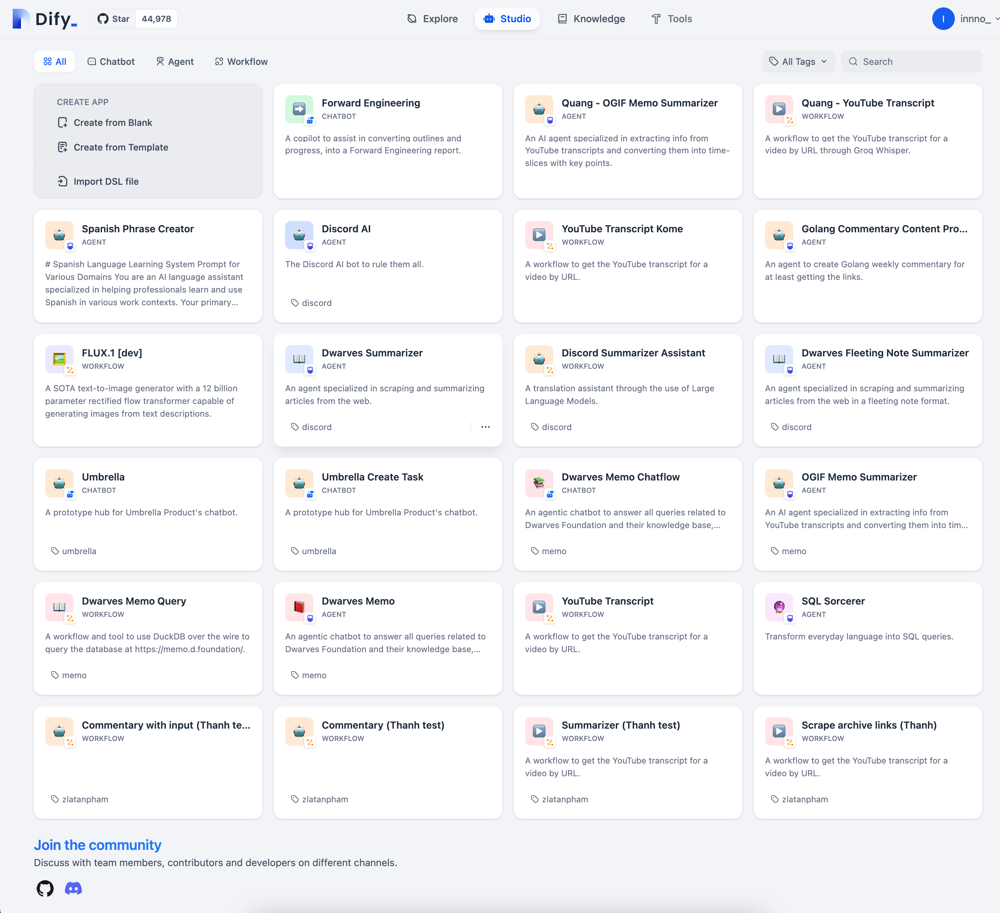

Hello,

It’s Han & Nikki here.

We have been quite busy with setting up our knowledge system to ensure learning is the top priority for everyone in the team, not just for the management.

Have a look at our [Dwarves Memo](http://memo.d.foundation), and you will see the effort starting to pay off, as more and more members’ names are showing up, more and more articles are being published.

As you might have known,  AI/LLM has been on our radar for a quite a long time. And the past few months have been all about investing in our AI/LLM competences. It’s been an interesting journey, and we’re excited to fill you in on how things are going.

## Working faster and smarter with AI
Our entire team, from engineers, and designers to operators, has started using AI tools in our workflows. With this extra brainpower, we now can get things done much faster, and deliver results faster and more accurately.

AI-driven project management tools optimize our workflows, project timelines, as well as, resources. This helps a lot with driving down time and cost in development. We are seeing a cutdown of our design-to-development time by at least 30%, and we bet this number will get bigger in the future.

Especially for our engineers, it’s like having an extra set of eyes and hands, making sure everything is just right, and fast. AI-powered code generation tools are used to automate repetitive coding tasks, suggest code snippets, find bugs, and help with testing. Lesser human errors, and more mind space impactful tasks. 

## Learning and training always
Since 2015, we have always known that R&D is the engine driving ideas, innovations, and all the other cool stuff in technology.

Now with the focus being AI/LLM, the team is going full speed with learning, training, and building for AI adoption. 

- **Large Language Models** like GPT and Claude to tackle all sorts of text-based tasks, from generating content to understanding complex queries
- **NLP Techniques** to make sense of text with techniques for sentiment analysis and summarization.
- **Retrieval-Augmented Generation (RAG)** combines multiple methods to improve how we search and retrieve information, making our solutions more effective.
- **Embedding Technologies** helps enhance content recommendations based on user needs.
- **AI-Powered Analytics** covers the analytics front by predicting trends, spotting anomalies, and understanding complex data patterns, helping us make informed decisions.

Additionally, we’re involved in computer vision projects for image recognition and develop multimodal AI systems that combine text and images for more comprehensive solutions.

We always share what we learn and train with other tech fellows through Dwarves Memo. 

- [Journey of Thought Prompting: Harnessing AI to Craft Better Prompts](https://memo.d.foundation/playground/01_literature/engineering/ai/journey-of-thought-prompting/)
- [Streamlining Internal Tool Development with Managed LLMOps: A Dify Case Study](https://memo.d.foundation/playground/01_literature/building-llm-powered-tools-with-dify/)
- [Evaluating search engine in RAG systems](https://memo.d.foundation/playground/01_literature/hybrid-search/)
- [Rapid software development with AI](https://memo.d.foundation/playground/01_literature/developing-rapidly-with-generative-ai/)
- [Building Agent Supervisors for Insight Generation](https://memo.d.foundation/playground/01_literature/supervisor-ai-agents/)
- [Re-ranking in RAG (Retrieval-Augmented Generation)](https://memo.d.foundation/playground/01_literature/engineering/ai/re-ranking-in-rag/)
- [AI-Powered Interview System](https://memo.d.foundation/playground/01_literature/how-we-created-an-ai-powered-interview-system-using-openais-chatgpt/)
- [Feedback Mechanisms for LLM Applications](https://memo.d.foundation/playground/01_literature/feedback-mechanism/)

## Building AI-powered solutions
AI has allowed us to provide solutions that are a bit smarter and more tailored to our client’s needs. It’s about finding practical ways to use technology to support our clients and help them succeed while spending less time and money.

- [FornaxAI](https://fornax.ai): a tool to help startup founders perfect their pitches. It provides instant feedback on content, structure, and design, leading to more compelling presentations and better fundraising outcomes. It even simplifies how investors grade and manage pitch decks.
- [Umbrella](http://umbrellaconcierge.com): an AI-powered project management tool that integrates real-time task management, chat, and analytics. Built with Serverless NextJS and MongoDB, it’s designed to boost productivity across teams.
- [Ascenda](http://ascenda.com): an AI and ML loyalty program integrating NLP models, Elastic search, and Kubernetes, we’ve enhanced customer loyalty in innovative ways.
- [Plot](https://www.plot.so/): a platform centralizing project and asset management for media teams. It uses AI to streamline content handling and collaboration, making the creative process smoother and more efficient.

## Looking ahead
We don’t think there are a lot of vendors in Vietnam going the path we’re going. All in all, running the team in the direction of a R&D-focused firm is challenging, but it is also rewarding when we see new developments, new types of requirements coming from prospects, new solutions we receive from our tech team, or a heated debate over a certain new tech on our Discord.

And we look for even better results to come, as there are still many things we can make happen. If any of the things we are doing is also what you care about, come collaborate with us, so we can learn, work, experiment, and win together.

That’s it for now. We hope this small update brings some joy and motivation for the day.

Until next time,

Han & Nikki.