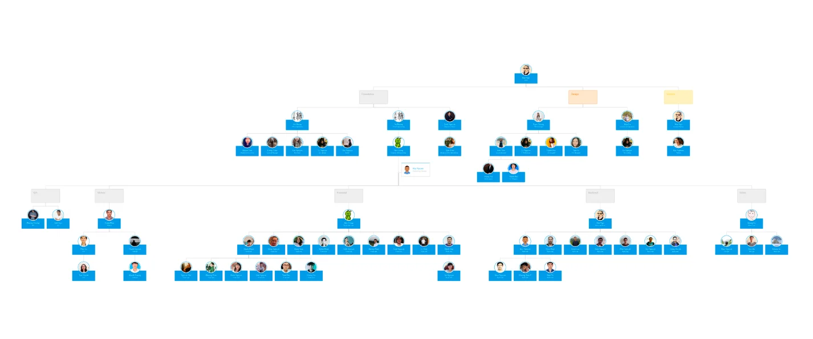
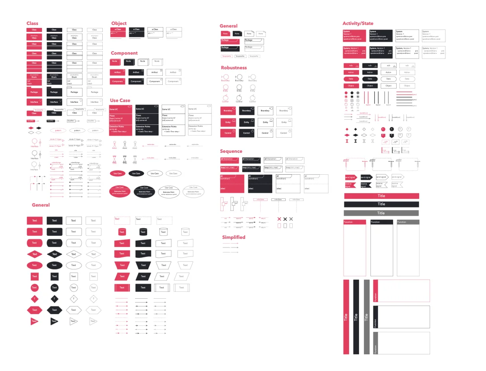

### Company updates

Rolling out schedule plan for Year-End Party

Our Operation team has finished the agenda for our 2019 Year End Party. This year party is hoped to be a memorable night, as it doesn't only to award our Dwarves of The Year for their hard work, but also to mark our 5 years journey. Guys, Dwarves Foundation is turning 5!

The party will be held at the beginning of January, according to the latest plan.

Agenda for Apprenticeship Program

Another great project to follow up. Apprenticeship Program is expected to start in February, the time we get back to work from Lunar New Year. So far, our Recruiter is working on addressing the appropriate resources to and drafting the timeline. The specific workflow and syllabus for the program will be the goal for next week, based on 4H method.

Organization Chart

A visual example for Who does what has been fully deployed last week by one of our engineers. Take a look at org.d.foundation and let us know what you think!

Content Pipeline Status update

After two weeks of working, we have gained some significant result. After our Editor finished writing the final version of a blog post, the Autobot will upload it on Woodland as a separate message in Message Board.

At the end of the week, all the news will be wrapped up and automatically sent to you through your work email in the form of The Dwarves Weekly Digest.

Learning Google Technologies

A full day hands-on workshop to experience Google's technology. Phat Nguyen - our Back-end engineer attended as a speaker with the talk Golang fundamentals & How to build an API server with Golang

The course introduces the basics of Go programming language and how to write a simple web server using Go:

- Packages, variables and function
- Flow control statements: if, else, for, switch and defer
- More types: struct, slice and map
- Method and interfaces
- Testing
- Manage external dependencies
  UML Stencil Kit

Omnigraffle is a tool that allows you to create and store your mindmaps, charts, layouts and every visual plan you need for your business. Once you've created and exported a version as an Omnigraffle file, you won't need to redraw it again.

Adapting this useful aspect, Ly N. is drafting a branding kit for Dwarves Foundation team using Omnigraffle. UML Stencil Kit will be utilized for internal purpose to create diagrams.

### Policy

Insurance Package

As a part of employee benefit package, Insurance Package is a policy that our Board members wants to apply on the team to make sure you can fully focus on the job and lift up the burden of any possible incident/accident.

The Board has given out 2 options:

- Medical Insurance & Social Insurance based on basic salary
- Heath Insurance (from Bao Viet Insurance, Silver package)
  For full information of each option, have a check at Basecamp.

Reading Articles from Business & Marketing

Let's have a look at what our members put on the reading list this week:

- Start-Up funding for beginners
- Outsource software development for start-up, should or should not?
- Mental Model + Reverse Mental Model
- Burnout is Software and How to Avoid
- Understanding the media of internal communication
- A list of how to build X 101 in different languages
  Tech 101 Class

To get every one aligned and possessed the same knowledge base toward our product and dive in the world of technology, it is vital for our sales, editors and operations member to understand the tech from scratch.

Tech101 is a class taught by anh Han that takes place on every Monday, Wednesday and Friday to walk the operation members through some basic tech knowledges. The topic of the class shall be rendered based on the member's interest.

So far, we have come up with 2 classes already. Take a look at the Class Notes

- 9/12/19: Dev Types, CMS, Roles of Dev and Difference between QA-QC-Tester
- 11/12/19: API - API Gateway
  Software Quality Class

Anh Han also launched a training class for our engineers to re-define the meaning of quality software. Huy N. and Phat are taking the class at this moment.

Should you find yourself seeking for a further definition of software, or just simply want to spend time to work on bettering your competency, give anh Han a ping.
