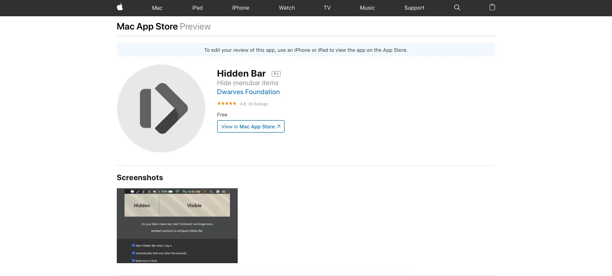

Hidden Bar

Created by our MacOS team, Hidden Bar allows its user to remove unnecessary items from MacOS menu bar. Achieve a clean and minimal desktop in a few clicks. Kudos to the great work!

We even made it to LifeHacker and HackerNews! Check it out!

Culture Book - Content Approval

A part of reaching to the full version of Dwarves Foundation Culture Book. Those articles are a documented version of the values we choose to live by. It would be great if you can take a look at these drafts and let us know what you think.

- Software Craftsmanship
- Avoid Burnout
  Engineering 1-1 Meeting

The Operation team has just finished the 1-1 meeting with some of our engineers.

The meeting aims to review the outcome after our previous ranking level calibration.

The final result will then be used as a standard for salary increment.

Christmas Wish from The Dwarves

Let’s take a second to thank our Design team for this lovely Christmas card. But the fun hasn’t ended yet. We’ll make sure you have something to excite about next Monday. Wait and see!

