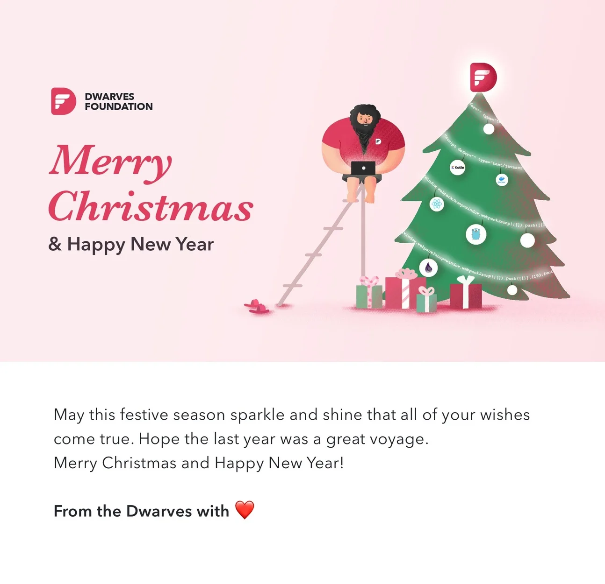
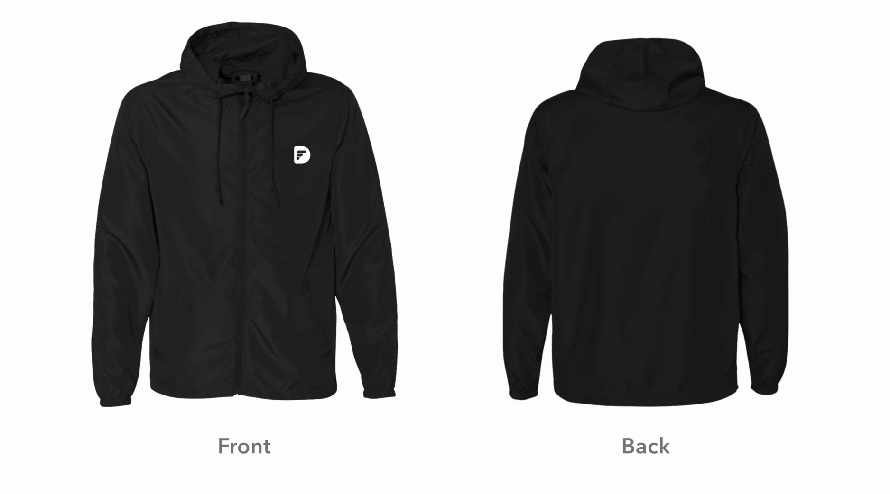

## Last Engineering Meeting of The Year

---

Christmas Wish

We do hope you have a great Christmas night with you beloved ones. And if you haven't checked up the wish note from anh Han last week, please take a look!

2. A Jacket Design for next year

Can you guess what our Designers are having in mind this week? A new kick-ass design model for team jacket!

…the rest is your canvas

…the rest is your canvas

This shall appear as a drafting design only, but let's take a look and stay tuned for the final one.

Engineering Meeting

Last Friday has hold the last monthly Engineering Meeting of 2019. It raised up the issue from the previous month, our current status and also the plan for our next steps. Let's go for a walk.

Previously

On-leave submission: Our team has greatly improved their self-discipline as there was no negative feedback from our clients on our working hours or productivity. However, the remote submission still be in needed of managed. Specifically, remote request shall not be submitted right before working hours, or during off-working hours. This may lead to uncertainty and prevent the line-manager from making a right decision between accepting of rejecting the request

Off-working hours duty call: Every project has its own premised working hours and has been agreed by our client (except for the case of eCal - which has been resolved by Huy N.). In case you receive a ping or email from clients during off-hours, should the problem is not a critical one, guys, work can wait.

Current status and What's next

We have updated the engineer organization chart in <http://bit.ly/df-org-chart>. This helps:

- People to know who they are responsible to mentor and who they should report to.
- Engineer on the same branch can involve on bettering the working process, to work on the practical solutions and apply that on their current project or working process.
  Huy N is taking trial for the position of Engineering Ops. He will help answer any issues regarding the Engineering team operations just in case you don’t feel great speaking to the Ops team or the C-level.

Each team can pick out their topic, technique, language or framework and verify its plausibility. The final result shall be conducted into a seminar to pitch in the next engineering meeting. After the presentation, the idea can be applied as a practice should it has been agreed by the team.

The deadline for submission will be on Monday, therefore, let's cross the fingers and hope we can come up with a great idea!

The Dwarves 5th Anniversary

Jan 3rd is our anniversary and we are planning to have a retreat day for all the Dwarves. The Operation team has finished the itinerary for our retreat activities on the 5th birthday.

The retreat day will include 3 mains activities

- Escape Room: a teamwork game in which a group of people are asked to discover the clues, solve the puzzles to figure their way out of a premised situation, in a limited time duration.
- Jimjilbang: A Korean style spa with sauna included.
- Year-End Dinner: An intimate buffet dinner to look back our 5 years journey and conduct Dwarves of The Year ceremony.
  Beside that, there are a few more things to wrap up before heading to the next milestone. A detailed itinerary with location and time will be announced by the end of next week.

Let's count down.

Dwarves of the Year

We had the final list from your recent nomination. The direction team is working on them to select the right Dwarves with the most enormous contribution and impact over the entire organization. Just a small hint: The number is increasing compared to last year 🎉
