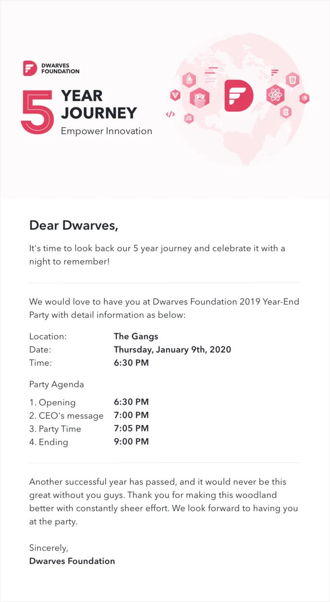
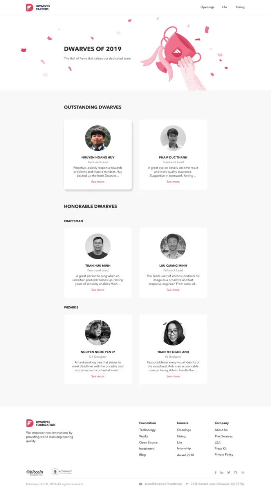
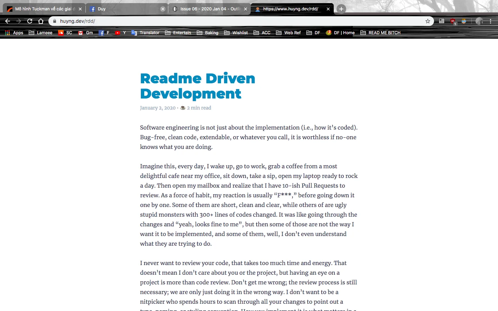
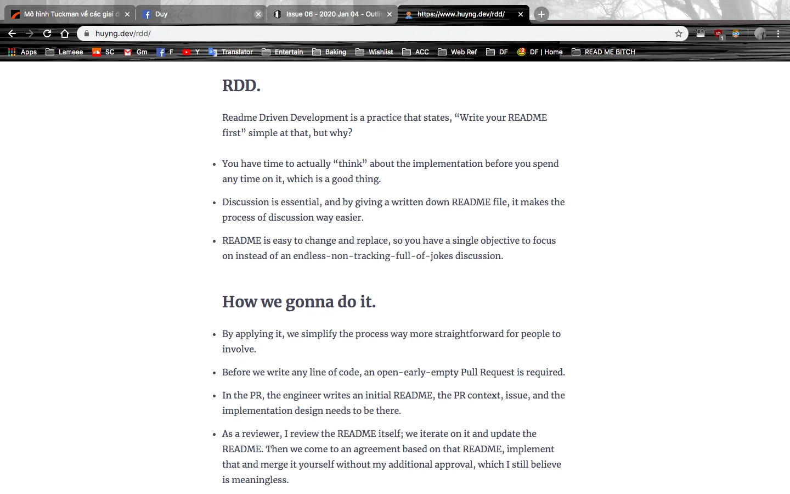

## You're invited to Dwarves Foundation 5th anniversary

---

All-Hands Meeting: November & December

We have just gone through the last All-hands Meeting of 2019. Jan 3rd also marked our 5th year as a company. After the phase of Forming, we are moving to the next part: Storming and Norming

This is the part where team members start to declare themselves and this is where the conflict starts. As you may recall, many team issues and problems were raised up. Communication, working style, work delivery, ...etc.

Though the list of issues may seems long, there was no problem is considered as "major". For the next steps, those issues will be turned into backlogs to resolve, and expected to meet the definition of Dwarves 2.0.

5th Anniversary Itinerary

Needless to say, we look forward to having you there. An applause to Design team for this lovely Invitation E-card.

Dwarves of The Year Celebration 💖

Let's spend a minute to celebrate these Dwarves for the contribution they have made. And furthermore, the inspiration they have spread to motivate us 🙌 Congratulation, our 2019 Dwarves of The Year 🎉

2019 Office Cleaning ⚒

What must come, has come.

Since our team will begin to work remotely a week earlier (from Jan 13th), we all must finish cleaning up the office by the end of Friday, Jan 10th.

Every office has been assigned a lead to make sure things are done perfectly.

- Lead Block A: Khai + Ngoc
- Lead Block B: Ly + Huy N.
- Lead Block D: Anh T + Giang V.
  For the "Definition of Done" of Office Cleaning, have a check at this 👉 Announcement !

Blog Post

As a part of Engineering Topic Discussion, Huy N has finished writing his blog about Readme Driven Development. From Huy's opinion, RDD might be a great way to control and simplify the working process, by being clear about the implementation process before spending any time on it.

Have a look at it here: <https://www.huyng.dev/rdd/>

