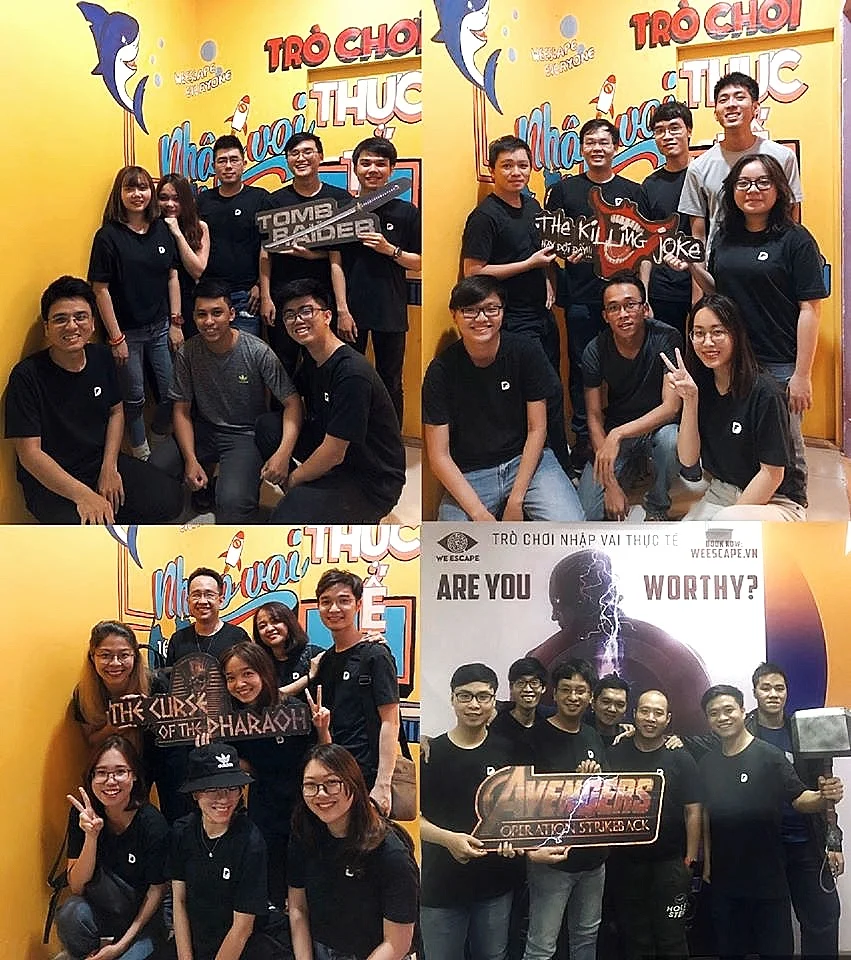
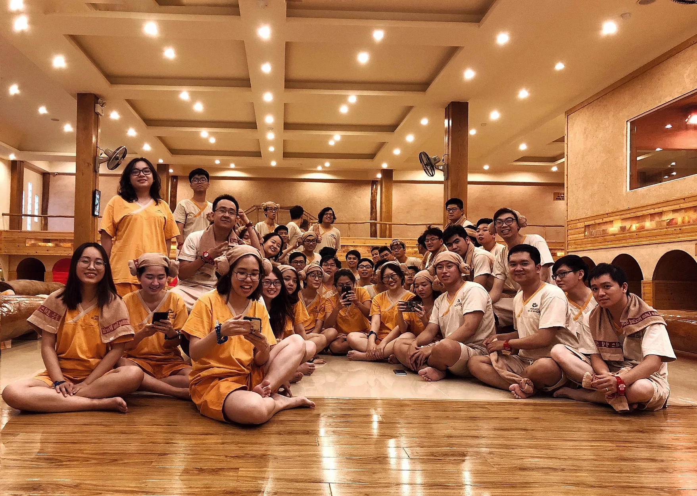
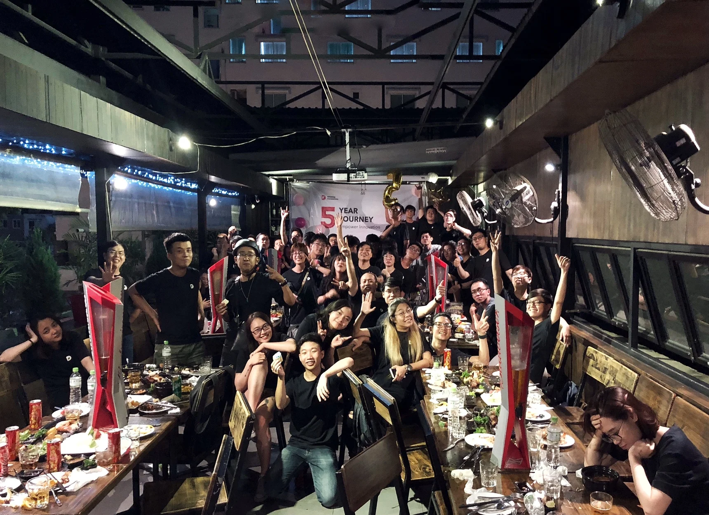
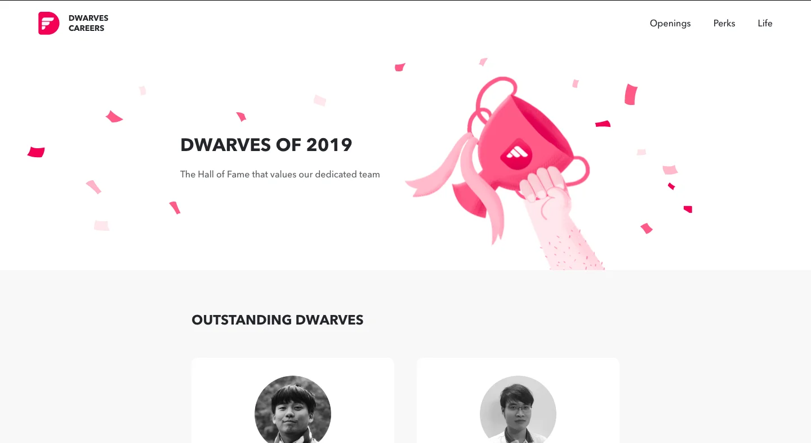
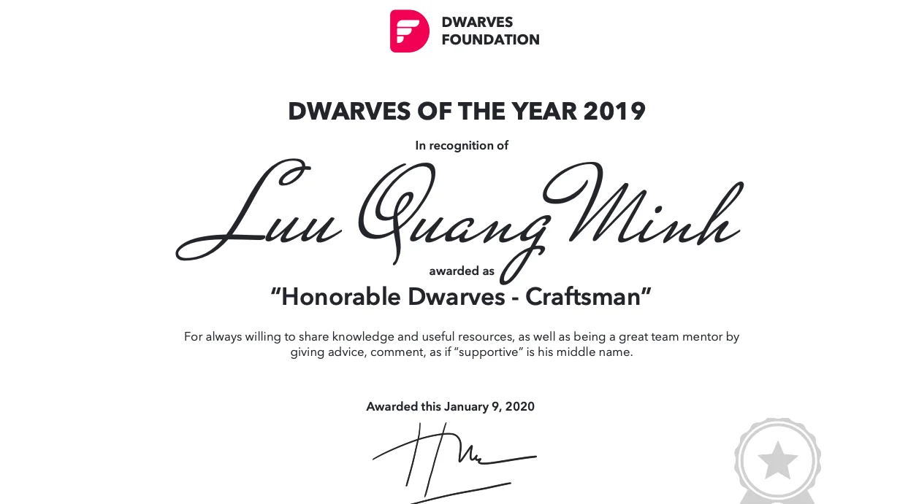
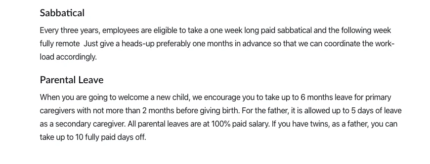
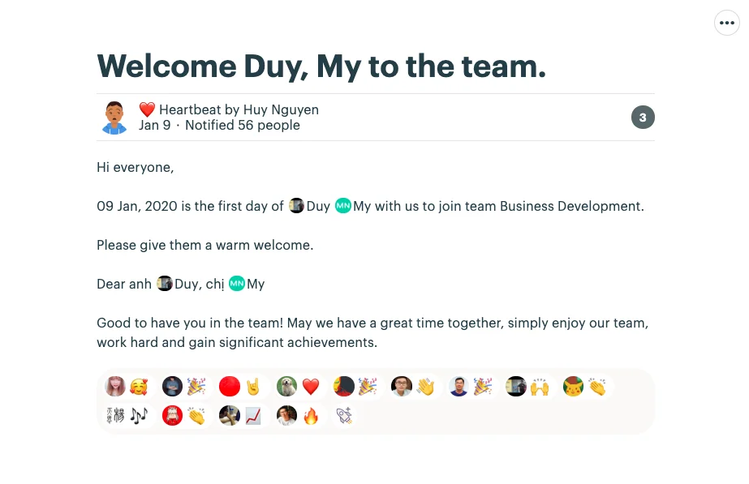

## The Dwarves Turns 5 🎂

---

### Dwarves Foundation Team Retreat

Finally, the wait is over! 🙌

Last Thursday was a blast. Gotta say Jimjilbang did a great job in chilling us out, while Escape Room spiced up our afternoon with its thrilling challenges. We do believe you enjoyed our team dinner as well, that reveals through the captured shot and the talks afterwards.

As mentioned, this anniversary doesn't simply mean to mark a milestone of Dwarves Foundation, it marks the 5th year of us as a team, from those who have only joined the woodland for 1 or 2 years, to those who have been with this firm since day one.

And shall the journey keeps going, we look forward to welcoming it with you. Here's to another year of challenge and joyful moments 🥂

Escape Room

Jimjilbang Korean Spa

Team Dinner - The Gangs

### Dwarves of The Year website 🏆

The Front-end team has finished crafting the web page for our 2019 Dwarves - The Hall of Fame to value our dedicated team.

Each Dwarves shall have their personal photos and short descriptions to portrait their contribution, along with a PDF certificate that later can be used to attach on their resume. We don't want the appraisal that's just about tangible value only. We want to make sure you have something to proud of, something you can use as a proven work of your improvement in self-competency.

2019 Dwarves of The Year website

- Contribution Description
  

### Engineering Topic Discussion

You may recall the last Engineering Meeting about Tech Topic Discussion. The Engineering Team is asked to submit individual or group topic that they find helpful and interesting enough to roll up their sleeves and start to dig deeper.

There have been many topics were raised in the past 2 weeks. Although we will start to work remotely from next week, please keep in mind that there will be a meeting during Investment Time to sync up the progress ✊.

### Operation Updates

Benefit & Perks

Lately, our Operation team has been working on some benefit to add up to our current perks. Here below are the two latest ones

- Sabbatical: a one week long paid sabbatical and the following week fully remote once every three years
- Parental Leave: for family duty calls.

Updates on English Class

After receiving feedbacks from the attendants of English Beta Course, we have decided to move forward with a solution. The company will support for those who voluntarily wish to have their English skill improved by covering the tuition fee of outside English Centre, with education allowance stated in benefit policy (up to 300 USD/year)

## NEW HIRES 🎗

Guys, the Dwarves has scaled up with 2 new members!

- Duy Nguyen as a new Business Developer for German market
- My Nguyen as a Business Developer for Canadian market.

We look forward to a fun ride with you guys 👏 Welcome abroad!

