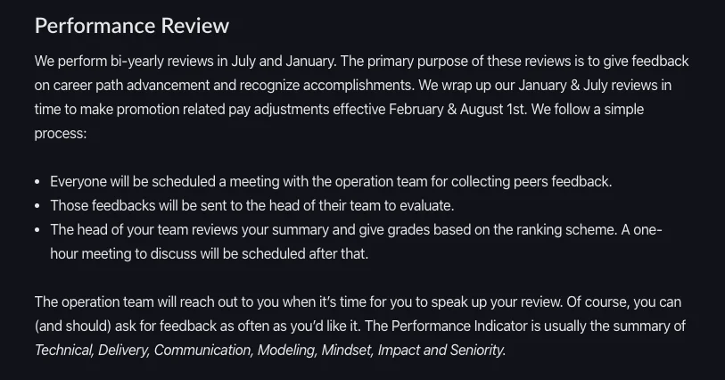

## The 1st Report of Tech Radar

---

### Tech Radar - the 1st Version 📡

It's been a month since our last meeting of Engineering Topic Discussion. All the selected topics will be used to build up our own Tech Radar, aiming to share and expand our knowledge towards the industry. As the industry grows, we must have ourselves caught up.

Last Friday, the Engineering Team conducted a meeting during Investment Time to sync up the progress of Tech Radar - the 1st version. The meeting went well as we finally end up with these achievements:

- List of permitted topics
- The same base knowledge of Tech Radar: how it runs, what benefit it will bring and what to expect afterwards
- Updated status of each team's project
  Currently, every team has done around 10-30% of their projects. As we are expected to have a report once every 2 weeks, the 2nd report should be held on the first week after Lunar New Year Holiday. In this 2nd report, every team/ individual is asked to submit their research and example toward the topics.

- For tools: there must be a runnable demo version
- For frameworks or technique: there must be documents and presentation (or both, even better!) about the structure.
  Definition of Done for Tech Radar ☑️

- Project's Objective: clear and concise
- Project's Motivation: why you build this, what is is for
- Project's Benefit and Proposal

### Handbook Update - Performance Review 📕

Duyen has continued to work on our Company Handbook and she came up this week with an updated version of Performance Review.

Performance Review is a part of Making a Career - a chapter of Dwarves Handbook that states what it takes to level up your career at Dwarves Foundation. It includes the metrics for Mastery and Titles, how the Salary and Promotion work and now Performance Review - which means to give feedback on career path advancement and recognize accomplishments.

View the full version at: Dwarves Handbook - Making a Career

### Blog Post

The recognition of our 2019 Dwarves doesn't just end there as we have just finished crafting a blog post about it on our News page - a medium for Company Updates at dwarves.foundation/n.

You may find at this page some blog post about our Company culture such as What Dwarves Foundation Stands For. We always to promote and live by the core values. For the upcoming stage, you might catch some more writing pieces about Software Craftsmanship, Know-how Craving or People Matters.

Stay updated!

### Operation Updates 💪

13th Salary Bonus

We hope this part gratifies you the most within this Digest. The 13th Salary has been transferred on Jan 15th based on the formula in this 13th Bonus Announcement. This bonus is calculated as the average income since the beginning of 2019, which means

- Bonus Salary = Total income of 2019/Total month of working.
  Thank you for all of the hard work and let's look forward for more to come ⚒

English Class

As we have mentioned in the previous Digest, the company has kicked off the policy for English Class tuition fee support. We have decided to support those who want to further improve their English skills, an allowance up to $300/year, to take an extra English class in a self-selected English center. We suggest you enroll in a full English course (which will teach you both grammar and speaking skills) with attendance <10 people/ class, as then you will have more time to practice speaking skills.

For further info, please refer to: Beta English Communication Announcement.

Bao Viet Insurance

The contract of insurance package for our Dwarves has been confirmed and expected to valid after Tet Holiday. The insurance card will be received on the 2nd week of Feb, 2020. Just in case, give a ping to Duyen, she can help answer and assist you should there is any further question or request.

Remote Working

Most of the team has been working remotely since Monday to better spend their time with the family during this Lunar New Year Holiday. As we wouldn't be able to meet each other until the beginning of February, please make sure you manage to wrap up all the work before our day-off begins, which is Jan 23rd, so that the rest of the Holiday can be a perfect and relax time to consume.

And most important, on behalf of the Dwarves brothers, we do wish you the greatest Lunar New Year Holiday! 🖤
