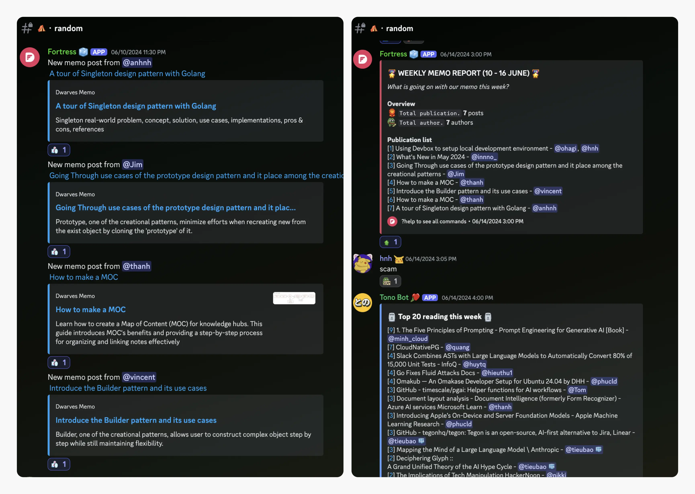
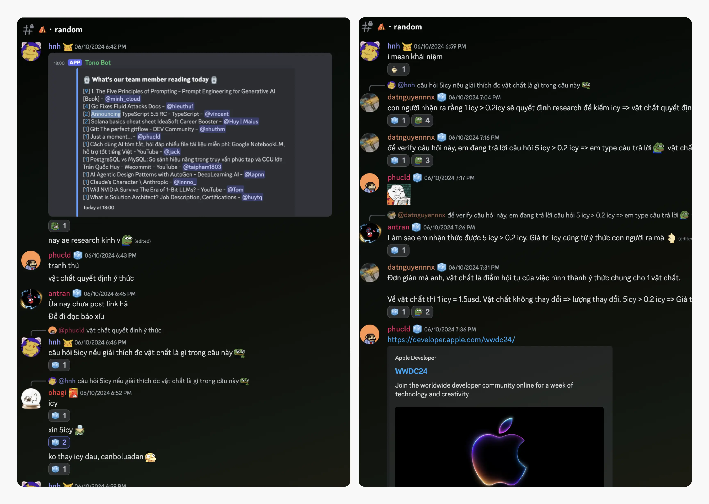
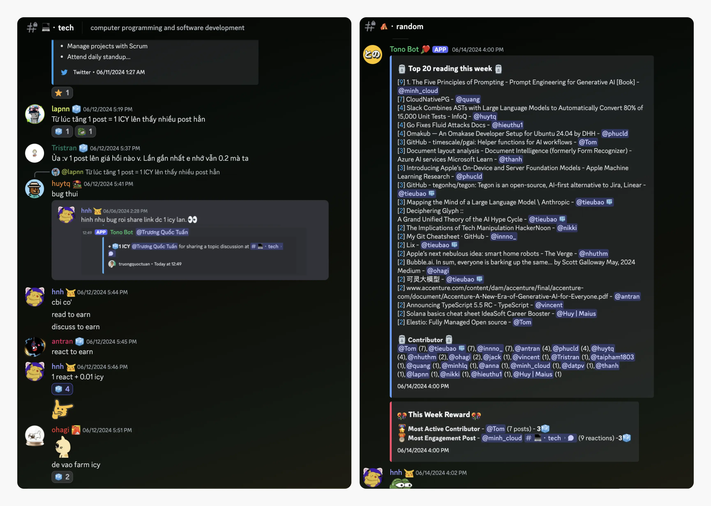
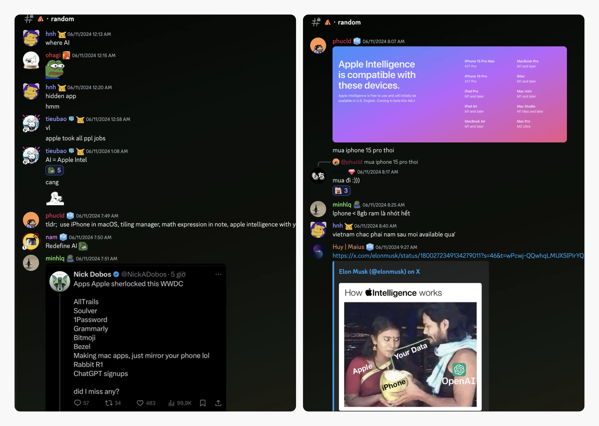
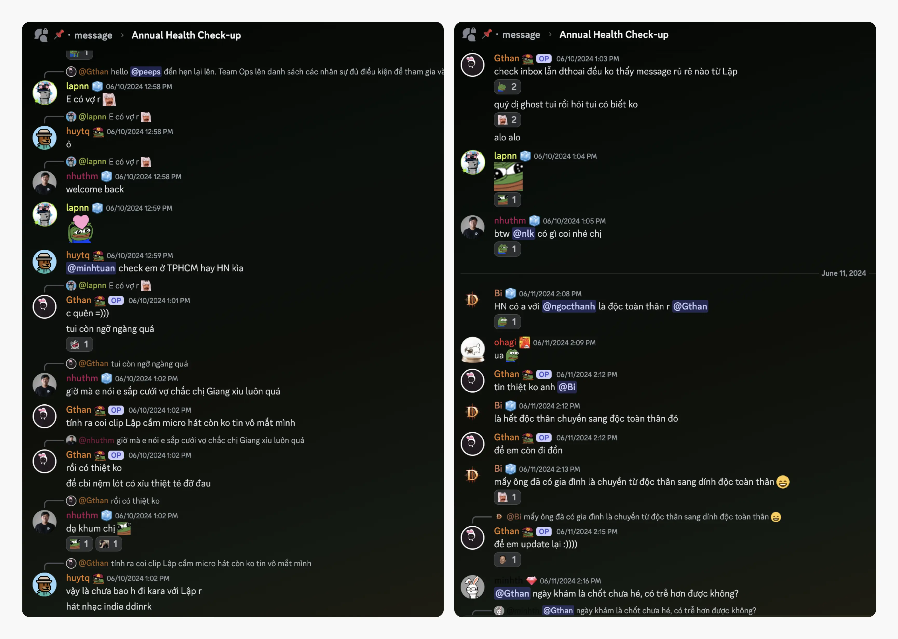
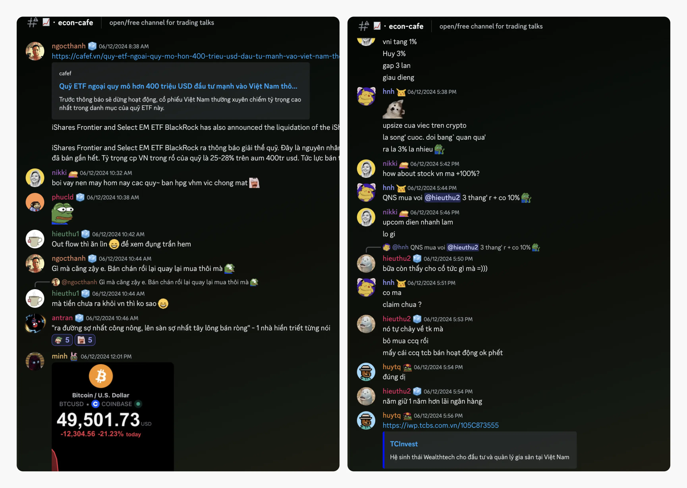
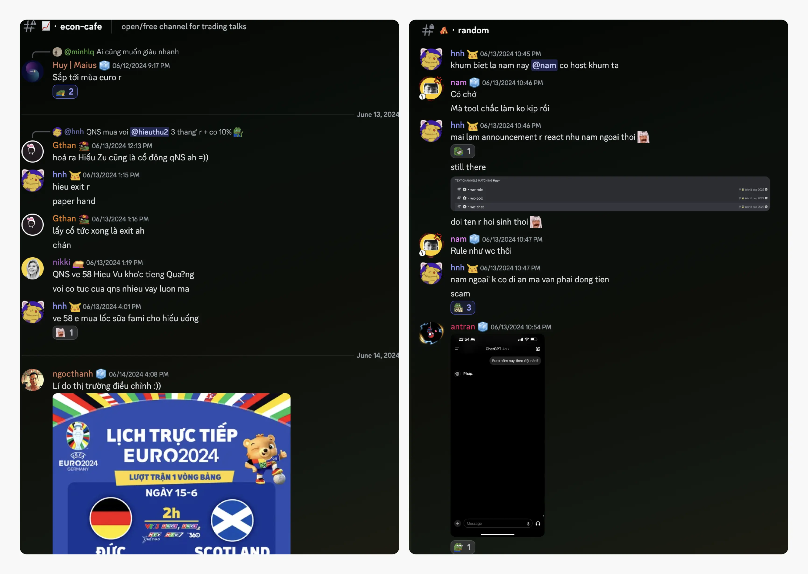

---
tags:
  - weekly-digest
  - memo
  - community
  - reward
title: "Weekly Digest #10: From lean to learner"
short_title: "#10 From lean to learner"
date: 2024-06-16
description: Double digits, I can't believe we've reached our 10th digest! It's been quite a journey putting together each edition and a blast creating these for you. When we talk about memo, we're highlighting an essential part of our learning culture. We’ve just noted a few updates for the cycle ahead. Now, let's dive into this round-up.
authors:
  - innno_
---

Double digits, I can't believe we've reached our 10th digest! It's been quite a journey putting together each edition and a blast creating these for you.

When we talk about memo, we're highlighting an essential part of our learning culture. We’ve just noted a few updates for the cycle ahead. Now, let's dive into this round-up.

### Building the best Dwarves wiki - memo.d.foundation
There's a long road ahead as we work on making [memo](https://memo.d.foundation/) the best it can be. It's where we keep track of what we learn—as a team and as a community—about tech, how we work, and anything else interesting.

We upgraded a monthly pool of 3000 ICY (~4500 USDC) to reward contributors who support our journey of lifelong growth in knowledge and network.

Community members, you're welcome to read, contribute, and suggest additions. Simply drop a message in the relevant channels on our [Discord](http://discord.gg/dwarvesv), or ping @thanh or @Tom for help.

We'd love to see more contributions.

### Dwarves sponsor for researching and learning
If you've been with us for a while, you'll know we're big fans of sharing software developments. We've boosted the ICY reward in the tech channel to 1 ICY per shared link. And guess what? The **💡・til** channel is now included too.

Keep spreading your knowledge. Every Friday, we'll be rewarding our top contributors. And remember, these rewards are for everyone, so bring your friends along.

### AI takes center stage at Apple’s WWDC 2024
2024 is shaping up to be a pivotal year in the evolution of artificial intelligence, and Apple's recent WWDC only solidified this notion.

But in addition to Apple Intelligence, iOS 18 is also bringing plenty of other cool features to the iPhone. The partnership with OpenAI to enhance Siri's capabilities is a testament to Apple's dedication to improving its AI services.

The trajectory is clear: AI is no longer a futuristic concept; it's rapidly becoming an integral part of our everyday lives.

Don’t get me wrong—I’m excited about the performance boost this transition promises. But I can’t help feeling a bit nervous about a future like in the movie "Her" becoming real.

### Annual health checkup
As mentioned, our Dwarves will have their health checkup in June. We will keep you posted in the 📌[**・message**](https://discord.com/channels/462663954813157376/1249591418746306570/1249591981248872501) channel. Drop @Gthan a ping if you have any questions about this.

### Market recap: VN-Index Takes a wild ride
Over the weekend session, the market decided to have a big sell-off for no specific reason. The VN-Index closed down 21.6 points (-1.66%), wiping out all the gains from earlier in the week. Our team members @ngocthanh, @nikki, @huy, @hieuthu2, and @huytq had a lively discussion about this rollercoaster in the 📈・**econ-cafe** channel.

Right now, the market’s mood swings are mostly driven by investment psychology, especially when there’s not much news to go on. In this sideways market, picking the right strategy is key—otherwise, you might feel like you're on a rollercoaster without a seatbelt.

### Prepare for thrilling matches from EURO 2024
EURO 2024 kicked off on June 14th and the action will keep rolling until July 14th. Our community is excited about all the epic matches ahead. Get ready for some nail-biting finishes, jaw-dropping goals, and maybe even a few penalty shootouts to keep us on the edge of our seats.

So, grab your favorite snacks, rally your friends, and join us for the most thrilling match predictions.

Lastly, HUGE thanks to our members who have shared a lot of interesting technical stuff. You rock!

Please keep sharing how we can make your days on the internet even better, including the small stuff, too small to see.
