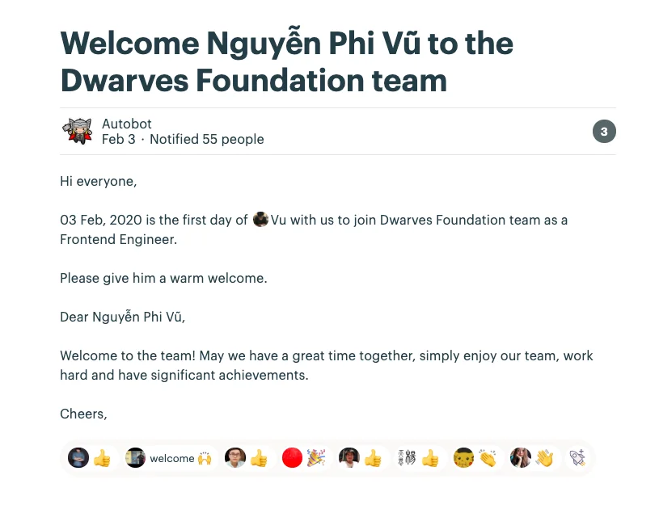
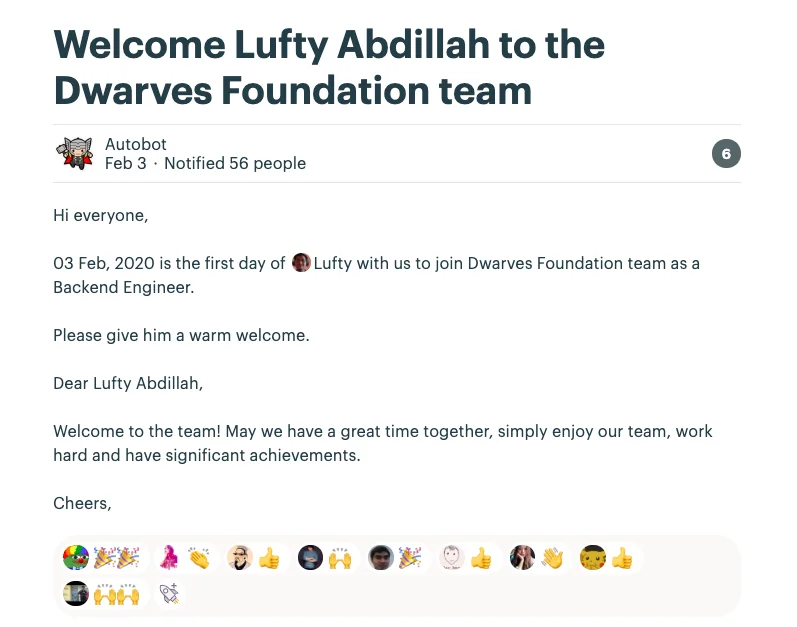

## The 3rd Milestone of Tech Radars

---

### 3rd Report on Tech Radar Topics 💪

We reached the 3rd milestone of Tech Radar last Friday. The meeting went for 45 minutes, with details updates on each topic. Some of the topics, such as Flutter and Zesi, were crossed out due to the lack of resources.

As for the next step, we are awaiting your final assets, which are slides and demos, to be uploaded and well-prepared to present it in the next meeting.

Though there was an overload in the first week after Lunar New Year, we can't help to recognize the percent of work progress has increased. Many of you did raise it up to 50 or 60, even 70% of the work. Those were the mini achievements to motivate the rest of us to reach the goal by the end of February.

### Apprenticeship Program Timeline 📈

Apprenticeship is our very first program in this model, and it urges us to assure every material and detail plan before the kick-start day. It's also a chance for our Dev team to upgrade their skills and dig deeper through the topics they're about to roll out.

The timeline is estimated at three months, beginning at the end of February, of which the first month for application and the rest two months are for training. In the mean time, we're reaching to the part of finishing the training material prior to validate it within the team.

We also allocate the PICs for each task:

- Lead: Huy Nguyen
- Run campaign: Duy Nguyen, Van Nguyen
- Trainer/Mentor: Minh Luu , Duong Pham, Huy Giang, Thanh Pham, ... (TBC)
  You can find a detailed plan at this message. We're still in need of some hands to perfect this. Please give Huy or Duy a ping should you find anything that can be added or improved.

### Team Bonding Activity Survey 📋

We received a lot of boosts after Duyen posted this on our Woodland Message Board. Thanks to the last kick-ass team retreat, we do realize that team-bonding should be a culture for us to connect and chill out instead of being a one-time activity that leaves us with formal photos that no one gives a shit later then.

You will find in this form a quiz where you can share your ideas on how we can better organize these activities. Kudos to the creative ideas!

## NEW HIRE 🎗

On last Monday, Feb 3rd, we were thrilled to welcome two more Dwarves to join our woodland. I know we have had the Autobot to send them the warm welcomes, but let's make sure we are all aware of what team they are stepping into:

- Vu Nguyen as Front-end Engineer
- Lufty Abdillah as Back-end Engineer
  We look forward to a fun ride with you guys 👏 Welcome abroad!

