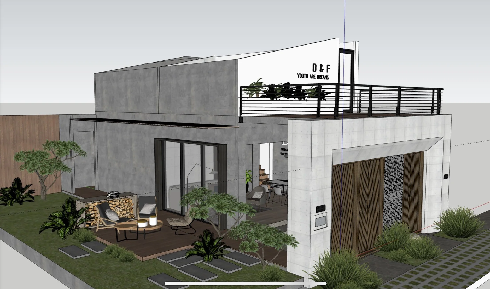

It’s 2 weeks early, but we’ve sent out the New Year Holiday Announcement for our clients. The Dwarves will officially take days off from 1/1/2022 till 3/1/2022. We’ll resume work on Tuesday, 4/1/2022.

Still, the pandemic is happening. Please take good care of yourself and the fam. Wish y’all have a good holiday ahead.

Dwarves of The Year 2021 has finally opened for voting. Please head to <https://airtable.com/shrjyN0nCuWJYksxk> and pick your most favorite Dwarves. The voting form will extend until the end of Christmas - and the result will be finalized a few days after.

Some of us have started to come back to the office. So we decide to pick up some groceries. Got any wishlist items for snacks, drinks & necessaries? Drop it in <https://bit.ly/3yxvu6F>

Da Lat Office is going through its final decision. Really looking forward to have its design kicked off by the next week. Looks like we’ll be having a real campfire up there soon ✔️

Please be well-noted that this is a 3D design, though I desperately want it to look exactly the same after they finished reconstructing 👉👈

