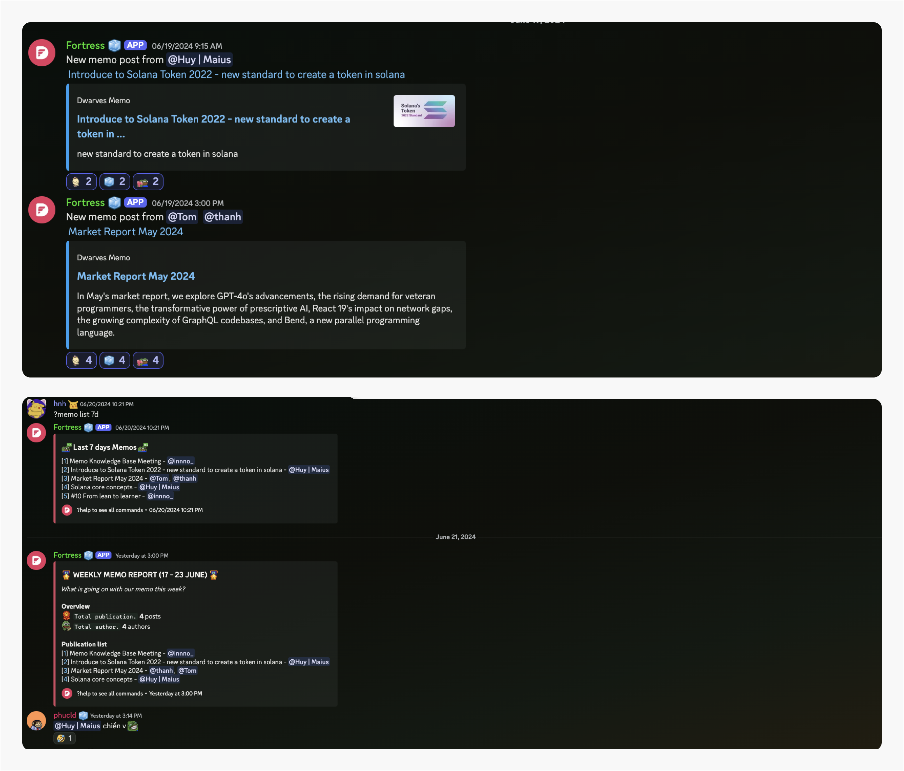
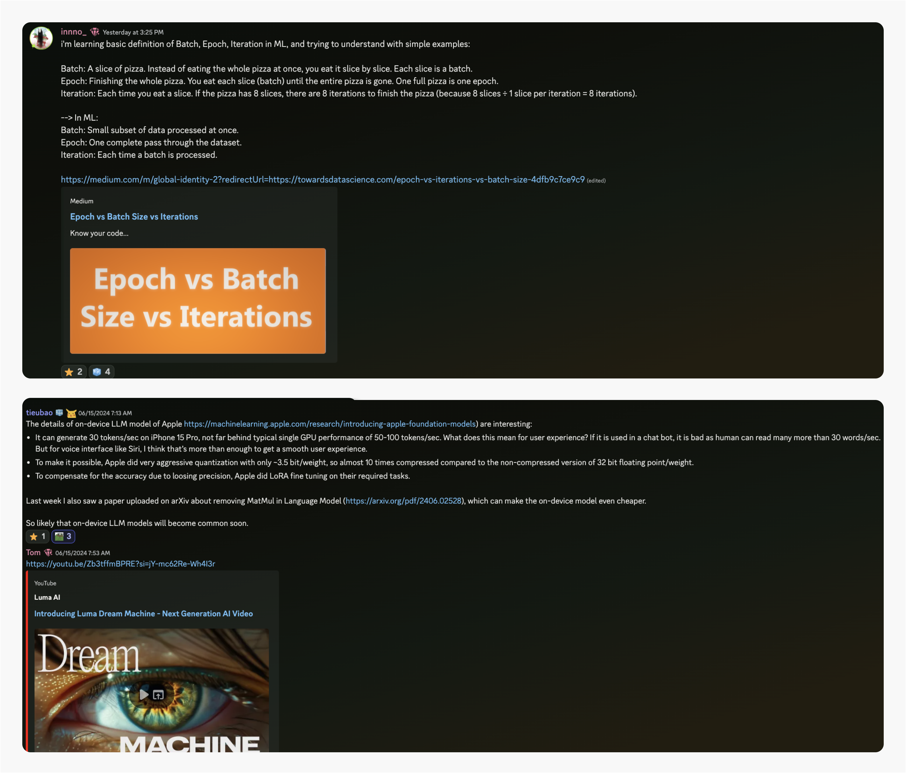
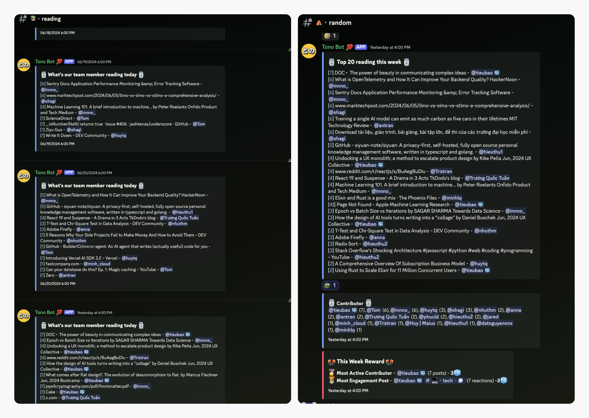
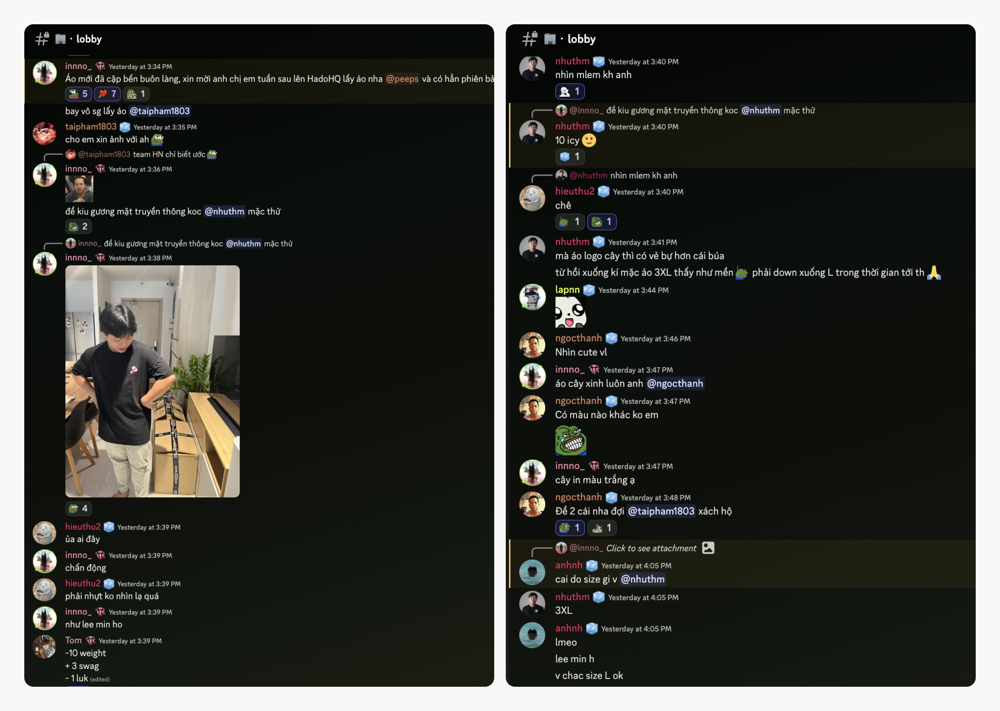
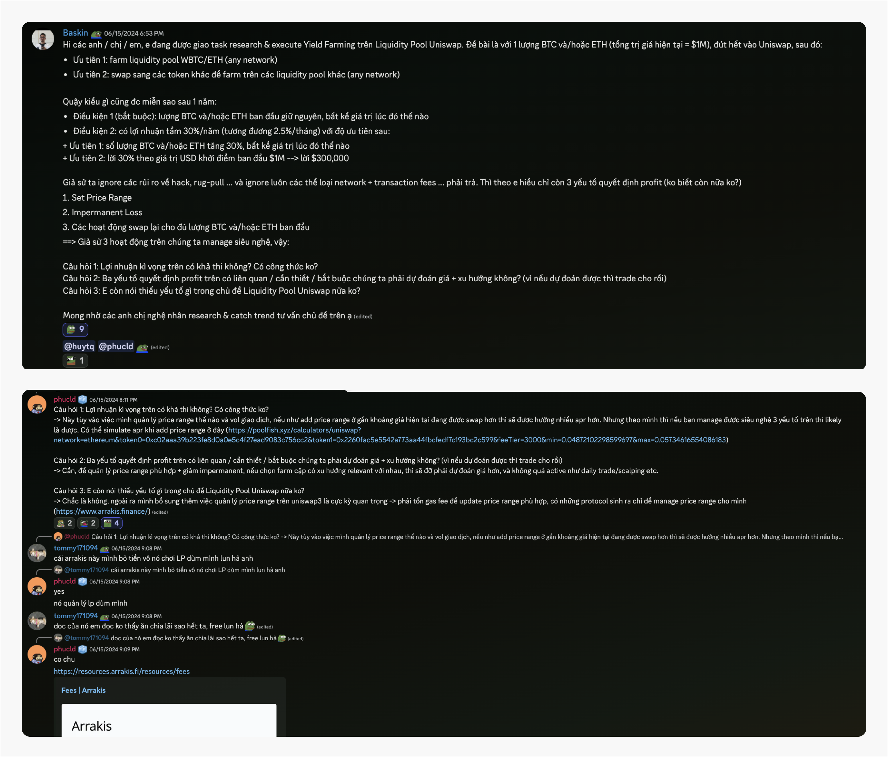
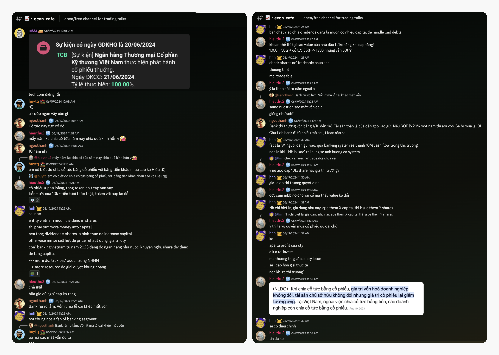
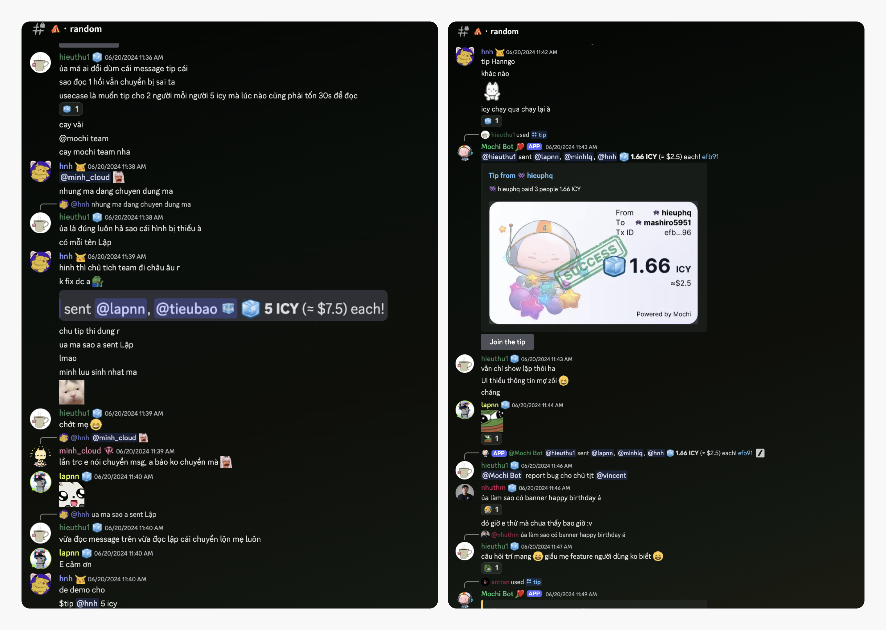

---
tags:
  - weekly-digest
  - memo
  - community
  - reward
title: "Weekly Digest #11: Come grow with us"
short_title: "#11 Come grow with us"
date: 2024-06-23
description: Things are always cooking on our Discord. So grab a virtual seat at our table, pour yourself a cup of something tasty, and read the digest. If you're reading this, why not pop into the woodland and say hello? We'd love to meet you.
authors:
  - innno_
---

Things are always cooking on our Discord. So grab a virtual seat at our table, pour yourself a cup of something tasty, and enjoy the digest.

If you're reading this, why not pop into the woodland and say hello? We'd love to meet you. 

### This week's knowledge bombs on memo.d.foundation
We've got some cool stuff to share from memo.d.foundation this week. Publications have skyrocketed. Big shoutout to @huymaius for the [Dynamic Liquidity Market Maker](https://memo.d.foundation/playground/01_literature/dynamic-liquidity-market-a-new-form-of-concentrated-liquidity-amm-on-solana/)—a new kind of concentrated liquidity AMM on Solana. Also, check out the new [Solana Token 2022 standard](https://memo.d.foundation/playground/01_literature/introduce-to-solana-token-2022-new-standard-to-create-a-token-in-solana/).

Don't miss @minhcloud's guide on [How to talk to ChatGPT effectively](https://memo.d.foundation/playground/00_fleeting/how-to-talk-to-chatgpt-effectively/). You can use `?memo list 7d` to see all the latest posts. 

**Bonus:** you get a 5-15 ICY reward for each publication. Everyone can contribute to memo and hopefully expand on the new topics.

### Rolling out fleeting notes
Dwarves has always been a playground for techies, where learning and sharing go hand-in-hand. We're stoked to see you all playing, learning, and sharing your discoveries.

To keep the momentum going, we're bringing back fleeting notes – for those quick tech insights and discoveries you want to share with the community. Whether it's a hot new tech trend, a clever coding trick, or just something interesting you stumbled upon, we want to hear about it.

Remember to keep it short, sweet, and easy to digest with a clear TL;DR. We've got a monthly pool of 3000 ICY that will be split equally among everyone contributing to the learning activities.

### Tech sharing is heating up
We've seen a surge in tech sharing—seriously, you all are killing it. If you have new findings, just drop them at **💡・til, 💻・tech channels.** Dwarves Rewards is here to support your learning.

### Annual heath check-up reminder
Folks in Ho Chi Minh City, don’t forget to check out the leaflet for your medical exam instructions at [**📌・message**](https://discord.com/channels/462663954813157376/1249591418746306570/1252160647983005706) channel. Team Hanoi, yours are on the way. 

If this month's jam-packed, no worries—you've got until July 15 to wrap up your check-up. Stay healthy and take care.

### Score your style with new tees
A new batch of t-shirts has just touched down at HadoHQ. If you're in sunny Saigon this week, be sure to swing by and grab yours – we've even got a limited-edition design that's calling your name.

And don't worry, our Hanoi crew, we haven't forgotten about you. The team will be sending your shirts your way very soon, so hang tight.

### Can we achieve 30% profit with Uniswap yield farming
@baskin (community member) asked @phucld about the feasibility of achieving a 30% profit by putting $1M worth of BTC and/or ETH into Uniswap's WBTC/ETH liquidity pool, aiming to maintain the initial amount and achieve monthly and yearly profit targets.

@phucld jumped in with some helpful insights: it's possible with skilled management of price range, trading volume, and impermanent loss. He also pointed to tools like Arrakis Finance for managing price ranges and PoolFish for APR simulations to assess potential earnings.

*Pro tip*: sticking with pairs that tend to move together can make your life easier. [Check out the convo here](https://discord.com/channels/462663954813157376/1216788839880724562/1251504848583655515).

### Econ-café deep dive: TCB bonus shares, dividends, and market insights
In the recent 📈・[econ-cafe](https://discord.com/channels/462663954813157376/1216788839880724562/1252821854670946345) chat, our COO @nikki, and team members @huytq, @ngocthanh talked about the upcoming event where the Vietnam Technological and Commercial Joint Stock Bank (TCB) will issue bonus shares.

@hnh and @hieuthu2 discussed how issuing dividends in shares can affect ownership value and market price. They explained that while the overall value of the company might remain the same, the value per share could change, which is crucial for investors to understand.

The conversation also touched on broader banking and market predictions.

### Belated birthday cheers to our dynamic duo
Big birthday wishes to our CEO @tieubao and head of meme @minhlq. Hope you both had a blast and were filled with joy. Here’s to another year of unforgettable moments. Wishing you all the best.

Well, folks, that's all she wrote for this week's digital dispatch. Now go forth and spread those summer vibes like confetti and take a moment to savor the simple joys.
