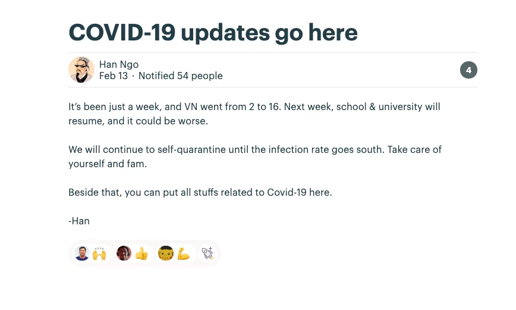
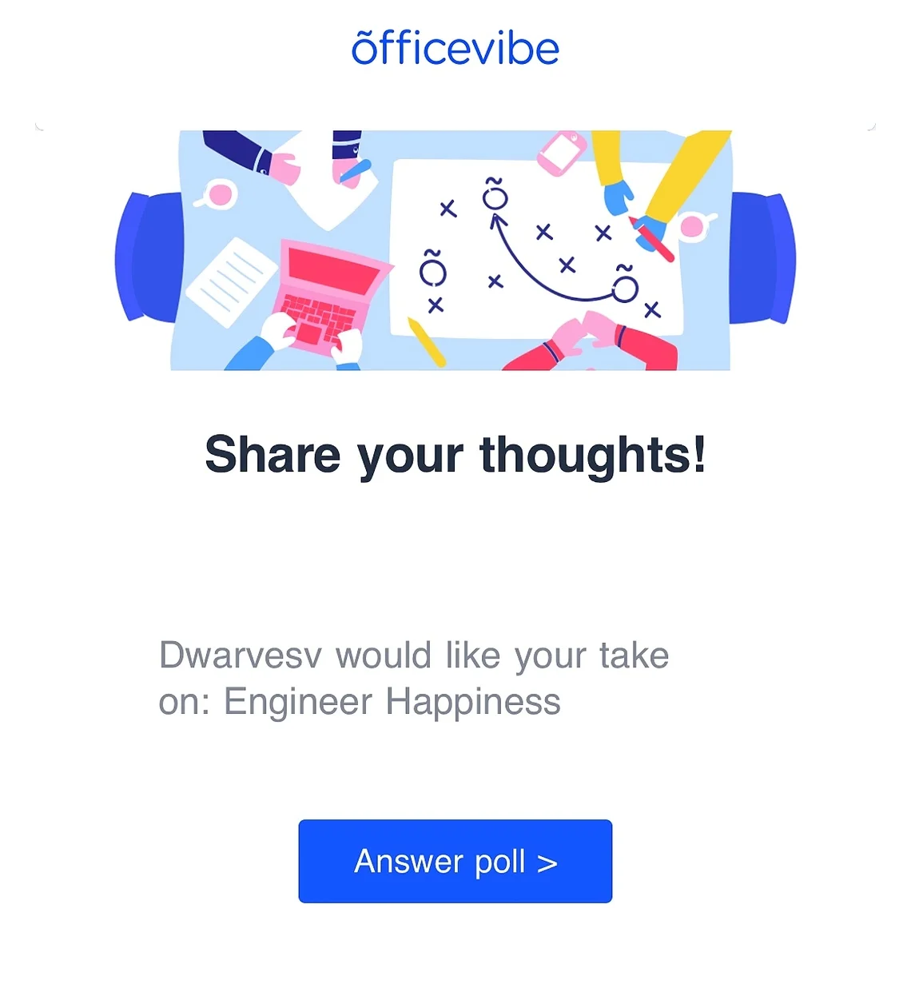
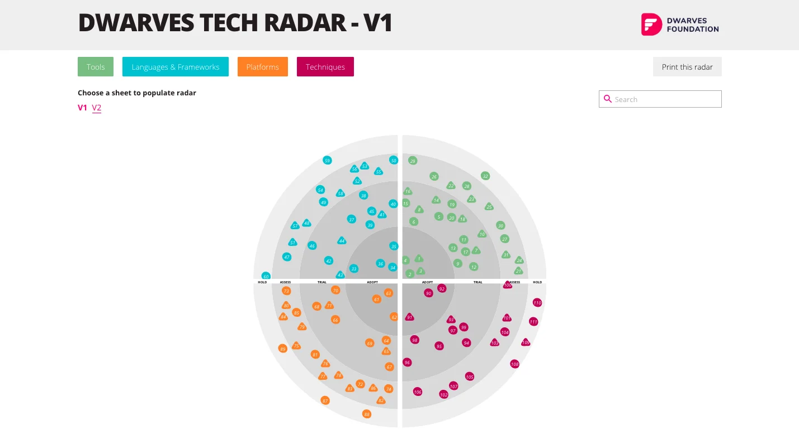

## Take care of your beloved now or get sml later

---

### COVID-19 Outbreak Caution ❗️

nCOV, now has been renamed to COVID-19, has enlarged it's coverage higher recently. The number of infected patients in Vietnam rose from 2 to 16 within a week, and we do have the reason to believe it could be worse once schools and universities resume working.

It has been announced that students in HCMC would continue to take their days-off until the end of Feb. However, please raise your awareness by taking great care of hygiene and avoid crowded places. In the meantime, to keep everyone up-to-date about the latest news, you can follow and drop every article that you may find it helpful and informative for the team in this Message.

Side Note

Last November, through a meeting at our office, the representatives from Nanyang Polytechnic Singapore approached us for a partnership that connects us to the talent pool of universities for internship and apprenticeship resources.

Due to the COVID-19 outbreak, we regret to announce that the potential intern from Singapore will be joining us in June instead of March as expected.

### Officevibe Survey Reminder 📋

As a part of making this firm a better workplace, our Ops team has been looking for more cool ideas to process and turn it into something we can use for our woodland. Officevibe, for example, is a question form in which you can be free to raise your ideas and expectations.

Officevibe is a platform that helps organizations to understand the team better and enhance performance. To speed up the progress and create some impact, please help us check your work email from Officevibe and fill in your answer.

Be creative in sharing the ideas on making our office an exciting workplace. We will try to fulfill your expectations at our best capacity. ✨

### Apprenticeship Program Preparation 📈

The team is making progress on the preparation stage. After the first sprint, we have come up with some mini achievements

- Marketing Channels: Facebook, Skype groups, GitHub and Slack
- Content for Program and Announcement: finished the 1st version with comments and feedback. We're going to need to make it more detailed and twist up a bit in message voice. The finalized version is expected to be done by next Wednesday
- Curriculum: the Dev team has wrapped up the training material and started to perform it in slides. After this step, we will pick out some team members and run it for the trial session.

### Tech Radar R&D Latest Update 💯

The team has finalized the website to sum up Tech Radars's work result. You can find the demo version here . Looks lit, doesn't it? 😏

The FAQ session was also updated on Dwarves Handbook - TechRadar. We're still considering moving this Handbook to GitHub. We will announce this to the team through Woodland Message Board and chase them for further results.

The FAQ of TechRadar defines the metrics we use to validate the topics. Other than that, it explains the reason and the benefit we end up having after then. It's challenging to keep moving alongside the industry, and Dwarves TechRadar is the first step we take to make it more interesting 💪

## YOU'RE STILL THERE?

