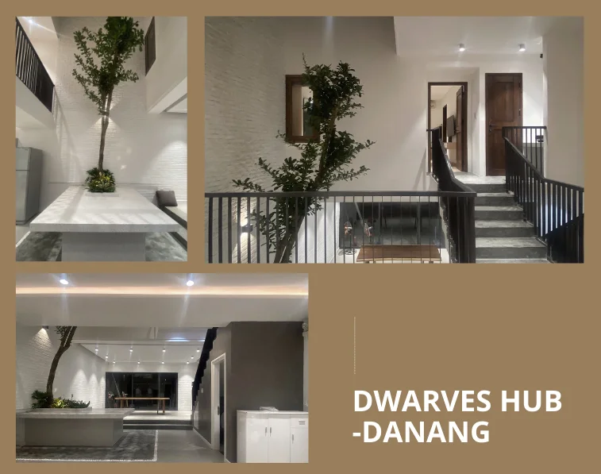

One last week until we close the openings for Apprenticeship 2022. I’ve gladly received some referrals from the team - which have successfully converted into the new Apprentices. It’s amazing, and we look to meet more of them.
Please help sharing <https://careers.d.foundation/apprenticeship-2022> and repost the LinkedIn job for further reaching. Thanks y’all 🤜🤛

Happy to load up more inputs for April Brainery, all from @Tom

- <https://brain.d.foundation/Engineering/Service-based+architecture>
- <https://brain.d.foundation/Writing/Question+tree>
- <https://brain.d.foundation/Engineering/C4+diagrams>
  Last week of April is coming. Submit your notes and get ready for the pool awards. Don’t forget, the weekly Radio Talks are also included as well. Just ping thanh if you have a new topic in mind.

Our Bao Minh Insurance Cards were activated last week. For the list of supported hospitals, please check out DF Bao Minh Insurance: <https://bit.ly/3xzhpa5>

We’re coming up shortly on the claiming process. Our annual health check up is expected to take place in May.

You can stop by our Hado Office to pick up the cards, or we can have it delivered at April Team dinner. Just ping @itsmia or @Thuong

Some shots of Danang Office

If you’re happen to be on traveling mode, swing by Danang office. It’s been redecorated and ready to welcome you guys. Looking good innit

Starting last week, @Hao & @Abbey have joined the next journey of Pod Town and team Dwarves - welcome onboard!

