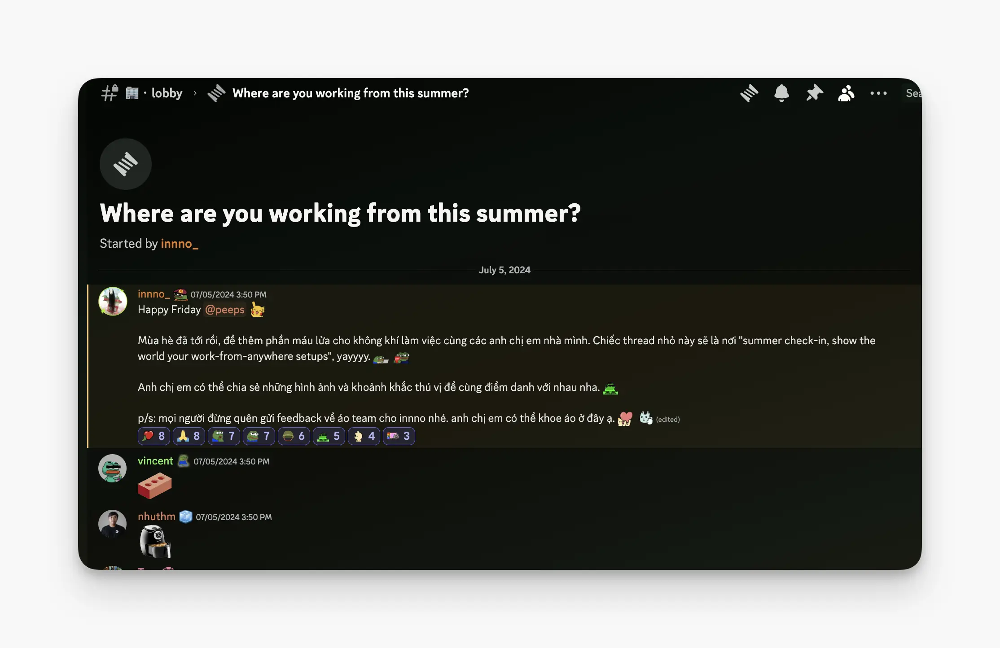
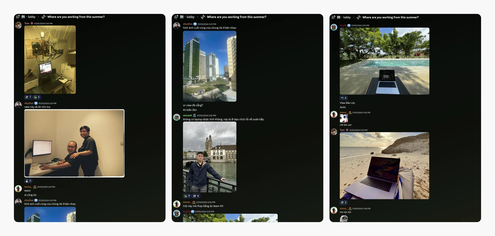
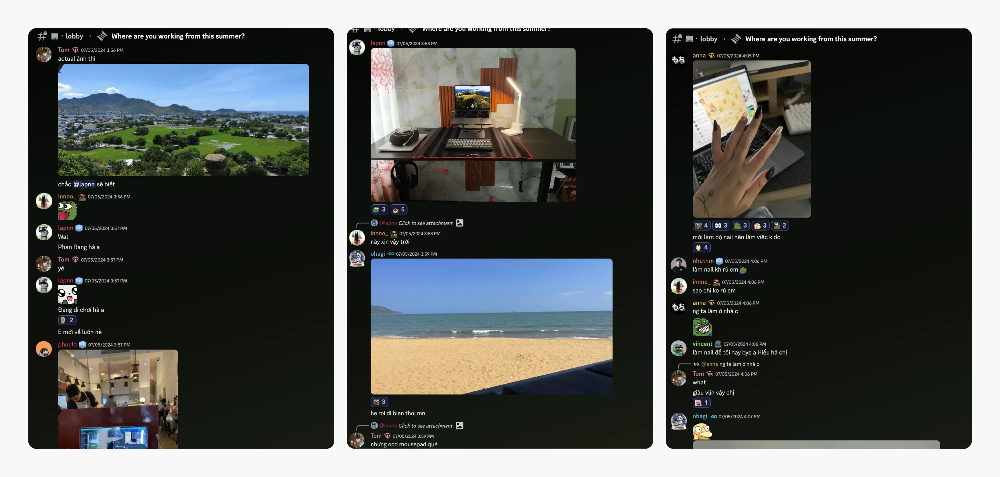
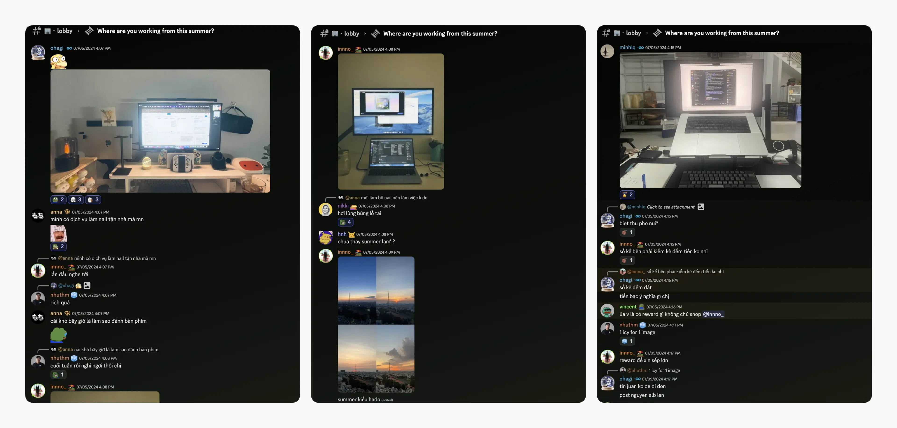
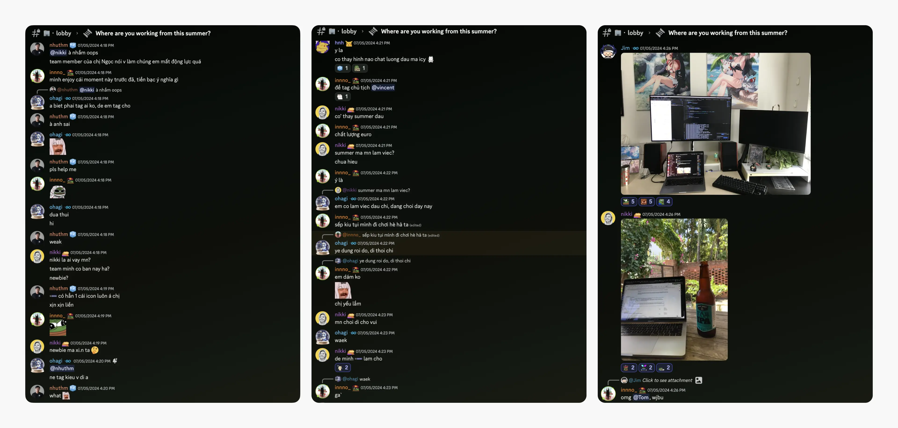
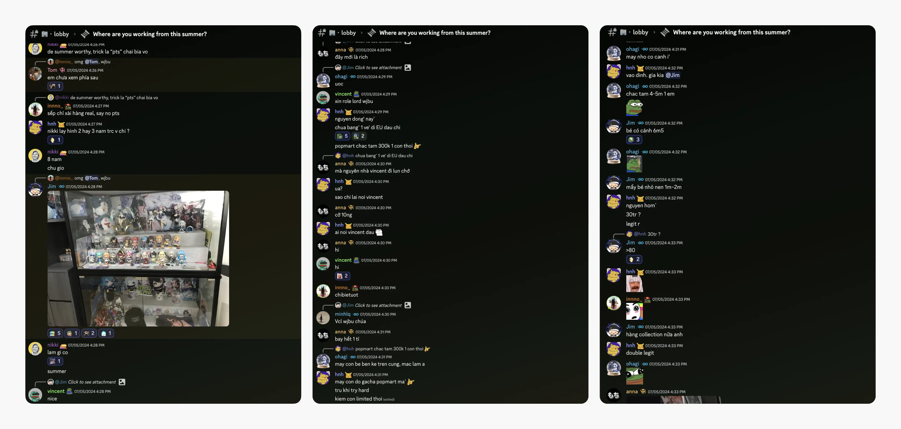
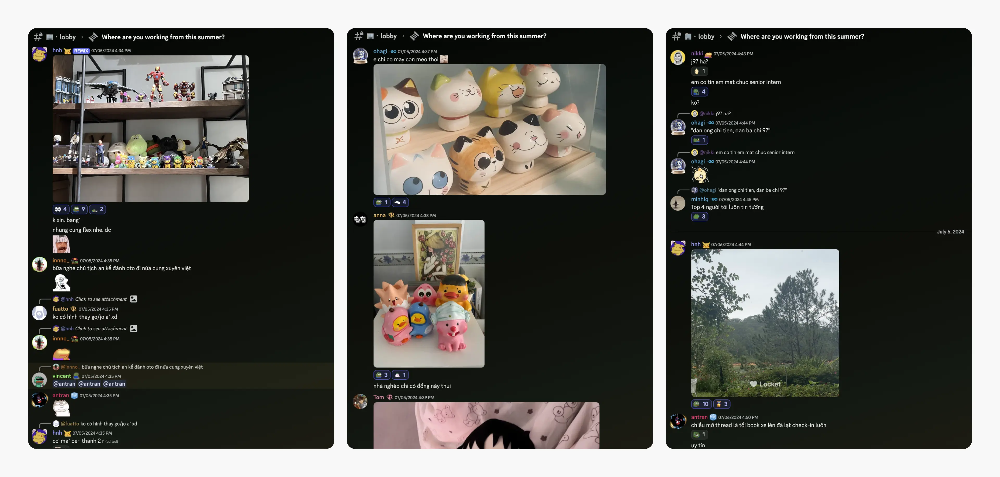

---
tags:
  - memo
  - team
  - remote
  - weekly-digest
title: "Weekly Digest #12: Summer moments - Our team's remote work adventures"
short_title: "#12 Summer moments"
date: 2024-07-11
description: 'There’s something special about bringing people together. Even as a remote team, we connect through shared interests and activities. "This summer, Where Are You Working From?" campaign sparked a wave of fun and connection across the team. Come along as we share the stories of our team members.'
authors:
  - innno_
---

You know, there’s something magical about bringing people together around what they love. It might seem simple, but a lot of thought goes into it. Even though our team works remotely, we have groups for activities like English, Poker, Board Games, Swimming, and Running. 

As I write this memo about our summer moments, there are feelings about the times with my teammates that will last a software engineering lifetime.

Looks like summer vibes hit our team early this year. @vincent kicked off the vibe with a check-in from Switzerland during his 10-day European adventure, quipping, "Does it count if I don't have my laptop? Just taking a quick walk before getting back to coding." His words perfectly capture the balance of work and leisure we strive for, even amidst Europe’s stunning landscapes.

Closer to home, @nhuthm escaped to Danang in early July, where the heat was clearly on, while @tom shared a stunning view of Phan Rang beach. @lapnn, never one to miss a beat, chimed in with local food recommendations and a photo of his impeccably organized workspace. (Perfectionists, beware: you might want to adjust that mousepad.)

Back in Saigon, @phucld fueled his workday with a coffee view at Okkio café, proving that a change of scenery can boost productivity. Meanwhile, @bienvh inspired us all with a suggestion to relocate to the beach or mountains for a refreshing change of pace.

What’s about @anna? She stole the show with her vibrant new nails, courtesy of at-home nail service, joking, "Now the challenge is typing." Her playful spirit and unique flair bring a spark of joy to our team.

Key members at HadoHQ shared snapshots of their summer office views, complete with stunning sunsets reminding us that no matter where we are, we’re united by our shared experiences.

@minhlq, currently in Lam Dong province, shared a peek into his family's business operations, showing how work and personal life can coexist.

Our COO, @nikki, even joked that the team should enjoy their summer travels while she handled everything back. She shared a photo from what looked like a homestay near the beach, complete with a good beer. "The trick is to 'Photoshop' beer bottles into the frame," she said, perfectly capturing the vibes while balancing responsibility and relaxation.

Just when we thought the fun was winding down, @jim blew us away with his anime-themed workspace, complete with a collection of Pop Mart anime figurines worth a staggering 80 million VND! (Some of them are even limited editions.) He estimates that each figure costs around 4-5 million VND. Now that's dedication.

Team members @hnh, @bienvh, @anna, and @tom also shared their own impressive collections, showcasing our team's shared passion for all things anime.

But wait, there's more. @hnh surprised us with a weekend check-in from the peaceful Binh An village in Da Lat. Working by the serene Tuyen Lam Lake sounds like the ultimate productivity booster. Meanwhile, @minhlq's location in the highlands seemed a bit more mysterious.

Like, someone might join a group for a specific anime but not another. That’s where our different servers or “guilds” on Discord help. They let people find their smaller communities within the larger team. This way, everyone can connect with others who share their interests. In these moments, big and small, we find the essence of who we are as a team.
