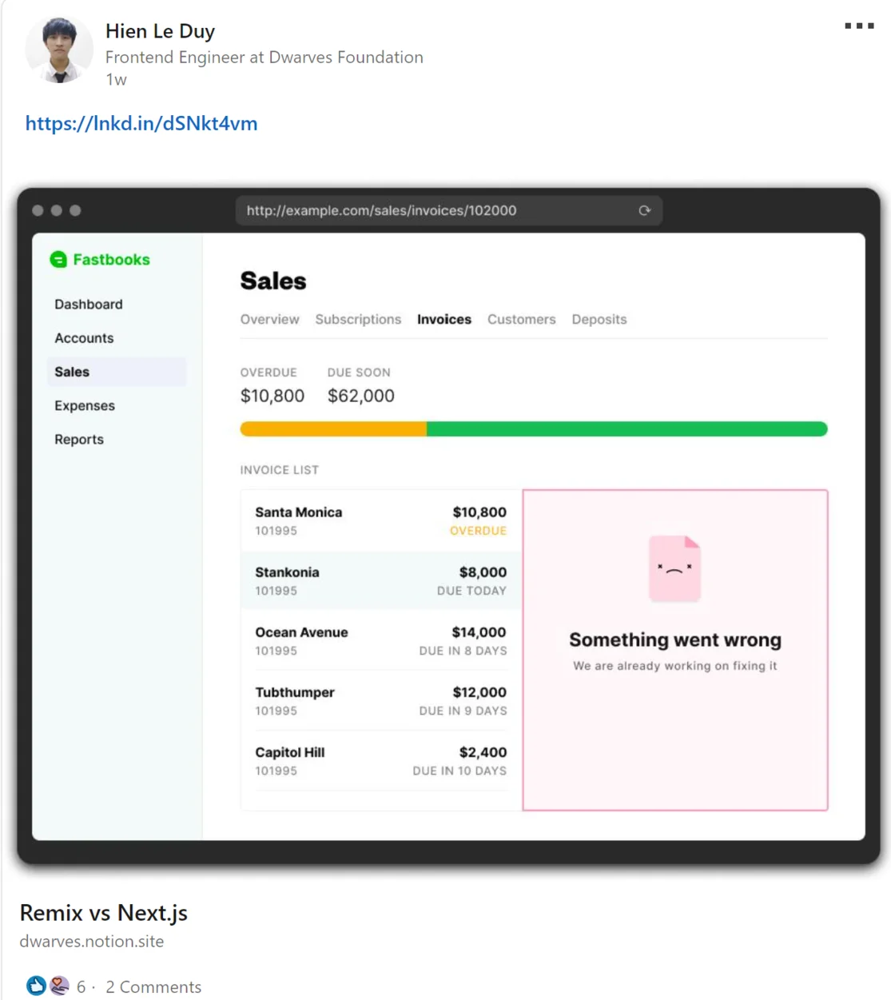

### Apprenticeship updates

For those who missed our workshops, you can stream at: <https://bit.ly/3GS4N0p>

Buck up and mark these date below for our upcoming workshops

- Apply basic DevOps: Containerized, Docker, Continuous Integration, Continuous Delivery: June 13
- Industrial movement - Blockchain Technology & Decentralization: June 15
- Teamwork - Recognition: June 17
- Software testing: June 20
- Product Quality and Delivery: June 22
- Navigate your career: June 24
  Please make your reservation on time @intern and @apprentices.

### Find your radio talk at Memo

The first few transcripts of Radio Talk - our weekly tech-sharing, have just been published. Every week, we'll summarize the highlights and share them to those who want to keep up with us.

- React 18: <https://bit.ly/3NTpawt>
- Remix versus Next.js: <https://bit.ly/3Mlb8CO>
  In Dwarves, we encourage peeps to proudly share their work. And in case you forget, it’s June already and we’re calling for new month brainery contribituors.

This week, we’re having the last Apprentices @Nguyen Hieu Nghia onboard with us. As to express our welcome to newcomers, a welcome kit had been shipped to you on Team Dinner last Friday. Who haven’t got it? Don’t worry, @thuongptt will send it to your bed.

We’ve had May All-hands meeting last Friday. We’ve upload a detailed sum up in here in case you missed it: <https://bit.ly/3xfOeaC>
