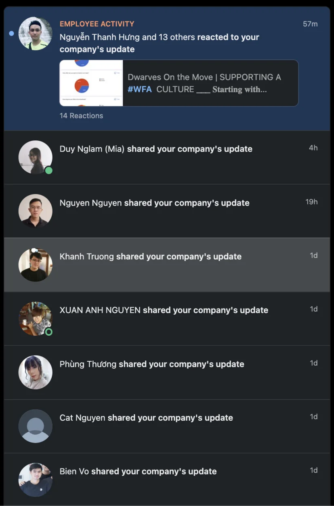

### Brainery submission

- Happy to load up more up-to-date crafts. Congratulations for a job well done.
  Conway's law <https://github.com/dwarvesf/brain/pull/26> by @thanh

Html inert <https://github.com/dwarvesf/brain/pull/27> by @thanh

NFT fractionalization <https://github.com/dwarvesf/brain/pull/29> by @khacvy

- Two weeks left to wrap up June Brainery submission so speed up and earn rewards for every qualified submission.
- In case you don’t know, it’s open for non-Dwarves who are eager to learn in our server.

### Annual health checkup result

- As @Gthan announced in #lobby, your health checkup result will be sent through your email by next week. Finger cross, everyone is in their good state.

### Have fun with our weekly minigame

- New things in town - we got minigames with a small prize happening every Thursday on our server for @everyone to get to know one another and have some cool-off time.
- Stay tuned and even better tell your friends to join. More people more prizes.

### Dwarves ambassadors

- First generation of Dwarves ambassadors are here. Can not thank @itsmia, @khanhtruong, @huytq, @lapnn, @trkhoi, @inno, @thinhlq, @vincentz, @antran, @nikki, @haongo, @tom, @cat enough for lending their hand boosting our social media exposure this week.
- Appreciate your support, we’ll work out a reward system for y’all soon!

And don’t forget to fill out your feedback survey <https://bit.ly/3mQYMYG> then @apprentice and @intern.

