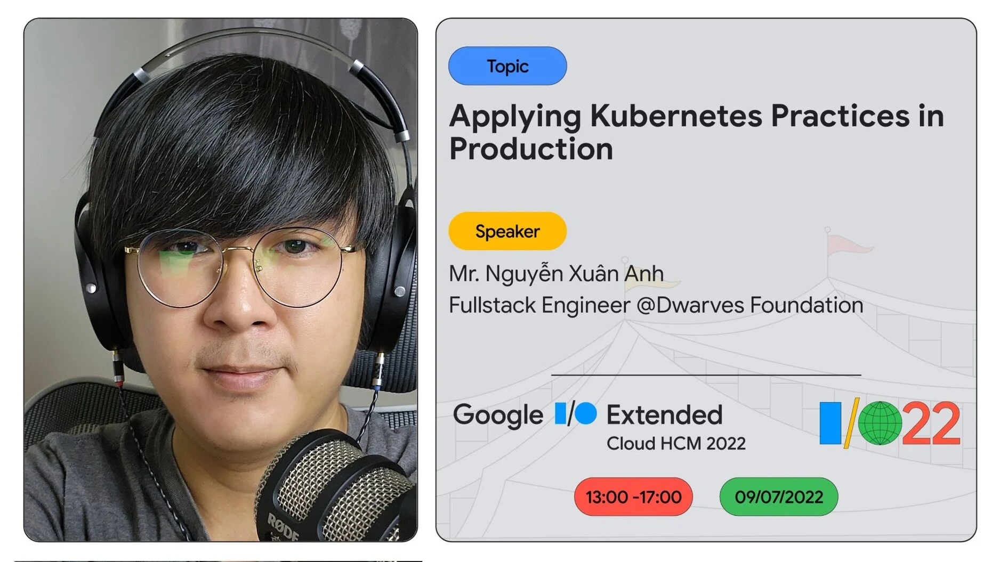

### More Dwarves join the brain team

Peeps, have you picked up reward from last month yet? In the mean while, Dwarves start looking into new topics

- Frontend: ViteJS Native Modules <https://github.com/dwarvesf/brain/pull/43> by @namth
  Hopefully to expand more on team size & new topics. We're calling for July input on Web3 and DeFI. Just give @thanh or @Tom a ping and they'll help set you up.

### Performance Review

For those who haven’t gotten your peer review yet, we’ll come up with a schedule in no time. Ping @thanh or @thuongptt if you have any question.

For the referral cases lately, we’ll be sending a confirmation note on the effective referral bonus. If you’re unsure on your referral case, just ping @itsmia. Other than that, we’re glad to proceed if you got any potential CVs. Just open an 🎫・inquiry-ticket.

### Meet @Tom at the next Google I/O Extended Cloud HCM 2022

We’re proud to have @Tom as one of the guest speakers at Google I/O Extended Cloud this year, giving his insight on Applying Kubernetes Practices in Production. So @peeps, swing by and give him a support at:

- Saturday, 09/07/2022, 13:00 - 17:00
- Location : CirCO Building, 384 Hoang Dieu, ward 6, D.4, HCMC
  @nhuocnam will be your contact point on this.

Thanks for spending your time. It means a lot to us and Tom himself ♡

