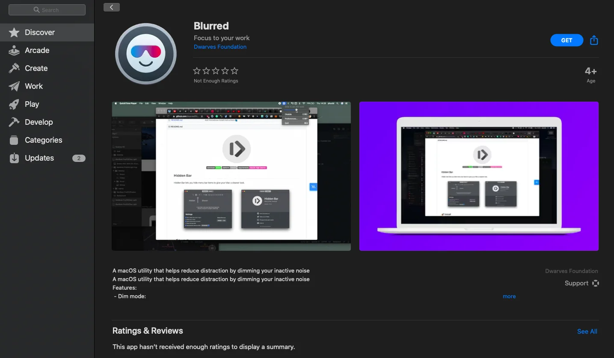
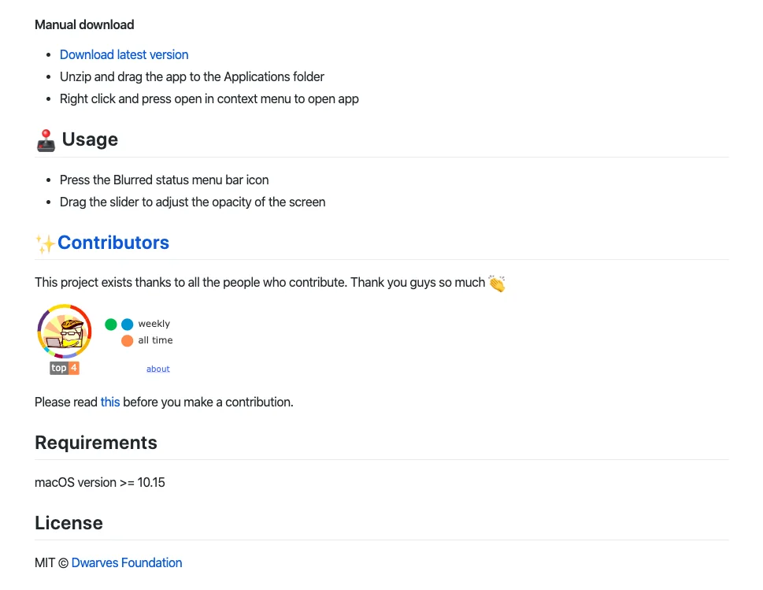

## DF Latest: What Are We Up To?

---

### Product & Design Topics 📌

We always consider curiosity as a culture to shape up the team. That spirit helps us strives for new ideas and leads to breakthrough initials.

As a move to empower that, we are opening an area for Product, Design, and Philosophy study - a place where you can pitch your latest discoveries on those topics and open the discussion for the team on different aspects. It can be all posts as comments, message boards, the Campfire - or anywhere you feel your message can be best delivered.

You may also find some examples of a.Han at this Message Board. There were a lot of raised hands to join in the game. Grab your seat for the cool products!

### Dwarves Foundation - Engineering Team Meeting ⚒

February has come to an end, and here we are with another Engineering Team Meeting. The meeting went for an hour with a real emphasis on one key point - Craftsmanship, the theme that reveals our working motto, and how we hone it to the utmost level.

That theme walked us through 3 main activities

- Tech Radar: after wrapping up the 1st cycle with some outstanding topics, there have been some feedbacks on topic picking and the goal for our 2nd cycle. For each qualified topic, we will create a Facebook event and invite engineers from other companies to listen to your presentation. It's time to go to the big ocean.
- Basecamp Restructure: as you may hear, Basecamp is no longer divided as departments. We believe interest is what connects people, and that's why we use that to make sure who's still in the crew. This aims to encourage our Dwarves to engage more in Engineering related things and make Basecamp our truly Foundation.
- Apprenticeship Program: a tailored program for juniors devs to level up the game. Next month, we will conduct an internal trial to validate the whole thing before going public.

### Dwarves Design at a Glance 📢

Design Team is boosting their skills with many cool things to work on, by applying Design Thinking on struggling SMEs to break out their current business cases and propose the solutions.

Recently, the team is working on 2 cases: Finhay and Viettelpay. The main work will be to enhance the UI and optimize its designing flow to improve user experience. Other than opening the discussion about potential solutions, this assists the team in digging deeper into the Fintech's business model.

### MacOS - Blurred App 🖥

Another great work from our MacOS Team: Blurred - A macOS utility that helps reduce distraction!

Using single dim mode for the main screen and parallel dim mode for multiple screens, Blurred helps user to focus more on work by dimming the inactive noise. You can also find the detailed description and usage at our GitHub as well.

