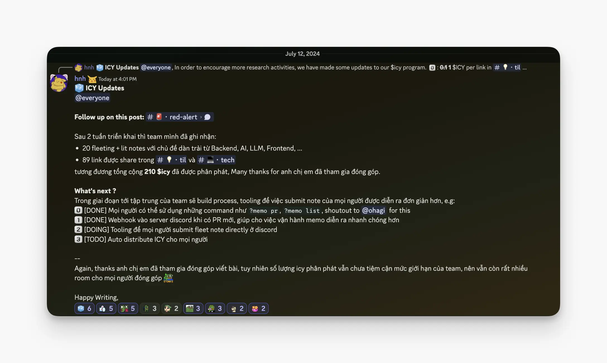
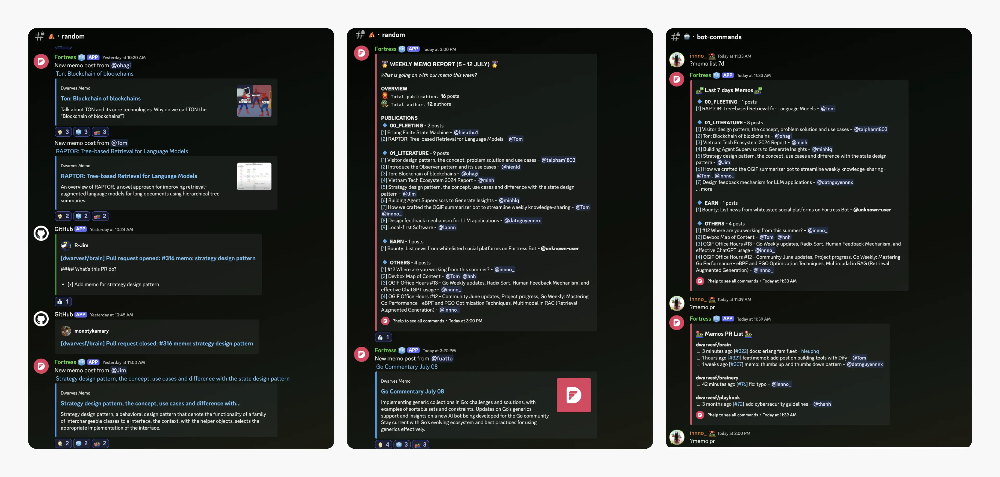
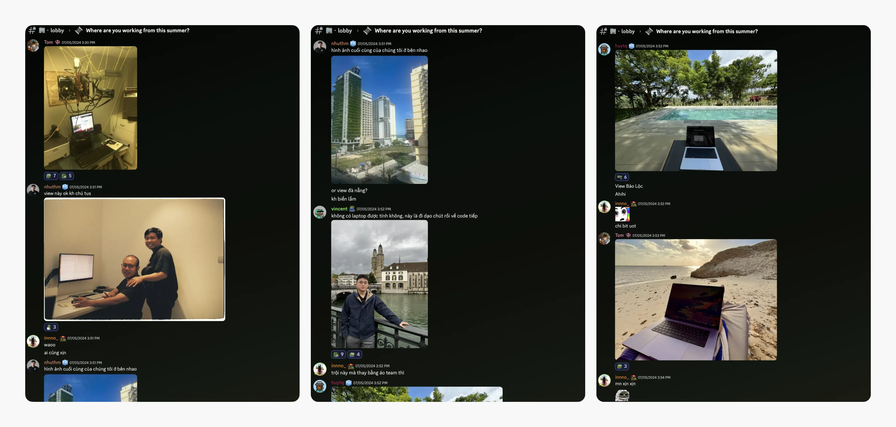
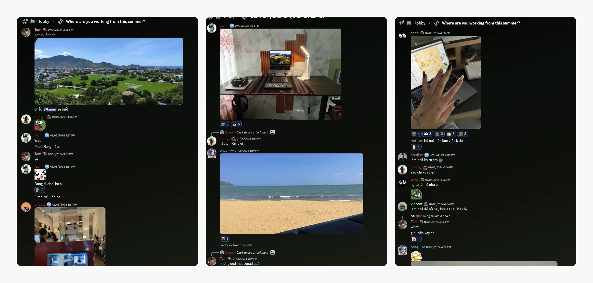
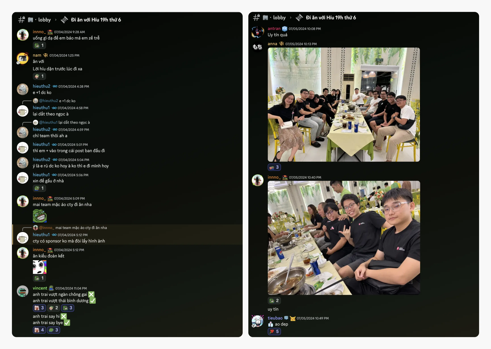
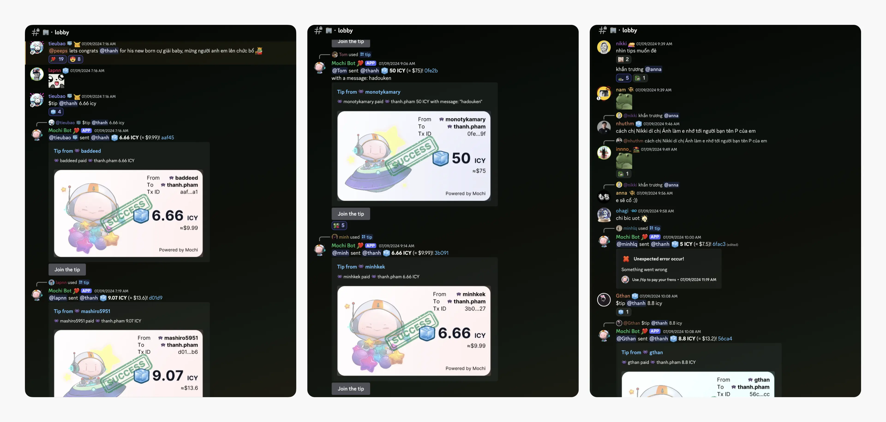

---
tags:
  - memo
  - team
  - remote
  - weekly-digest
title: "Weekly Digest #13: More than lines of code"
short_title: "#13 More than lines of code"
date: 2024-07-20
description: "Welcome to this week's edition of our roundup, where we highlight the moments that make us more than just lines of code. This week, we're jet-setting around the world with our team's summer adventures, introducing new memo features, cheering for a beloved teammate's new chapter in the US, and celebrating new born. From beachside workspaces to anime figurine collections, we've got it all."
authors:
  - innno_
---

Welcome to this week's edition of our roundup, where we highlight the moments that make us more than just lines of code. This week, we're jet-setting around the world with our team's summer adventures, unveiling new memo features, and cheering for a beloved teammate's new chapter in the US. From beachside workspaces to anime figurine collections, we've got it all.

### Memo submission and boosting team contributions
In the upcoming phase, the team will focus on streamlining processes and developing tools to make memo submission easier for everyone. Here are two ways we're helping you stay up to speed:

- Use commands like `?memo pr` and `?memo list` to check out the latest memos. (Shoutout to @ohagi for this!)
- Receive webhook notifications in the Discord server for new PRs, speeding up memo operations.

We're also introducing tooling for submitting fleet notes directly on Discord and automating the distribution of ICY to everyone. However, the amount of ICY distributed is still below the team's limit, so there's plenty of room for more contributions. Everyone can join hands.

### Summer snapshots: where our remote team works
This summer, our team's "Summer Times, Where Are You Working From?" updates took us on a virtual journey around the world. We saw it all: Swiss mountains, Vietnamese beaches, killer nail art, desks so neat they spark joy, anime havens, and even our COO chilling beachside (while "working," of course). 

These snapshots of our team's lives—filled with personal flair, with a mix of personalities and passions that make our team so rad, no matter where we're working from. 

[Check out the full recap of our team's summer escapades.](https://memo.d.foundation/updates/digest/12-where-are-you-working-from-this-summer/)

### A fond farewell and best wishes to our teammate Hieu Phan
As you all saw in the lobby last Friday, we had our final team dinner with @hieuthu1 before his move to the US. The memories we made together in Vietnam will always stay with us, even as he embarks on his new journey under American skies. 

He was always a caring presence at Hado, a fantastic cook, and a friend who joined us on afternoon walks after work, always connecting everyone on the team. We wish you all the best on your new adventure and don't forget to call us.

### Celebrating the newborn
Congratulations are in order for @thanh, who recently welcomed a new addition to his family. The whole team is overjoyed for him and his partner as they embark on this exciting new chapter. There's been plenty of well-wishing and baby-related chatter around the team.  

Of course, with such happy news, the playful banter has already begun: who's going to be the next to share a baby announcement? We'll have to wait and see. 

In the meantime, we're sending Thanh and his family all the best as they navigate the joys (and sleepless nights!) of parenthood.

From tech tips to tiny toes, this week's digest reminds us that we're more than just a team. So, whether you're sharing a memo, a vacation snapshot, or a life-changing announcement, remember: that we're here to celebrate it with you.  
