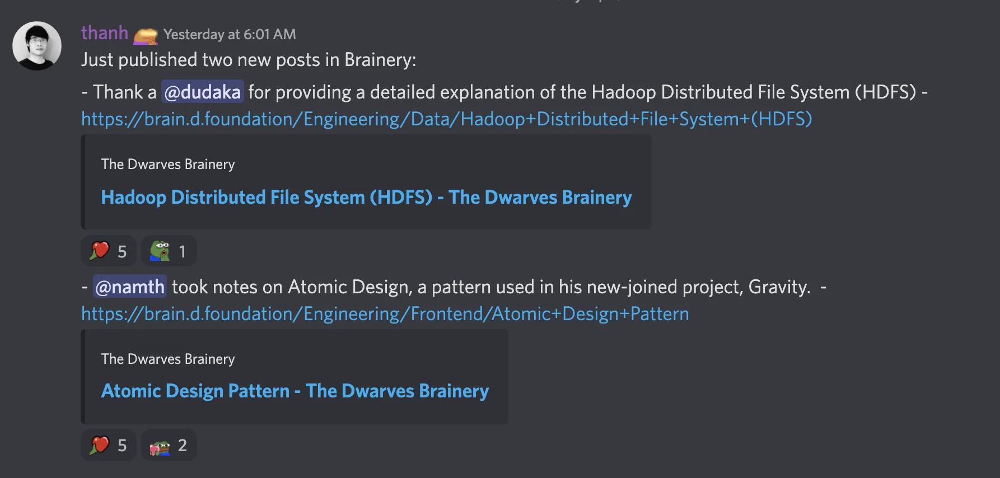

### Tech Event l AMA with @thanhlv - Solution Architect at Google

Last Wednesday marked our first ever tech event.

- A few sum up note was posted in our Facebook, hops in <https://bit.ly/3OpuuI4> for more details.
- For a full version, visit our <https://youtu.be/qpesPDdK4So> for session recap.
We just wanna thank y’all for taking part in and appreciate @thanhlv for his amazing Q&A. Looking forward to our second session.

### Learning culture game is going strong

Release two new officially published articles this week for July Brainery:

- Frontend: Atomic design pattern <https://brain.d.foundation/Engineering/Frontend/Atomic+Design+Pattern> by @namth
- Data: Hadoop Distributed File System (HDFS) <https://brain.d.foundation/Engineering/Data/Hadoop+Distributed+File+System+(HDFS)> by @dudaka
Where are my Web3, blockchain fellows? Don't hesitate to share your learning curve with the rest of the team. We always welcome new input to grow together.

### Book a slot for your PR

The annual Performance Review has been on going this week. To schedule, please ping @Thanh to reserve the date. Constructive feedback and achievement recognition is what we hope you learn from it.

### Paid our Chalet a short visit

Dwarves Mountain Hub has been ready to welcome you. Built by Dwarves & opened for @everyone. Drop us your schedule in #visit-dalat-chalet ⛺️

Note: June insurance card batch has been sent to those who passed probation or registered for Bao Minh insurance card. Expected to meet you in the next 2-3 days.

