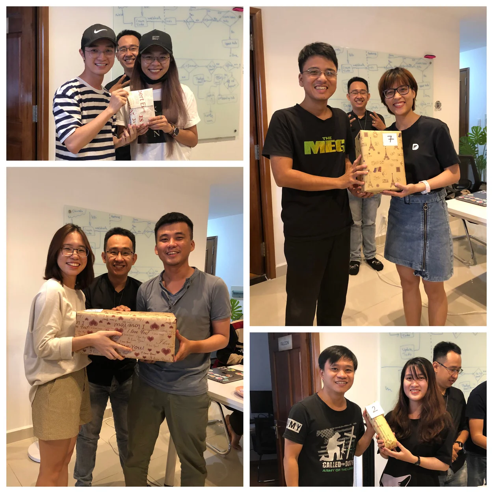

## This week's highlight? Happy women's day

---

### Basecamp Restructure - What's the Difference? 🧩

It's been a week since we have our Basecamp reorganized. Here are some aspects you may find interesting looking back:

- More interaction amongst the team. The two most hooked questions must be "Seen anything recently that others on the team would find interesting," and "Today I Learned."
- Frequently updates on app/ product ideas
- Regular discussion on Tech topics
  It's good to realize these amazing first changes. Keep up the good vibe! ✨

You can download and enjoy the iOS version here 👈

### Bao Viet Insurance 💳

The insurance cards were delivered to our office last week. It'll be nice if you can give Van a ping beforehand, she'll make sure the card is ready by the time you need.

### Women Day Treats 🎁

Though remote work has been actively followed lately, we still manage to create some fun at the office on this special day. The team has prepared a small surprise for our Dwarves sisters. We hope it finds you well! Happy 8.3 🎉

## NEW HIRES 🎗

Last Monday, we were delighted to welcome some new Dwarves to join the team!

- Quynh Le: Quality Assurance
- Lap Ngo: Frontend engineer
- Giang Tran: Frontend engineer
  It's good to have you guys on board! Thanks for helping scaling up the crew and may we share many great moments together! 💪
