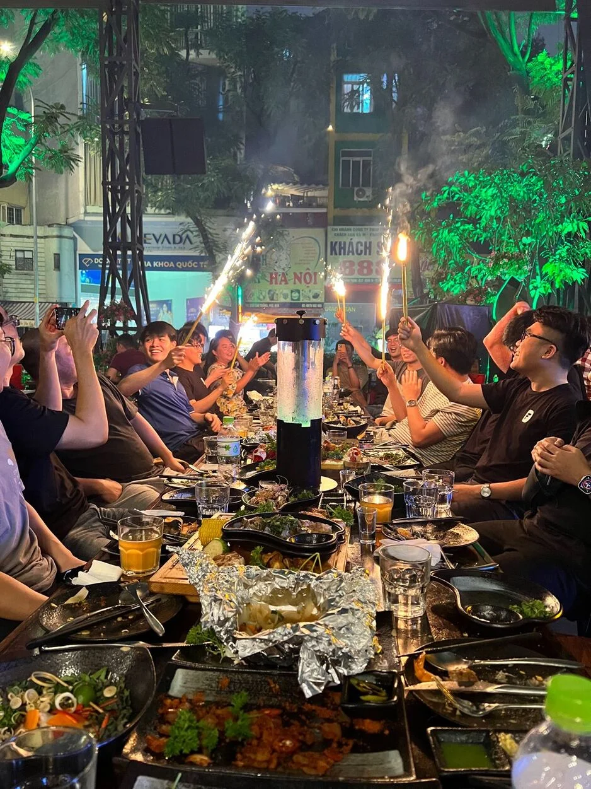

Resuming project changelogs

- Not a lot of companies provide clients with weekly changelogs. Dwarves use changelogs to summize the work we deliver and also to get frequent feedback, so we can be better. Starting now, every project is required to have weekly changelogs.
- Changelogs are drafted by team leads. So leads, in case you’re not sure on how to draft a good changelogs, feel free to open a help ticket here on Discord for assistance.

New partnership

- We had our newest development partnership. Originally, we worked with this partner to redesign their website using Webflow.
- A new client decided to work with us to develop their software as well. We’re looking at a team of 3 BE and 1 mobile (react native). Khoi Ngo joined the project last week, more to come!

Wins to celebrate

- Tuan Pham passed his probation! The team are happy about having him onboard.
- Our ecommerce team definitely got their fair share of hustle. With their 120% effort, we helped a partner launch their US app for customers and v.3 website for business. We appreciate the hard work Thanh Pham, Huy Tieu, Khac Vy, Tai Pham, Phat Ha, Dung Nguyen.

The asks

- If you know any react native dev who looks for contractor work, please lead them to us. There’s a referral bonus on the horizon.

Oct team dinner

Last week team dinner is on fire, like literally. See, it’s good to see these shy souls get comfortable and just have a damn good time!

