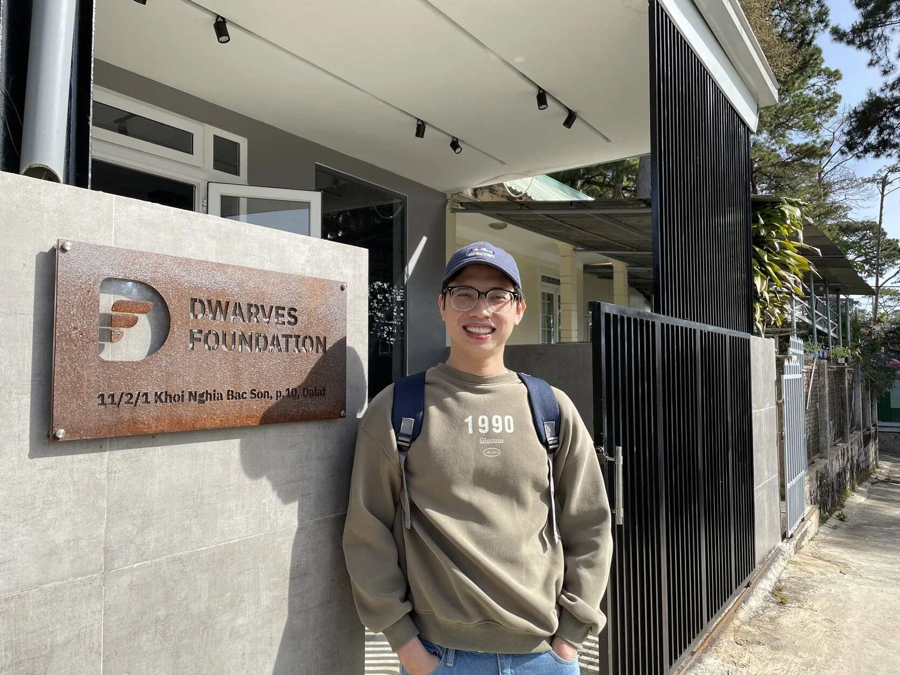

NEW YEAR HOLIDAY
Please be aware of our upcoming New Year with details as below:
☆ Close date: Saturday 31st December 2022 to Monday, 1st January 2023
☆ Resume date: Tuesday, January 3rd, 2023

COMMUNITY EARN
We do this so to encourage everyone to learn new things and/or engage with the rest of the team. Our quests are officially public, and there’s ICY to be earned for all the quests.

Have a look at (<https://earn.d.foundation>). There are multiple activities going on and anyone is welcomed to join hands.

TECH EVENT
Thank y’all for taking part and we greatly appreciate @hieungo#4878 for his amazing session at the latest Tech Event.

- ICYMI: <https://youtu.be/8z33k8A-97g>
- Field note: <https://dwarves.notion.site/The-Key-of-Security-Mechanisms-in-Tackling-Cyber-Threats-7359cee9fa504def81159f6985edf044>
  Ping @innno\_#0801 if you have any suggestions & feedback for our events next year.

WORLD CUP WRAP-UP
Well, after 64 matches, Sports fans all across the Dwarves network and communities united in the @world-cup-2022. Qatar 2022 World Cup finally reached its crescendo, we really appreciate @namnhce#9999 for hosting the show.
Now we have a budget of >16M for some good-time gatherings!

DALAT OFFICE
Looking for a short vacation, or new year's eve out of town? Sweet reminder, it’s the perfect weather to visit our Dalat Office. It’s open 24/7/365. The best way to start 2023, is a campfire at night, shall we? LGF @peeps

p/s: This is the last working week of 2022, strike the lucky pose from Dalat. Say cheers with @chip#1094 (￢‿￢)

