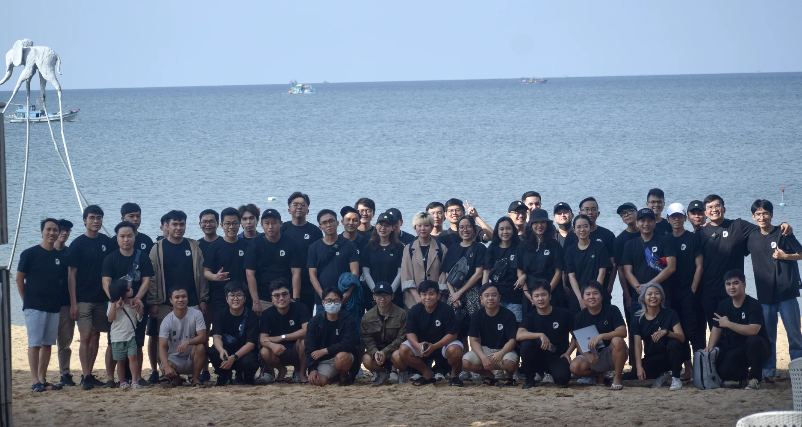

# 145 - 2022, A Year Gone By

As 2022 comes to a close, take a moment to look back, reflect, and celebrate all the moments this year that challenged, inspired, and enabled us to grow. So many memorable milestones that we've enjoyed, @peeps

DOTY 2022 and WIN of the Year have officially closed. The results will be announced soon.

ENJOY YOUR NEW YEAR HOLIDAY
We will have days off from December 31, 2022 to January 2, 2023 and resume work on January 3, 2023. Wish you a happy holiday with family, stay safe and stay sparkling.

DECEMBER ALL-HANDS MEETING will take place on Friday, January 6th, 2023, at the same time as our Year-end Party. We look forward to seeing you there and having a great time together.

LEARN IN PUBLIC
Wrap up this year, with many untold stories in our learning journeys. Give a big thank you to @monotykamary#6285 for loading and managing all the brainery notes and contributions throughout the year.

Visit December's latest notes: <https://brain.d.foundation/Latest+Notes>

TEAM UPDATE

- @hienld#3856, @hieuvd#4261 have joined Neutronpay team. A perfect lineup that makes the game strong. Welcome onboard and keep up the good work, mate.
- @taipn#6071 has offboarded Droppii team, we cannot thank you for you being hard work. You did great a job, buddy.
Thank everyone for such a rewarding year. All the best from Dwarves. ＼ (＾ ∀ ＾) メ (＾ ∀ ＾) ノ

