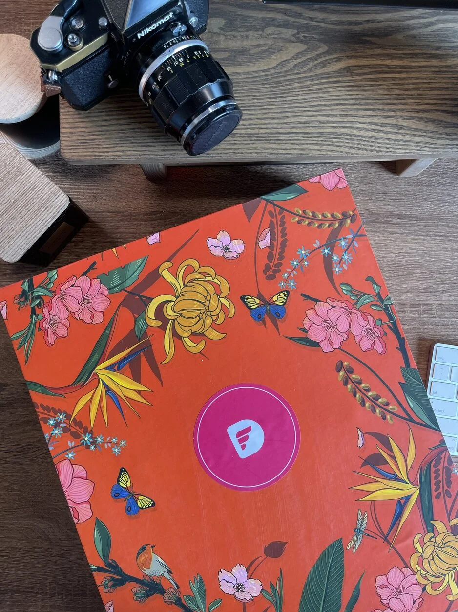

# 147 - Happy Tết Con Mèo

Here's to a brighter and better 2023, @peeps. We're in the heat of Tết Con Mèo, by the way, folks are getting a bit busy ahead before celebrating a New Year's Eve. So let's touch on what we've been up to date.

LUNAR NEW YEAR SCHEDULE
Please take note the day off our Lunar New Year Holidays 2023
○ Close date: From Friday 20/1/2023 - Sunday 29/1/2023
○ Resume date: Monday 30/1/2023

Also, The Ops team has delivered the Tet Holiday Gift set to you with great excitement and anticipation. As soon as it reaches your doorstep, be sure to check your phone to confirm the delivery. Surely all of us are looking forward to the New Year.

DWARVES FORTRESS

- Fortress will be used to record the company's data later on, which includes your feedback, engagement, survey results, and performance review, so keep that information up-to-date: (<https://fortress.d.foundation/login>)
- Please log in with the company's Google email account. Make sure to scan through your personal information is correct after logging in; if the data needs to be updated, you can go to the Profile section to edit any necessary changes.
  PROFILE TEAM PHOTO
  Don’t forget the deadline to submit your new photo. If you are not able to take the photo by yourself, let the communication team know on #message-board and we will coordinate the photoshoot session at our hubs (Hanoi, Danang, Saigon).

CHANGE EMAIL DOMAIN
For more customization to the setup. You change the email for using team Notion and Basecamp by @d.foundation to keep your personal email address separate from any team-related activities.

A LOOK BACK at Forward Engineering in 2022 was published on Memo and Social Media and it was met with great enthusiasm by the team. We’re really proud of how all the continuous improvement initiatives have turned out since then.

Explore the most highlighted and dominated of the year: (<https://bit.ly/3Zui1cQ>)

TEAM UPDATE:

- Welcome @KhÁNH#4523 be a new community team member to get more engagement on Dwarves Network.
- We’re hiring for upcoming projects, especially Senior React Native with experience in Frontend development for both web and mobile. The full JD can be found at (<https://careers.d.foundation/>). If you have friends to refer for a referral bonus, please send an email to <spawn@d.foundation>.
  p/s: Let’s experience cheerful and happy days with the fam to prepare Tet (─‿‿─)

