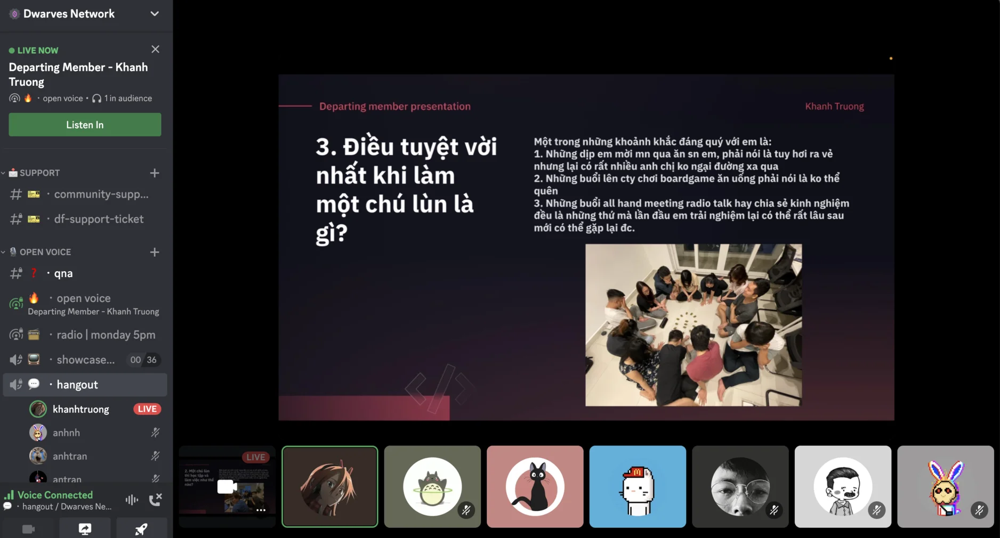

Hello @peeps, get ready for the big year ahead after a restful, much-needed of celebrating Lunar New Year. We all enjoy "Lì Xì" by using Mochi cmd $ICY tip, thanks everyone for the fun we had.

1/ New Role System for Discord
We are transitioning into 50% community 50% company. In order to foster an enjoyable and interactive within the Dwarves community, we have implemented a new Discord roles system.

Also, $ICY will be used as the main currency to give back to everyone who contributes to our culture and activities.

Revisit the details post: [https://memo.d.foundation/Discord-Roles-c88649c5a45c4c608df0bdec385024a5]

To contribute and follow up on what happening at Dwarves network. Check out [index.d.foundation], [earn.d.foundation], [event.d.foundation]. This pages summarize the team's activities, including a list of bounties, rewards and a community events calendar.

2/ Introducing the ?help Command!
We are thrilled to announce the launch of the ?help Command -an automated query that will provide you with all things engineering you need to keep up-to-date within the Dwarves.

From now on, you can now easily access our extensive public database, including stack information, how to earn in community, hiring updates, upcoming events, and much more.

Keep building a powerful and engaged community here on our Discord server.

3/ Khanh Departing Presentation
@KhÁNH#4523 is departing, joining his next project outside of Dwarves. He did a presentation on what he learned & experienced during his time at Dwarves.

A great journey ahead with the full of excitement. We wish you the best.

4/ Learning: Initial Required Diagrams

Han and @hieuvd#4261 held the initial required diagrams session. These diagrams provided full awareness of the project charter, direction, and milestones. Team leads and members can update these diagrams documents and send them back to Hieu. He'll spare time to review.

- Note for project charter: [https://github.com/dwarvesf/playbook/blob/master/engineering/charter.md]
- Handover & Excalidraw docs:
  [https://github.com/dwarvesf/playbook/blob/master/engineering/handover.md]
  [https://excalidraw.com/#room=cb8f5b3939e63083aec6,zGOsrX6T18N3xladJjwpyA]

5/ Remember to fill out the form
February marks the start of Performance Review. Please make sure you've read the specific procedure announcement as follows at #pink-alert channel, and submit your self-review and peer-review to your leads.

- Don't forget to fill out: [https://form.d.foundation/growth]
- Self-review example: [https://www.notion.so/Self-review-example-75c1cdb4a37346d89e01006be404c62a]
- Reflected your career ladder: [https://bit.ly/3n8MoU3]
- @thanh#0605 has sent out peer reviews at Fortress, check your inbox: [https://fortress.d.foundation/feedbacks/inbox]

6/ Kick-off 2023:
@baddeed.eth#0001 has written down the goal for the next cycle ahead on Memo. Read by Happy 2023 here: [https://dwarves.notion.site/Happy-2023-363e10867de0495997fc95e6fe2475ca]

Everyone is the key to being a part of the inner circle at Dwarves to crush MMA goals as the year resolution. Take a step into 2023 with greater force.

