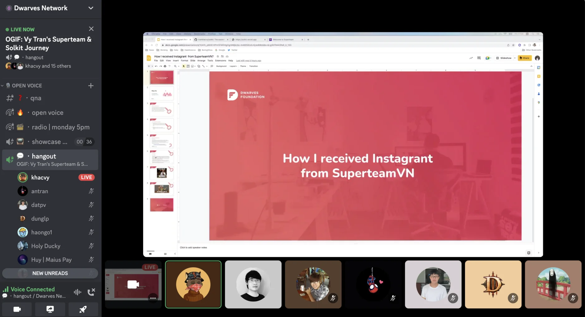

# 149 - ChatGPT, OGIF, New Project, New Teammates

@peeps, lots of movements last week, but here are some highlights to help you keep the momentum going

1/ Dwarves Discord got GPT-ed

• We added 🤖・gpt-01 🤖・gpt-02🤖・gpt-03 to our Discord for everyone to explore. With ChatGPT bot, you can ask questions, and get help with programming, software delivery.
• While we are having fun this new addition, it’s also time to think how we can utilize this tool to help the team ship more.

2/ Communication is super important

• A small reminder, working remotely requires communication, so y’all please make sure all communication is immediate and seamless. Keep professionalism and productivity in mind.
• If you run into any issues with clients and are not sure what to do, ping

@delivery team for assistance.

3/ OGIF - Oh God It's Friday

• Every Friday 5PM used to be about showcasing demos of software we work on. Next level, #OGIF is where we will showcase our 70/50 results. Think craftsmanship, new findings, techniques, and industry insights. Everyone can reach out @thanh when you have something you want to contribute.
• OGIF #1 == @khacvy sharing his journey of joining Superteam, winning a 3000USDC grant for Solkit. You did great, mate.

4/ Team Updates

• Welcome @tranthiaivi266 (Comm) and @thangnt294 (BE) onboard. We look forward to great works from you

• @khanhtruong is now our Comm Manager, he'll help with engaging and growing our Discord.

@taipn is the first member and we’re looking for a few more React Native peeps. If you know anyone, send them our way. Referral bonus applied.

5/ Upcoming

• We'll be organizing photoshoots for everyone to have their new profile photos taken, the Ops team will let you know details real soon.

That's it for now. Happy coding

