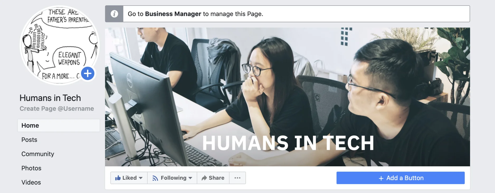

## Have You Heard of Humans in Tech?

---

### All-hands Meeting Notes - The Next Cycle📍

It's a bit late, but we finally had the 1st cycle of 2020 summed up. For the newbies who have just joined the team, this also includes the Notes of our previous All-hands Meetings.

It walks us through the great moments, like the splendid 5th Anniversary last December, or an upgrade by Fortress Team on monthly payroll with full automation flow. It also brought us back to the lesson learned, the current state of the team and what's waiting for us in the year ahead 🤟

📈 In this message, you'll find the cycle update of Design - Engineering and Business team as well!

### Security Basis - The very 1st TechRadar Webinar ✔️

Last Friday was the showcase of Security Basis of SSH, SSL, and Blockchain brought by Bien, Khoi & Phuong under the form of a webinar. We hope it brings you a closer look at the topics and the excitement to hear more. Well done guys.

A record of the presentation has been published for those who are interested. You can find it at Dwarves Foundation Drive > Engineering > Tech Radar > Presentation.

The team conducted a survey to collect your feedback on the webinar. Let's spend a few minutes telling us what you think by filling this form.

### Design Status Updates 🌆

We kicked off the workshop with a key client last week. This helps us to know better on their current business context and optimize the proposed solution.

We're pursuing the main goal of March, which is going freebie. Adopting the Minimalism Design System, we'll be picking up a real website with optimized design flow to imitate, starting with wire-framing. The final result will be displayed on Dribble under the form of web-app. Zara, H&M or Uniqlo might be good examples.

### Google Developer Expert Application 🌟

Lately, we received an invitation from Vietnam Golang Developer Group (GDG) to apply as Google Developer Expert. Should you feel this might be the time to shine, drop us your info at Woodland > Todos > Apply for GDE.

### Community: Humans in Tech 🌐

As you may see in the last few days, we are launching a new playground for tech savvies. Humans in Tech is a collaboration project between us and WeBuild Community, intending to bring your closer to the industry with Latest news, Dev daily stories, Music playlists and of course, Memes 😏

We still expanding the field of topics and reaching for more cool stuffs. If you have anything in mind, let us know at Humans in Tech 🤞

Still there are rooms to improve, those were the mini achievements we were glad to reach. Our next moves is to go hard for branding and community, therefore the intervention of Humans in Tech and GDE application are strongly encouraged to expose yourself to the tech world, and we hope, as a team, you'll find a reason to be a part of it.

