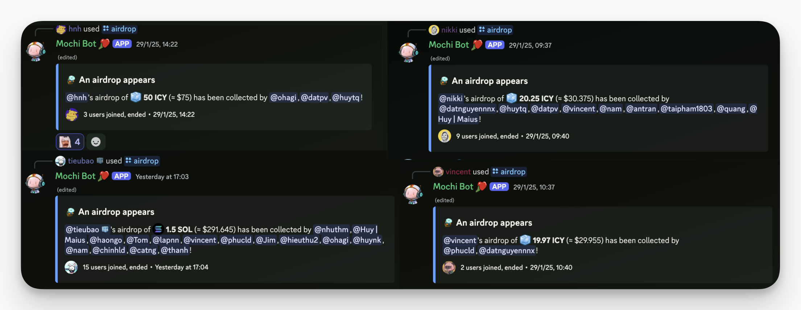

---
tags:
  - weekly-digest
  - team
  - community
title: "Weekly Digest #15: New year Gathering: Sharing Tết, starting strong"
short_title: "#15 New year gathering"
date: 2025-02-04
description: "Tết break came to an end, and the Dwarves team reunited to share stories, reconnect, and kick off the Year of the Snake in style. We brought it all back to Discord—along with a little SOL & ICY drop to start the year right."
authors:
  - innno_
---

We kicked off our gathering after Tết, bringing the community back together in true Dwarves style - dropping some SOL and ICY tokens into everyone's wallets, bringing the community back together in true Dwarves style. Not a bad way to start the year.

On the first day back, the team flooded Discord with Tết stories and updates. Between the usual tech talk and project discussions, conversations shifted to lucky money tales, family gatherings, and the inevitable food coma from too many bánh chưng and bánh tét.

Some bragged about their winning streak (or admitted their losses) in traditional New Year games, both the triumphs and the mishaps. Others shared their first sips of spring wine, late-night card games, and that one cousin who somehow always wins.

Photos and stories kept rolling in. From pristine beaches and mountain retreats to hometown reunions and family feasts, each snapshot captured a different way the team spent the break. Some took the chance to travel, exploring new places. Others returned to familiar spots, embracing the warmth of home, reconnecting with loved ones over shared meals and old traditions.

And of course, there were those who simply recharged — sleeping in, catching up on games, and enjoying the rare quiet before diving back into the grind. Now, we’re back at it, picking up where we left off. The Year of the Snake has just begun.

