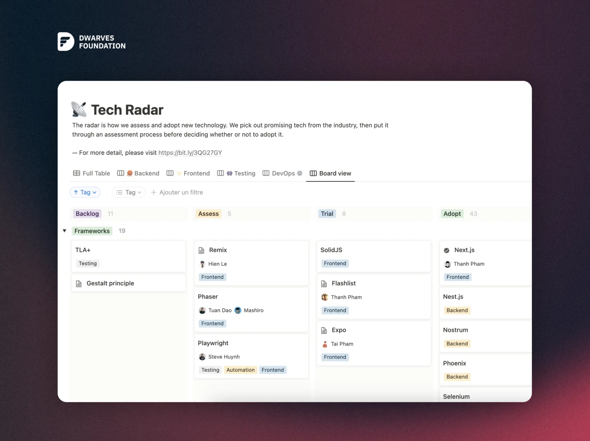

Hey there @peeps. Did everyone have a retreat weekend? Another highlight of Monday Changelog will reflect on everything we've accomplished just over the week!

Tech Radar

Starting in 2020, Tech Radar is a place for our engineers to trial and evaluate emerging technologies, then set the direction for Dwarves’ tech stack.

Tech Radar Volume 4 will continue with Elixir, Artificial intelligence, Testing, Experimentation and Automation.

Eager to earn more ICY, let’s begin at: <https://radar.d.foundation/>
Revisit “Building a better Tech Radar”: <https://bit.ly/3xyqK0M>

Profile Team Photo

Thank you so much, @peeps, for joining us at the profile photoshoot at Hado HQ. Let's give @Eric.Le#4718 a round of applause for his hard work in making the photoshoot a success.

Deadline for submitting the last round: Wednesday 22nd, 2023 - <https://drive.google.com/drive/folders/1jlErhbfVbx4Lke_XEuRb5VuUJtoKYYwY>

?issues, ?milestones, ?radar log, ?radar

These commands allow you to access and manage your issues, milestones, and radar logs with ease. A big shoutout to the amazing @hnh#8241 and @quang#8888 for helping us create the useful commands.

Performance Review

As we near the end of the Performance Review process this week. Next step, the salary adjustments and team notes will be sent directly to your email, so be sure to keep an eye out for them. This is an exciting time as we recognize your hard work and contributions to the team.

Read by Growth is our universal language: <http://bit.ly/3k4rhEN>

Learning

Last Monday, @R Jim#4545 had given a Radio Talk about State Machine Patter. Check it out at our Youtube channel: <https://bit.ly/3Kp5PF1>

February All hands Meeting will take place on this Friday 24th, 2023. Please mark your calendar and hope to see y’all there.

Can’t wait to see more things in March.

