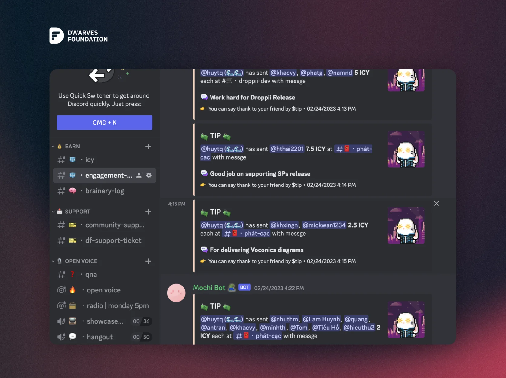

# 151 - February’s Updates

How time flies. It's already the end of the month, check out our latest February Changelog for key updates. Let's keep the momentum going, @peeps.

1/ Some mini wins

Shout out to khanglna#0521, hieuvd#4261, taipn#6071, y’all have received good feedback from our clients. These pros ship more, got involved with the project beyond their assigned tasks, and our client love it.

Delivery Quality can help us identify areas in which we can improve efficiency and meet deadlines, resulting in greater effectiveness. In order to encourage everyone, with each mini wins like releases, new features, etc., we will send some ICY as a way to thank you for the great work.

2/ Community Call

February All-hands Meeting is coming this Friday, March 3rd, 2023. Please reserve your schedule. We’ll be working through updates, reports for the last month, and directions for the next one.

Say cheers to a happy working week.

