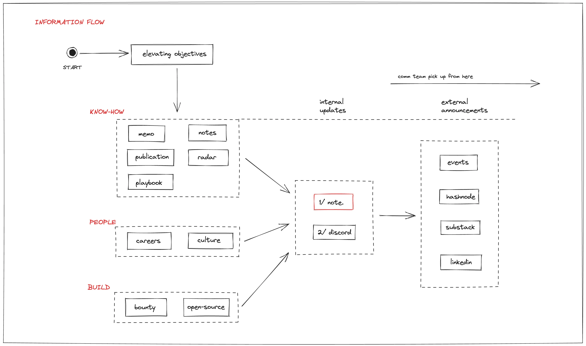

> **Before you dive in**
> Dwarves is operated as a 50% company, 50% community. Everything we learn along the way of work, we transform into knowledge and distribute back to our tech community.
>
> If you want to get in touch, visit [Dwarves Network](http://discord.gg/dfoundation)

Each month, we release a recap noting all the significant changes in our company and our team. October's highlights include:

- **[memo.d.foundation](#notedfoundation)** - The wiki of how we work, learn, and operate the team at Dwarves.
- **[New functional teams](#new-functional-teams)** - A single core team expands into 5 functional teams for better delivery.
- **[MMA-based career development](#mma-based-career-development)** - Mastery, Meaning, Autonomy allow us transparency in what we do and ways to provide growth paths for everyone based on their interests.
- **[Frontend Course 2023](#frontend-course-2023)** - Our free FE Course is successfully finished with a fun demo day.

## State of Dwarves

For a tech team like Dwarves, there are only a few things that matter. Coming to the end of the year, we're reflecting and re-enforcing what matters to us.

- Cross-team transparency: we're bringing more documentation, reports, cross-team meetings so everyone knows what the others are up to.
- R&D: fueled by innovations, more hands are joining R&D to learn the next best thing in tech and programming.
- Diverse projects: we are now more open to whichever projects that can promise an exciting challenge, regardless of domain, scale, or duration.

## memo.d.foundation

We think of this site as our company wiki. It's where we note (hence the name) and share everything we learn as a team and as a community, knowledge-wise and operation-wise.

With [memo.d.foundation](memo.d.foundation), we hope the time and effort we spent in the tech industry will become valuable lessons and stories for everyone who also cares about technology and innovation as we do.

Community members are welcome to share their learning notes too. Simply drop a message in relevant channels in our [Discord](http://discord.gg/dfoundation)

## New functional teams

In October, we reorganized the core team into 5 functional teams with clear responsibilities and deliverables. Each team has its own thing and operates all differently. Different ways of facilitating activities, creating team bonds, delivering results and getting rewards.

- Labs: folks learning, researching emerging tech
- Consulting: folks using software to improve biz results
- Console: folks focusing on products
- Techie: folks enjoying celebrating humans in tech
- Ventures: investing in cool tech teams and products

## MMA-based career development

The only legit performance indicator at Dwarves is MMA; Mastery - Meaning - Autonomous.

- Mastery: Are you highly talented and skilled? Are you doing anything to become even better?
- Meaning: Do you work just for the money, or do you have a purpose in the tech industry?
- Autonomy: Are you proactive? Are you a high performer?

Since we adopted this model last year, everything we do revolves around it. Thanks to the consistency, we have been able to see improved performance, higher drive at work, more transparency across project teams, and more peeps expressed their interest in R&D activities.

From there, we design personalized growth paths, that fit their interest. With enough effort and grit, soon we will see the next part of teammates taking part in the 5 functional core teams.

## Frontend Course 2023

Our free FE Course is successfully finished. The stats are astounding, because compared to our previous Golang Course, there is a 4x jump in participants. We believe this signal shows what we do is being well received by the tech community in Vietnam.

## Community Growth

- Discord welcomes 2050 members in total. Lots of good stuff on tech being shared at #tech #til #random
- Top 10 voices contributing to our server get rewarded in ICY
- [Techie Story](http://techiestory.net) fanbase reached 8.8K members
- Elixir Meetup in Saigon was a fun experience for the team

**Coming up:**

- Golang Meetup
- Techie x Webuild Summit

## FAQ

**Q: Do Dwarves offer internships?**

> Currently we don't have any internship positions available. Dwarves facilitate apprenticeship and internship as a program, instead of individually. News about these programs will be updated on [memo.d.foundation](memo.d.foundation).

**Q: How can I contribute to Dwarves network?**

> Everyone can contribute knowledge in our [Discord](http://discord.gg/dfoundation) and/or contribute to our [Bounties](http://earn.d.foundation).
> All valuable contributions will be rewarded in ICY ( 1 ICY ~ $1.5)

**Q: Do Dwarves have any events?**

> We have these reoccurring events:
>
> - Radio Talk (Weekly, Monday): sharing technical learning, demos, showcases
> - Tech Event (Monthly): sharing programming trends, tech trends, panel discussions
> - Community Call (Monthly): summary wins and growth of the month

