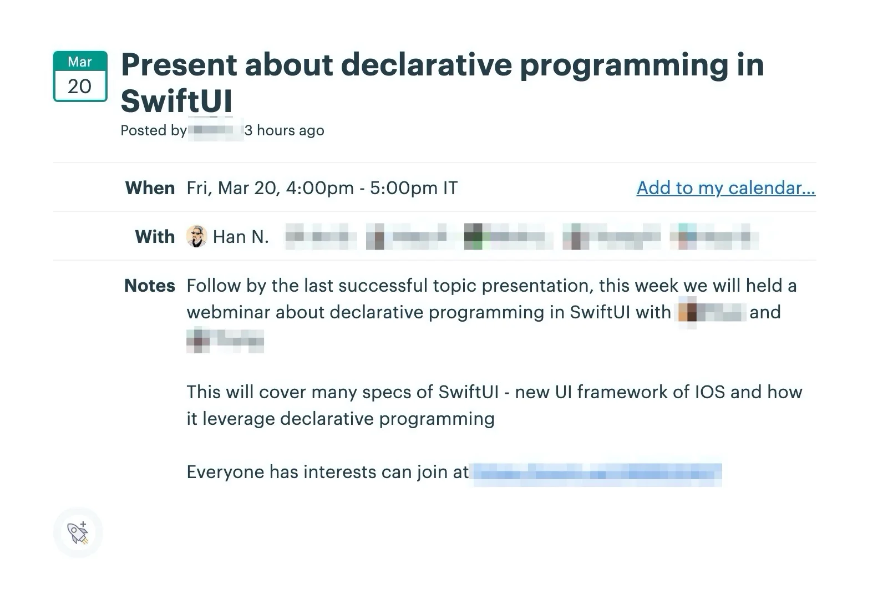

## The Dwarves Latest News

---

Covid-19 is still raging and affects many aspects of businesses all over the world. Most of our team has chosen to work entirely remotely, and it might take a while until we can resume the normal days. Meanwhile, take great care of yourself and the family, stay connected with the team and hope for the best.

Here are what we've gone through the past week.

### Operation Updates 📈

After recent recruitments, we'll stop putting effort into hiring and spend more time utilizing the current resource. This means there will be more plans to convert more juniors to seniors and scale down the unnecessary operation tasks to the minimum.

For the short-term plan, our resource will be deployed for new projects and other internal team projects.

### Canada Sales Partnership 🇨🇦

It's only a few last touches until we finish the final list of Toronto potential sales partnerships. After this, a new plan will be conducted to reach out and validate our new ideas. Some warm messages might be a good start. Currently, Nam and Linh are working on this.

### TechRadar Webinar 🎥 Declarative Programming in SwiftUI

Succeeding the 1st Webinar of Basic Securities, this time webinar covers many specs of SwiftUI - the new UI framework of IOS and how it leverages declarative programming. For further dig in, we have uploaded the recorded version and the presentation slide on Github.

We had invited some external audience to join. That came out with a 2-hour online webinar with more than 30 participants. More than just attending, they have extended the Q&As section by constructive feedback and informative source of info to improve the topic better. We're thinking of a solution for people to register more effectively next time.

### Team Jacket Preparation 📌

After weeks of pending, we found a supplier that matches our expectations. The first sample is estimated to be done in 2 or 3 days. After that, if the sample works well and ready to proceed, we'll move to the printing based on the mockup demo that the Design Team has prepared in advance.

### Culture Book - Mini Article 📰

Mini Article is a small section in Culture Book that reveals the fact that spreads among the team. That contains the intangible aspects that form up and distinguish us from others.

Duy has begun to work on that with Remote Working - an article that states one of our daily working systems. And if you find any exciting figure that may be a good fit for the list, give her a ping.

## NEW HIRES 🎗

Let's have a hand to welcome these newbies onboard!

- Le Xuan Nha - Frontend Engineer
- Tran Tri Tin - Data Engineer
  Hope to see the good achievements and may we share many great moments together 🤙!
