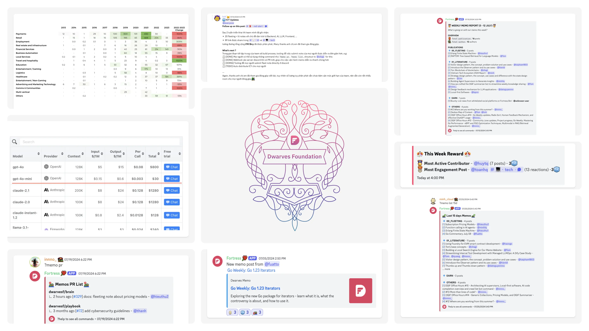
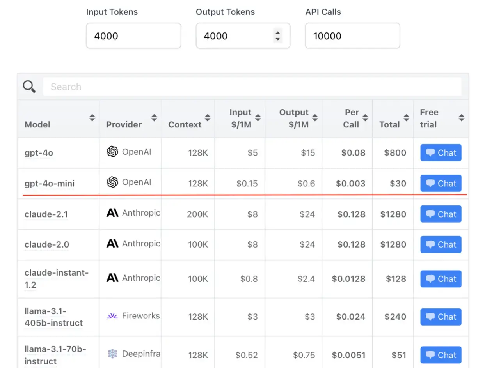
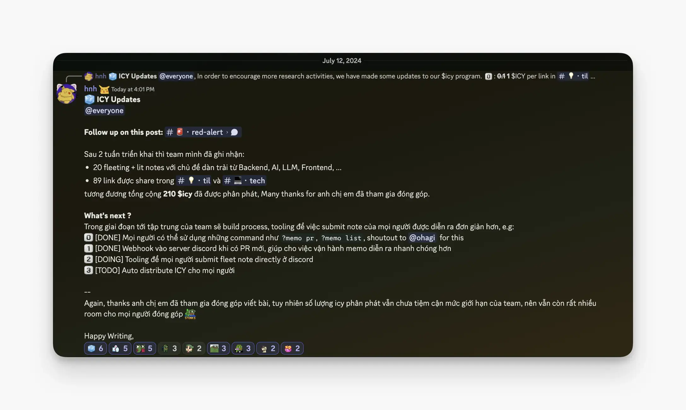
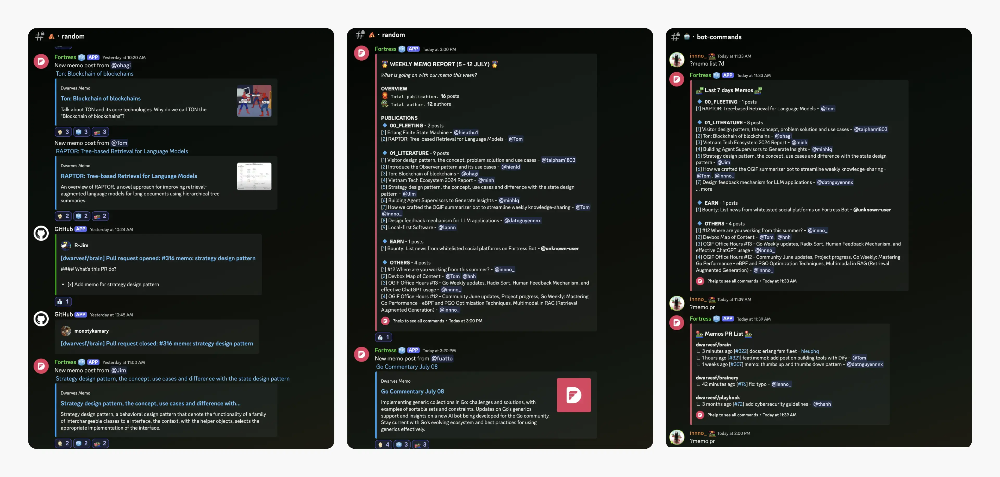
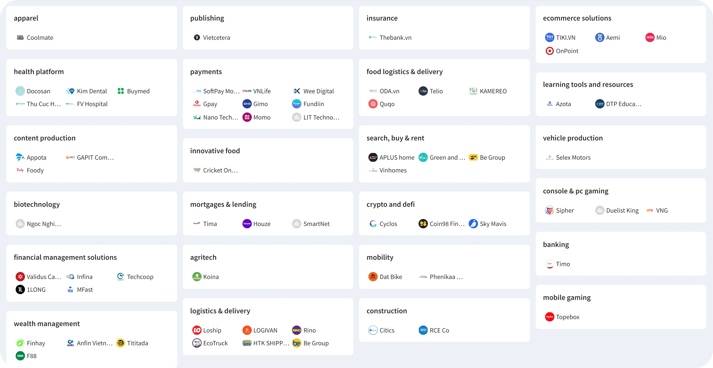
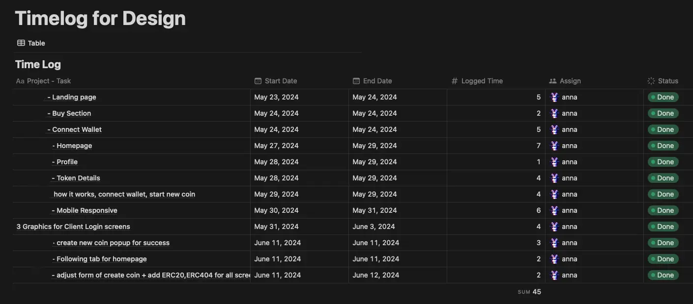

---

title: "What's New in July 2024"
date: 2024-08-09
description: "Each month, we release a recap highlighting key updates and progress within our team and community. July covers AI advancements, community contributions, insights from Vietnam's tech scene, new memo commands, OGIF automation, and the introduction of our hourly billing model"
authors:
  - innnotruong
  - nikkingtr
tags:
  - newsletter
  - memo
  - community
---

- [**Reporting Tech Signals:**](#reporting-tech-signals---ai-advancements-cybersecurity-focus-and-shifting-software-trends) Significant AI advancements, cybersecurity focus, and shifting software development trends.
- [**memo.d.foundation**:](#new-memo-command-to-boost-team-contributions) You can now access new commands to view the memo list and automate weekly reports.
- [**Dwarves Token Usage:**](#dwarves-token-usage-for-july) Community participation led to ~857 ICY being rewarded for contributions, including OGIF talks, tech sharing, memo notes, and bounties.
- [**Reporting Tech Scene in Vietnam:**](#reporting-tech-scene-in-vietnam) Insights into Vietnam's tech landscape, investment trends, and key players in AI, fintech, and blockchain.
- [**OGIF Automation Recording and Topics Overview:**](#ogif-automation-recording-and-topics-overview) Efforts to streamline the automation recording process and a summary of the topics discussed in July.
- [**Golang Enterprise:**](#dwarves-advancing-with-golang-enterprise-solutions-and-industry-insights) Dwarves advancing with Golang and sharing insights through weekly commentary.
- [**Pricing Model - Bill by Hours:**](#pricing-model-bill-by-hours) Introduction of an hourly billing model to ensure fairness, flexibility, control, and transparency in engagements.

## Reporting tech signals - AI advancements, cybersecurity focus, and shifting software trends

In July, the tech landscape saw significant advancements in AI, a heightened focus on cybersecurity, and notable shifts in software development trends.

- **Meta's Llama 3.1:** The 405B parameter model is a major leap in open-source AI, competing with top closed-source models.
- **OpenAI's GPT-4o-mini:** Fine-tuning capabilities democratize AI customization for optimized business applications.
- **Claude Sonnet 3.5:** Enhances software development speed by 10x for UI components.
- **AI in Sports Analytics & TTS:** Roboflow and ElevenLabs' innovations boost performance analysis and communication.
- **Cybersecurity Incidents:** Highlight the need for resilient system designs to prevent single-point failures.
- **Software Engineering Trends:** Emphasis on "boring" technology, full-stack development, and AI tool integration.
- **Programming Language Salaries:** JavaScript sees a median salary drop, while Erlang, Elixir, and Clojure command higher salaries.

[Read the full report here.](https://memo.d.foundation/playground/01_literature/market-report-july-2024/)

## New memo command to boost team contributions

In the upcoming phase, the team will focus on streamlining processes and developing tools to make memo submission easier for everyone. Here are two ways we're helping you stay up to speed:

- Use commands like `?memo pr` and `?memo list` to check out the latest memos. Shoutout to @bienvh and @huymaius for this.
- Receive webhook notifications in the Discord server for new PRs, speeding up memo operations.
- Coming soon: Tools for submitting fleet notes directly on Discord and automating ICY distribution.

The amount of ICY distributed is still below the team's limit, so there's plenty of room for more contributions. Everyone can join hands.

We've seen a great increase in memo input from members this month. Here's the list for July:

1. [Devbox Map of Content](https://memo.d.foundation/playground/-devbox/), [Ton's base concepts](https://memo.d.foundation/playground/01_literature/ton_core_concept/), [Ton ecosystem](https://memo.d.foundation/playground/01_literature/ton_blockchain_of_blockchains/) - @bienvh
2. [Go Weekly: Go 1.23 Iterators](https://memo.d.foundation/playground/00_fleeting/go-weekly-511/), [Go Commentary July 08](https://memo.d.foundation/playground/00_fleeting/go-commentary-jul-12/), [Go Commentary July 26](https://memo.d.foundation/playground/00_fleeting/go-commentary-jul-26/) - @fuatto
3. [Re-ranking in RAG](https://memo.d.foundation/playground/01_literature/engineering/ai/re-ranking-in-rag/) - @hoangnnh
4. [Market report July](https://memo.d.foundation/playground/01_literature/market-report-july-2024/) - @thanh, @tom
5. [Local-first Software](https://memo.d.foundation/playground/01_literature/local-first-software/) - @lapnn
6. [Building a Local Search Engine for Our Memo Website](https://memo.d.foundation/playground/01_literature/creating-a-fully-local-search-engine-on-memo/) - @tom
7. [How we crafted the OGIF summarizer bot to streamline weekly knowledge-sharing](https://memo.d.foundation/playground/01_literature/how-we-crafted-the-ogif-summarizer-bot-to-streamline-weekly-knowledge-sharing/) - @tom, @innno
8. [Streamlining Internal Tool Development with Managed LLMOps: A Dify Case Study](https://memo.d.foundation/playground/01_literature/building-llm-powered-tools-with-dify/) - @tom
9. [Function calling in AI agents](https://memo.d.foundation/playground/00_fleeting/function-calling/) - @minhlq
10. [Design feedback mechanism for LLM applications](https://memo.d.foundation/playground/01_literature/feedback-mechanism/), [Thumbs up and Thumbs down pattern](https://memo.d.foundation/playground/01_literature/thumbs-up-and-thumbs-down-pattern/) - @datnguyennnx
11. [Using Foundry for EVM smart contract development](https://memo.d.foundation/playground/01_literature/using-foundry-for-evm-smart-contract-developement/) - @haongo
12. [State of Dwarves: 2024 Semi-annual Review](https://memo.d.foundation/updates/changelog/2024-state-of-dwarves-semi-annual-review/) - @innno
13. [Subscription Pricing Models](https://memo.d.foundation/playground/00_fleeting/subscription-pricing-models/) - @hieuvd
14. [Error handling on Rust](https://memo.d.foundation/playground/01_literature/error-handling-in-rust/), [Rust Trait](https://memo.d.foundation/playground/00_fleeting/rust-trait/) - @trankhacvy
15. [Proximal Policy Optimization](https://memo.d.foundation/playground/00_fleeting/proximal-policy-optimization/) - @ngocthanh

## Dwarves token usage for July

We've seen active participation from everyone, and it's great to see so many members getting rewarded. This month, we handed out ~857 ICY for all your contributions, a significant increase from June's.

Here's how the rewards break down:

- **OGIF talks:** 210 ICY (~315 USDC)
- **Links shared:** 373 ICY (~560 USDC)
- **Memo notes:** 184 ICY (~276 USDC)
- **Bounty tasks:** 90 ICY (~135 USDC)

Special thanks to our top contributors:

- **OGIF talks:** @fuatto, @datnguyennnx, @hieuvd
- **Tech Sharing:** @minhlq, @tom, @huytq, @tristran
- **Memo notes:** @fuatto, @bienvh, @tom
- **Bounty:** @bienvh, @huymaius

## Reporting tech scene in Vietnam

Vietnam's tech market is vibrant and growing, attracting startups and investors. Following the forecast, Vietnam's digital economy is projected to reach $43 billion by 2025, fueled by breakthroughs in AI, fintech, and crypto - areas we're eager to shape alongside nearly 100 active investors.

Leading firms like 500 Startups Vietnam, VSV Capital, and VinaCapital Ventures are driving this progress, supporting innovative startups and the broader ecosystem. By connecting key players in the ecosystem, this report aims to establish a network of trusted partners who can collaborate and drive mutual growth.

[**Read Vietnam Tech Ecosystem 2024 Report.**](https://memo.d.foundation/playground/01_literature/vietnam-tech-ecosystem-report/)

## OGIF automation recording and topics overview

To improve the efficiency and accessibility of recording our OGIF sessions, thanks to @quang, @tom, and @innno\_ for their efforts in streamlining the automation recording process.

Last month, we've walked through:

- [Multimodal in RAG](https://memo.d.foundation/playground/01_literature/engineering/ai/multimodal-in-rag/), [Re-ranking in RAG](https://memo.d.foundation/playground/01_literature/engineering/ai/re-ranking-in-rag/) - @hoangnnh
- [Go Weekly: Go 1.23 Iterators](https://memo.d.foundation/playground/00_fleeting/go-weekly-511/), [Go Commentary July 08](https://memo.d.foundation/playground/00_fleeting/go-commentary-jul-12/), [Go Commentary July 26](https://memo.d.foundation/playground/00_fleeting/go-commentary-jul-26/) - @fuatto
- [Radix sort](https://memo.d.foundation/playground/01_literature/radix-sort/) - @hieuvd
- [Feedback mechanism for LLM app](https://memo.d.foundation/playground/01_literature/feedback-mechanism/) - @datnguyennnx
- [How to talk to ChatGPT effectively](https://memo.d.foundation/playground/00_fleeting/how-to-talk-to-chatgpt-effectively/) - @minh_cloud
- [Local-first Software](https://memo.d.foundation/playground/01_literature/local-first-software/) - @lapnn
- [TIL in Dune's query](https://memo.d.foundation/updates/ogif/16-ogif-office-hours-0726/) - @phucld
- [AI voice clone demo](https://memo.d.foundation/updates/ogif/16-ogif-office-hours-0726/) - @tom
- [Architect supervisor AI agent](https://memo.d.foundation/updates/ogif/16-ogif-office-hours-0726/) - @toanhq, @datnguyennnx
- [AI code completion overview](https://memo.d.foundation/updates/ogif/16-ogif-office-hours-0726/) - @minhlq

## Dwarves advancing with Golang: Enterprise solutions and industry insights

Dwarves has long embraced Golang, leveraging its performance and simplicity for enterprise solutions. We've pushed the boundaries with Go, exploring advanced use cases and sharing our learnings through our weekly Go commentary.

By staying ahead of market trends, we're contributing insights that shape the language's direction and adoption in the industry. For more information about Golang, reach out to @fuatto.

Check out our Go weekly updates [here](https://memo.d.foundation/tags/go-weekly/).

## Pricing Model: Bill by hours

In response to the economic challenges and the demand for comprehensive solutions, Dwarves is now implementing an hourly billing model. This ensures fairness, flexibility, control, and transparency in our engagements.

To understand how this new model benefits both our team and our clients, read the full article [here](https://memo.d.foundation/playbook/business/pricing-model-bill-by-hours/).

