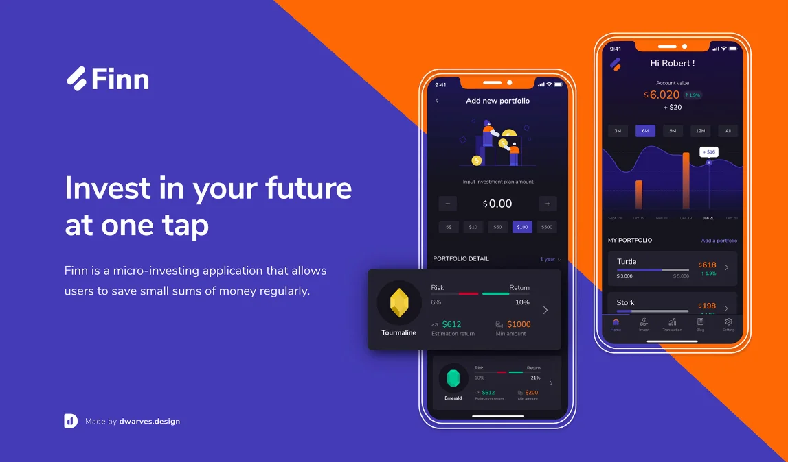
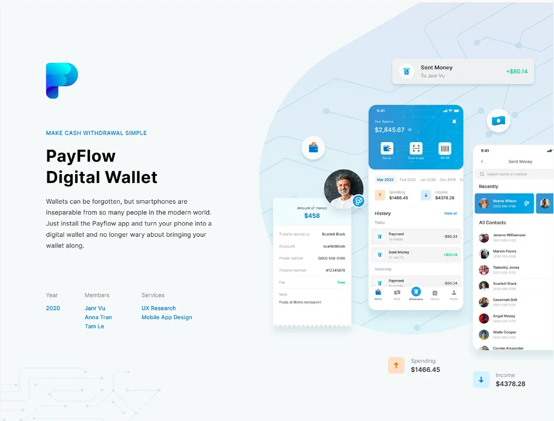
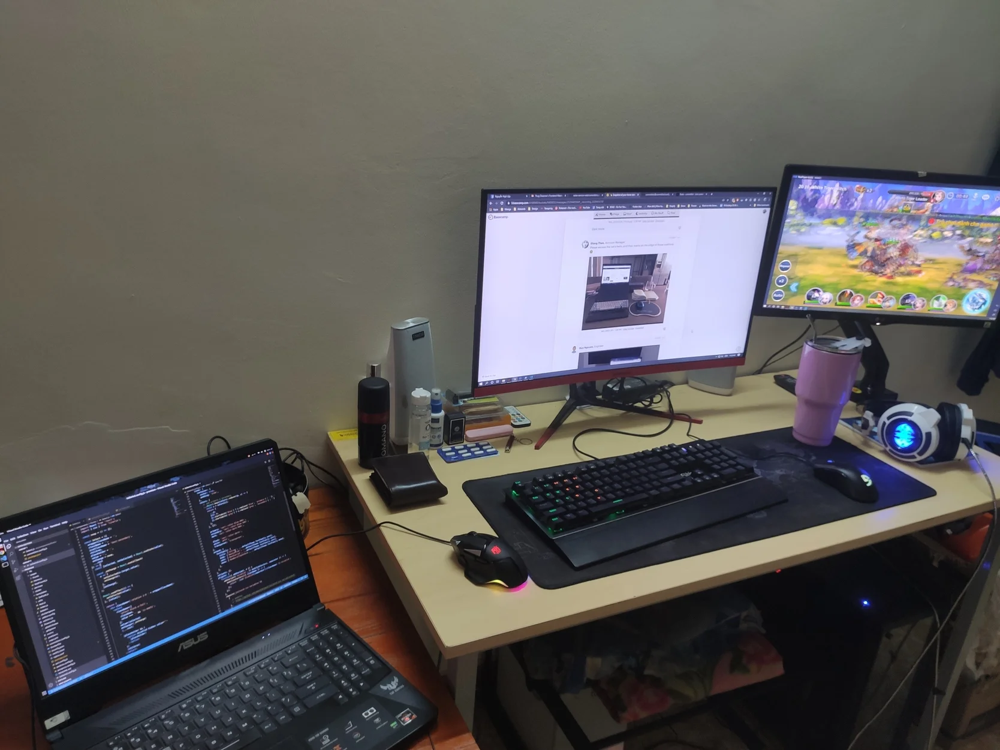
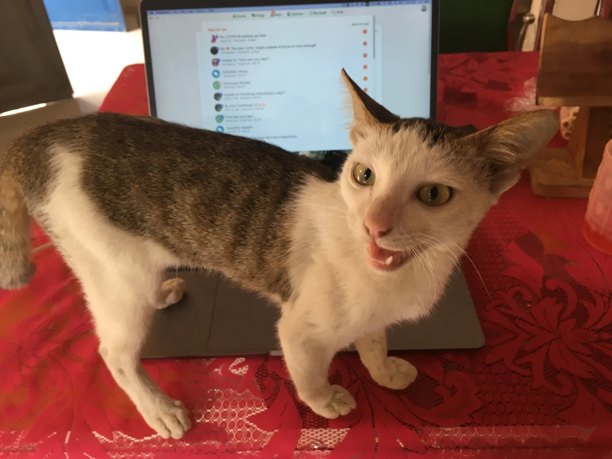
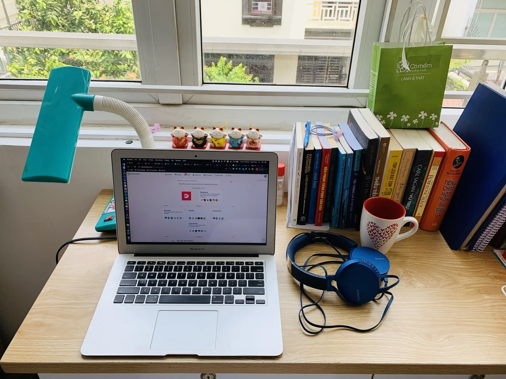
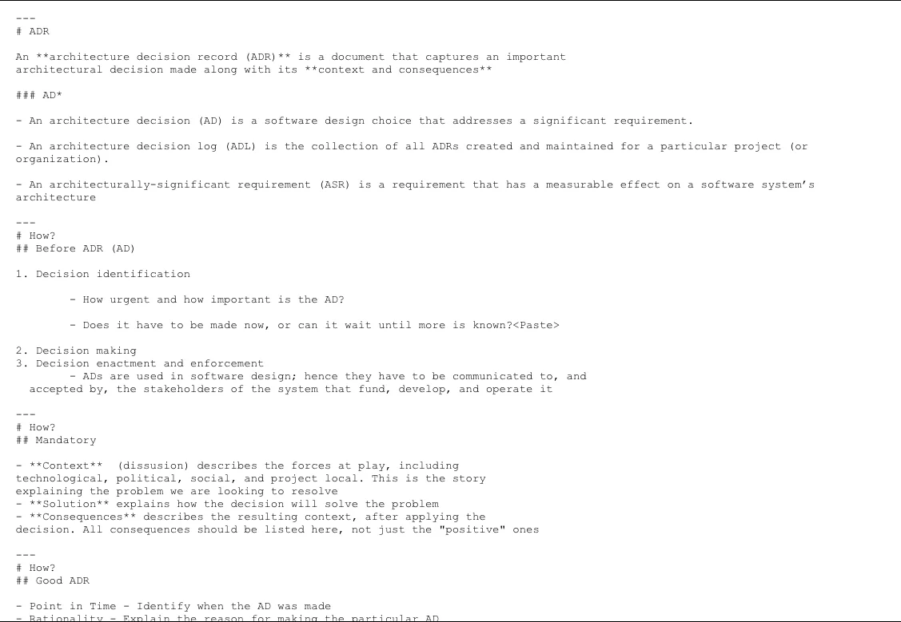

## Why People so Giàu lately?

---

See the title? Exactly, that's the common reaction after I created a mini-campaign called "Snapshot of Your Home Desk" during the Covid-19 outbreak. Seriously, I find it doubtful that some of you need a job tho. Must be for passion instead of profit 🤷‍♂️

Enjoy this week's articles!

\_

### Design Behance New Portfolio ✨

The latest achievement comes from our Design Team - 2 kickass portfolios on Behance. Both cases are about to enhance the app's UI and help our Designers to improve on the fin-tech domain knowledge.

1. FINN : a micro-investing application to save small sums of money regularly.
   

2. PAYFLOW : A digital wallet for simple withdrawal.

### Snapshot of Your Home Desk 📸

As mentioned in the intro, this message board encourages our team to post pictures of their current home desks. Some of us still choose to work from coffee shops or the office as usual. But we received so many cool shots that Duy turned out wrapping a whole new post on Medium to introduce this externally.

Have a glance at some 👇

The message can be found on Woodland. If you haven't drop your shots there, we're still waiting!

### Topic Submission for TechRadar V2 📍

TechRadar V1 closed with 4 qualified RFCs and 2 successful webinars. And it excites us to roll out the 2nd one - starting with topic selection. Thought the preparation stage might takes more time than we expected, but the successful webinars, starting with Basic Securities and SwiftUI, we're starting to expose ourselves to the outside world.

Please help create a to-do with your topic name, picking from the curated list here.

Submit a topic for this round means you earn a spot to keep staying in the Engineering group. In the Announced Message, we also stated some requirements for the qualified topic as well. Make sure you scan it well enough to result in no mistake at all.

### ADR Webinar 🌐

Hosted by An Duong & Minh Luu, the webinar demonstrated how Architecture Decision can be recorded

When a decision is made, it significantly affects the application. Architecture Decision Record is a viable and powerful approach to prevent other teams from being confused.

For those who are interested, you may find the detail document and records of Zoom Videos in Team Drive.

### This Week's Blog Posts! 📇

During one week, we're piling up the team's publication with 3 blog posts on Medium :clap:. It's been so long since the last post made its way there.

- Create Circular Text Using SwiftUI - Trung Phan: A quick tutorial on how to build a circular text with SwiftUI
- Draw Watch Face using SwiftUI - Trung Phan: Deeply connected to the post above, Trung continues to demonstrate how a watch face can be conducted, using the knowledge of Shape, Path and circular control
- #DFstaythefhome - Duy Nguyen: Duy's latest work since she recognized it would be a huge waste not to show the world your exciting home desk shots, our engineer mascot (s) and the consistent system of Macbook culture 💻

### The Dwarves Team ⚒

We welcomed another Dwarves earlier this week! Nhut Huynh is a fresher and will be working under the supervision of Quynh to better perform his part as QC Engineer ✔️
