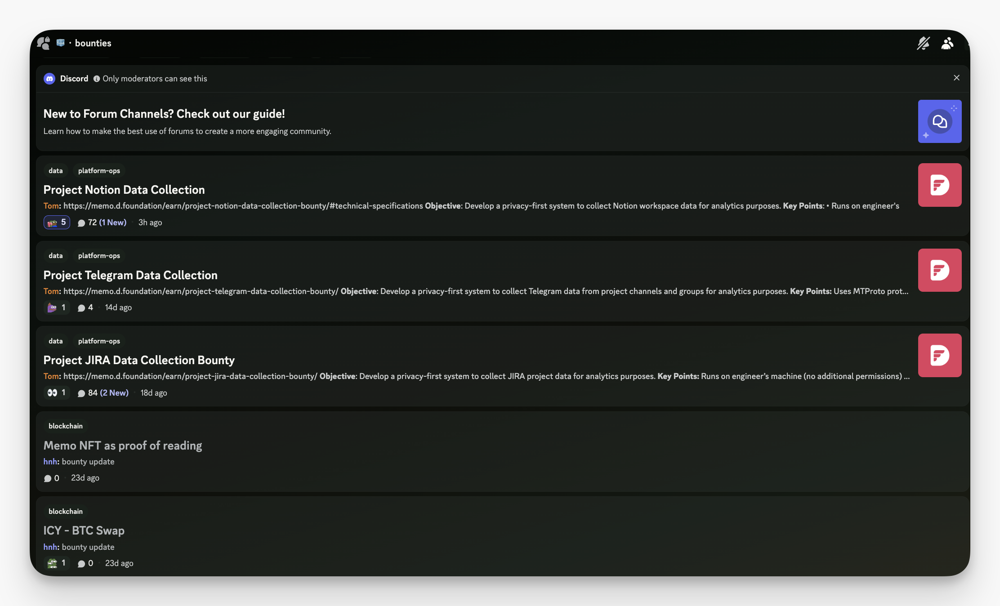
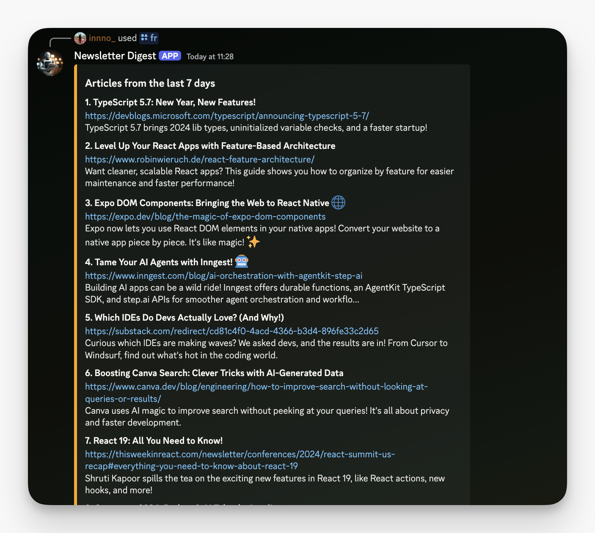
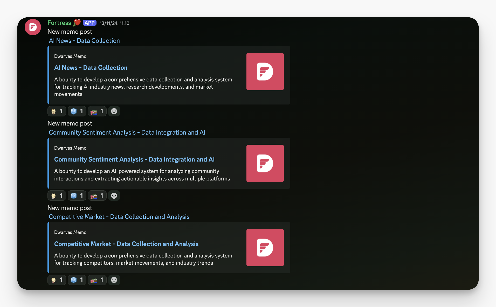
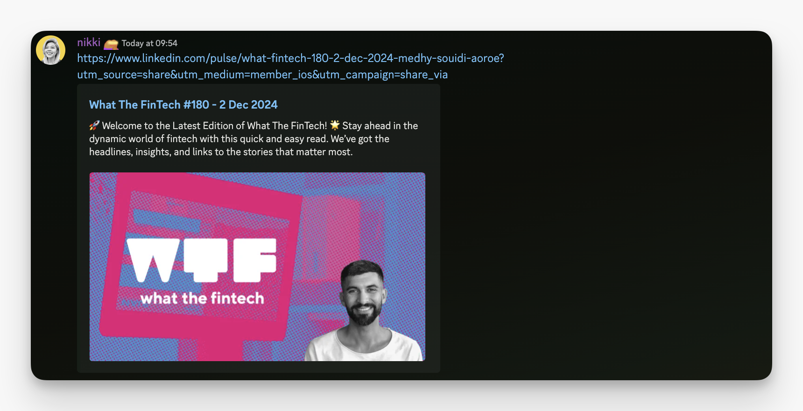
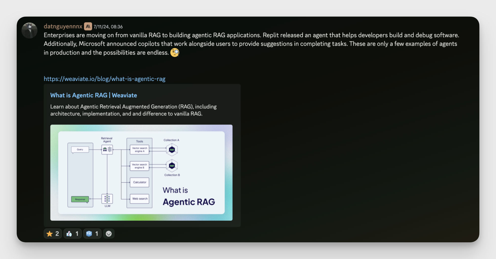
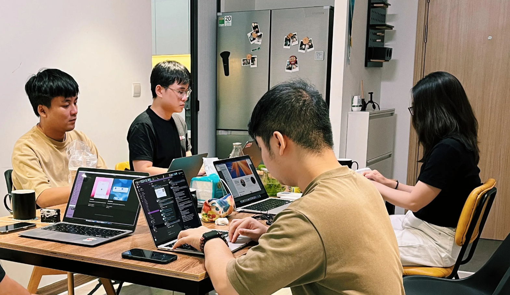

- [**Building the team's second brain:**](#building-smarter-systems-with-platform--data-engineering) Progress in platform & data engineering, smarter decision-making, and new directions ahead.
- [**Sharpening OGIF weekly sharing:**](#sharpening-ogif-office-hours-where-learning-grows) Updates to align with team priorities and industry trends for deeper learning.
- [**Team copilot tools:**](#team-copilots-index-smarter-tools-to-simplify-your-work) Advancing productivity with AI copilots - tools designed to streamline and elevate our work.
- [**Adapting to market shifts:**](#in-demand-skills-staying-ahead-in-market-shifts) Insights into client demands and the rise of Blockchain, Data, Platform, and AI/LLM.
- [**Market insights radar:**](#industry-radar-sharing-signals-that-drive-us) Biz team is tracking trends and delivering weekly updates to keep us aligned.
- [**New service offerings:**](#new-service-packages-solutions-designed-for-real-needs) Redesigned packages tailored to meet client needs with innovative solutions.
- [**Earn more ICY:**](#high-quality-knowledge-sharing-earns-bigger-icy-rewards) Recognizing quality contributions with higher rewards for impactful sharing.
- [**Fostering connections:**](#engaging-with-the-industry-showing-up-and-sharing-back) Summits, meetups, and chances to grow valuable relationships.
- [**Let's go to Penang:**](#pack-your-bags-penang-awaits-for-the-company-trip) Company trip confirmed for 14 - 17/12/2024, get ready for a memorable team retreat.
- [**Join the team:**](#join-us-opportunities-in-marketing-biz-dev-and-full-stack-roles) Open roles for Marketing Executive, Business Development Specialist, and Full-stack Engineering, be part of Dwarves.

## Building smarter systems with platform & data engineering

We're doubling down on Platform & Data Engineering, building a "second brain" for smarter decision-making and seamless knowledge sharing.

Last month's progress: wrapped up bounties for **Notion** and **Slack**, with **Telegram** and **JIRA** integrations coming up. The new **🧊・bounties** channel keeps track of all updates and next steps. The goal? A solid foundation where insights and decisions fuel smarter operations.

Next up: we're fine-tuning our integrations to stay ahead of our clients' needs. Keep an eye on the bounties channel - more updates are coming as we build.

## Sharpening OGIF office hours: Where learning grows

OGIF Office Hours is getting better with each session. We keep things simple: pick a topic that matters, learn from each other, and walk away with something useful. Since resuming in April, these learning activities have become the cornerstone of a consistent habit.

What's working well:

- Quick, focused talks on tools and problems we face daily.
- Everyone gets to share their take - from demos to technical deep dive sessions.

Drop by and bring what you're working on or learning about. Could be a new tool you're trying out, or that tricky bug you solved. These sessions work best when we all chip in.

## Team copilots index: Smarter tools to simplify your work

We've put together a list of all our AI copilots in one place. It's a simple collection of tools the team built to solve real problems and make the work smoother.

What's in it for you?

- Tools your teammates have already built and use.
- Starting points for building your own copilot.
- Ready-to-use AI helpers for your daily tasks.

Explore the index: [**Team Copilots**](https://memo.d.foundation/playground/ai/copilots/team-copilots).

Got ideas for new tools or ways to make existing ones better? We'd love to hear them.

## In-demand skills: Staying ahead in market shifts

The tech world doesn't stand still, opening up exciting opportunities for growth and change.

Here's where we see the shifts:

1. More interesting work ahead - clients want folks who can mix skills like backend/full-stack
   with Blockchain or Data.
2. Generative AI continues to make waves, with solution design and system architecture becoming the real differentiators.
3. The road ahead is rich with potential in **Blockchain, Data, Platform, and AI/LLM.**

How to stay ahead:

- Pick something that interests you from Blockchain, Data, Platform, or AI/LLM.
- Chat with your manager about what you want to learn - they're here to support you.
- Got something cool to share? Write a memo or bring it to OGIF.
- Need a place to start? Check out Tom's **[Bounty List](https://memo.d.foundation/earn/)** - we've got some interesting problems to solve.

## Industry radar: Sharing signals that drive us

Keeping up with the market is a must. Our Biz Dev and Community teams are diving into trends, picking out key signals, and breaking down what they mean for us.

Each week, these insights flow back to the team through OGIF updates or dedicated sessions, turning external shifts into clear, actionable steps. The goal is clarity: staying informed, aligned, and ready to adapt as opportunities arise. Stay tuned for the first relay.

## New service packages: solutions designed for real needs

We've reshaped our services around a simple idea: solve real problems, do it well. After working closely with clients and seeing what really moves the needle, we're focusing on three areas where we excel - AI integration, platform scaling, and blockchain systems.

Why this matters:

- Teams get solutions they can actually use, not just fancy tech.
- Projects move faster because we know what works.
- Everyone spends time on work that makes a difference.

With a clear focus on what works, these updates make it easier to deliver results that matter, quickly and effectively without overloading with options.

## High-quality knowledge sharing earns bigger ICY rewards

We've been tuning up our rewards for knowledge sharing in **💻・tech**, **💡・til**, and **🧠・ux.** Good ideas deserve good rewards.

Here's how it works:

- Drop a useful link, grab 0.3 ICY - it's a start.
- Got the team interested? 5+ reactions bumps you up to 3 ICY.
- Share something that catches [@tom](https://memo.d.foundation/contributor/tom), [@thanh](https://memo.d.foundation/contributor/thanh/), or [@tieubao](https://memo.d.foundation/contributor/han/)'s eye as high-quality? That's 3 ICY right there.
- Add your own thoughts and break it down for everyone? You could snag up to 5 ICY.

Pop into our Discord and share what interests you.

## Engaging with the industry: Showing up and sharing back

The tech community is active right now, and we're right in the mix. We're diving headfirst into events, meetups, and summits to connect with the tech community. That gives us a clearer sense of where we need to grow.

What we're doing:

- Connecting at the right places - tech meetups, summits, and shows where we meet peers, partners, and clients who are building interesting things.
- Bringing knowledge back home - capturing insights from every event through memos, podcasts, and OGIF sessions.
- Adding to the conversation - taking what we've learned and built, and sharing it back with the community.

## Pack your bags: Penang awaits for the company trip

Get ready - we're taking the team to **Penang, December 14–17, 2024**. After a year of shipping great work, it's time for some team adventures in Malaysia.

Four days of good food, beach vibes, and quality time with the crew. We've planned a mix of activities that'll let you experience the best of Penang while getting to know your teammates better.

Highlights to expect:

- Team activities that bring us closer.
- Local food and culture to explore.
- Time to kick back and recharge.

Grab the details in **🦄・pink-alert** and stay tuned.

## Join us: opportunities in Marketing, Biz Dev, and Full-Stack roles

We're still on the lookout for talented folks to join the team:

- [Full-stack Engineer (Blockchain)](https://memo.d.foundation/careers/open-positions/full-stack-engineer/)
- [Marketing Executive](https://memo.d.foundation/careers/open-positions/marketing-and-communications-specialist/)
- [Business Development](https://memo.d.foundation/careers/open-positions/business-development/)

Think you're a fit or know someone who is? Drop us a line at [spawn@d.foundation](mailto:spawn@d.foundation) or ping [@nikki](https://memo.d.foundation/contributor/nikki) on Discord.

