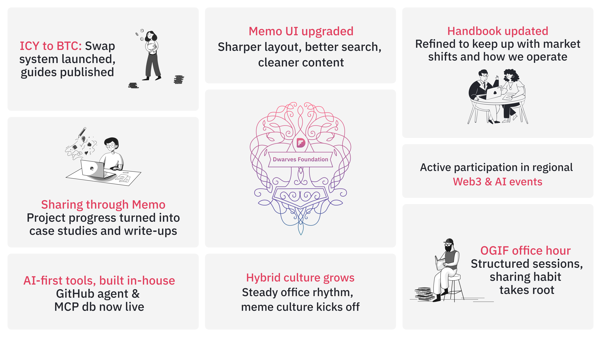
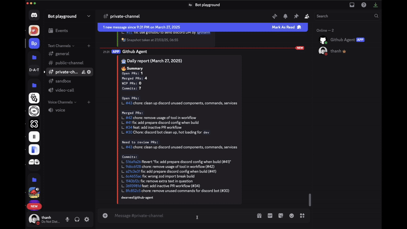
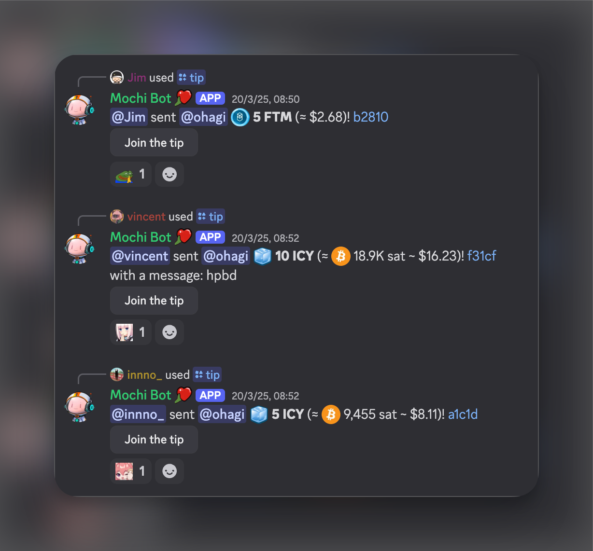
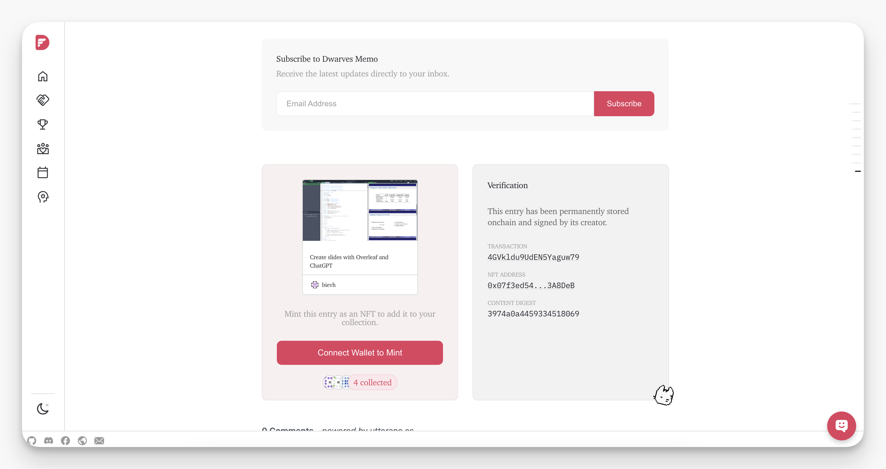
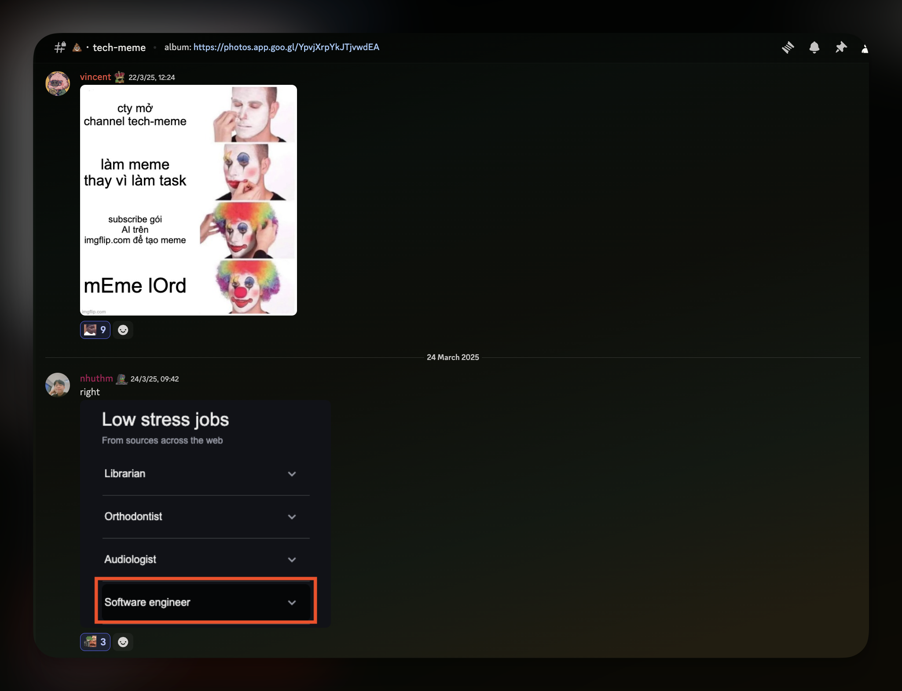
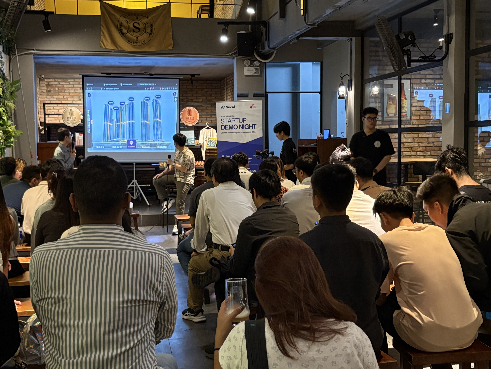

In March, we rolled out structured OGIF demos, launched key internal AI tools (GitHub Agent & MCP DB), and wrapped up the ICY-BTC swap. We also improved memo.d.foundation's UI, introduced meme culture internally, and our BD team tapped into Asia's Web3 and AI scenes to spot what's ahead. Here's the quick summary:

- [**Pushing AI-first workflows with GitHub Agent & MCP DB:**](#reinforcing-our-ai-first-mindset-with-internal-tooling) Automated PR management and structured data access to streamline internal operations.
- [**Sharing team progress through demos and case studies:**](#creating-space-for-team-wide-sharing-through-ogif-demos-case-studies) Showcased project updates and hands-on learnings that help connect engineering to everyday work.
- [**ICY-BTC swap finalized with internal demos and guides:**](#finalizing-icy-to-btc-transition-and-aligning-it-with-earning-strategies) Transition completed and support materials published on valuation and usage.
- [**memo.d.foundation UI upgraded:**](#upgrading-ui-memodfoundation-with-a-smoother-flow-and-better-look) Improved usability, content structure, search functionality, and integrated NFT minting. The handbook was also updated with policies reflecting current tech and consulting dynamics.
- [**Making office life part of the daily rhythm:**](#bringing-office-life-into-everyday-team-culture) Rolled out the 💩・tech-meme Discord channel to bring in humor and subtle shifts that make the office feel more like a shared space.
- [**Participated in Asia's Web3 & AI events:**](#tapping-into-the-web3-scene-real-signals-from-builders-on-the-ground) Joined regional events to observe how builders are shifting toward long-term, community-driven ecosystems.

## Reinforcing our AI-first mindset with internal tooling

March pushed us further toward an AI-first workflow by formalizing internal policies that encourage scripting and system-driven operations. Two new systems are now up and running:

### GitHub agent

Built on the Mastra framework, this system automates pull request monitoring, sends reminders for blockers like pending code reviews or merge conflicts, and posts weekly project summaries to Discord. It integrates seamlessly with our GitHub workflow and helps reduce review cycle bottlenecks.

→ Explore the repo: [github.com/dwarvesf/github-agent](https://github.com/dwarvesf/github-agent)

### MCP database

As part of our agentic stack, the MCP server supports querying PostgreSQL, DuckDB, and GCS-stored Parquet files. It exposes structured data for internal workflows and research tools, enabling use cases like real-time trend tracking and Discord queries (e.g., `?df upcoming birthday`). Built for extensibility, it includes a plugin-style interface for custom tools and handlers.

→ Explore the repo: [github.com/dwarvesf/mcp-db](https://github.com/dwarvesf/mcp-db)

These tools are already making our day-to-day smoother, helping cut down small blockers and freeing up time to focus on deeper work. We're building exactly the tools we need, one improvement at a time.

## Creating space for team-wide sharing through OGIF demos, case studies

March marked a deliberate shift in how we share and celebrate our work. The team introduced a structured format for OGIF demos, encouraging team members to present updates through lightning talks in a casual, open setting. These demos created space to surface behind-the-scenes work and helped connect the dots across teams.

### Highlights from the month

- **ICY-BTC swap:** @hnh walked through the swap mechanism and updates to ICY valuation logic, following February's launch.
- **GitHub bot:** @thanh introduced a new automation agent that handles PR reminders and activity summaries to reduce friction in code review cycles.
- **MCP integration & GitHub reminder bot:** Showcased MCP's integration into internal workflows and revisited the GitHub bot's reminder features, rounding out the month's focus on tooling and automation.
- **Memo UI improvements:** The team shared updates to [memo.d.foundation](https://memo.d.foundation/), focusing on readability, homepage structure, and contributor visibility.
- **MCP-db agentic:** @hnh explained how the MCP database supports automated workflows by handling structured queries across PostgreSQL, DuckDB, and GCS.
- **Pocket turning & Recapable:** @vincent demoed early gameplay builds and and outlined next steps for both projects.
- **Funding rate arbitrage:** @antran presented a multi-exchange trading strategy based on funding rate differentials, highlighting both technical setup and risks.

These demos reflect the team's commitment to transparency and progress, setting the stage for future milestones.

### Case studies: Turning output into insight

We continued documenting our work through technical write-ups and internal showcases on [memo.d.foundation](https://memo.d.foundation/):

- [ICY swap series](https://memo.d.foundation/tags/icy/): Covered token pricing, the mint/burn mechanism, and a practical guide to the ICY-to-BTC transition.
- [Screenz.ai](https://memo.d.foundation/playground/use-cases/ai-interview-platform-mvp/): A case study on building an MVP for an AI-powered interview platform, by @thanh.
- [Hedge Foundation](https://memo.d.foundation/playground/use-cases/create-slides-with-overleaf/): A workflow breakdown on using Overleaf and AI to streamline documentation and slide-making, by @ohagi.

## Finalizing ICY-to-BTC transition and aligning it with earning strategies

In March, the ICY-to-BTC swap officially went live following February's demo and final testing. With the system now in place, team members have a reliable way to convert ICY rewards into BTC, supporting our shift toward more sustainable earning strategies.

This rollout also tied into our internal focus on financial literacy. Throughout the month, we ran internal demos to walk through the ICY-to-BTC swap and introduced the guide to help the team better understand the mechanics and value behind the transition.

To support the adoption, we published:

- [A tutorial on how to perform the swap](https://memo.d.foundation/handbook/community/how-to-swap-icy-to-btc/)
- [A breakdown of the mint/burn mechanism](https://memo.d.foundation/playground/blockchain/cross-chain-transfers-implementing-a-token-swap-from-base-chain-to-bitcoin/)
- [A guide to how ICY token pricing works](https://memo.d.foundation/handbook/community/how-to-swap-icy-to-btc-copy/)

All resources are available on: <https://memo.d.foundation/handbook/community/icy>

## Upgrading UI [memo.d.foundation](http://memo.d.foundation) with a smoother flow and better look

Last month marked a key update for [memo.d.foundation](http://memo.d.foundation/), our digital knowledge hub. The team wrapped up a round of UI upgrades to make Memo feel smoother and more structured. These changes aim to make learning in public more accessible for both readers and writers:

- Tweaked layout and spacing for easier reading across pages.
- Reorganised the homepage to help surface relevant content more clearly.
- Added minting for NFTs and proof of reading, now working without login sessions.
- Improved search to return more relevant results, faster.
- Contributor pages now show author history and related posts.
- Cleaned up folder structure, removed outdated content, and restructured the Handbook.

Alongside these UI changes, the Handbook and Playbook sections were updated to reflect how we operate today, with clearer policies, processes, and references aligned with the fast pace of tech and consulting work. From client engagement to internal operating, the goal is to make it easier for the team to find what they need and keep moving.

We're ready to shill more. Let us know what you think.

## Bringing office life into everyday team culture

We've taken steps to make the office a more welcoming space, aligning with our policy of bringing office life into our daily experience. This month, we launched a small but fun initiative - 💩・tech-meme channel to bring some lightness and shared humor into our internal culture. Team members share memes on Discord, archiving them on Google Photos to preserve these moments.

Additionally, two months into our transition from remote-first to hybrid, the presence at the office has become steady. The space now feels less like a traditional workplace and more like a spot where conversations happen naturally, ideas bounce around, and people find their rhythm together. Such a subtle shift, but one that we think will deepen our team's sense of belonging in the long run.

## Tapping into the Web3 scene: Real signals from builders on the ground

March brought a packed schedule for our BD rep @minh, who joined four standout events: XDC Network, Building Asia's Web3 Ecosystem Roadshow, Berachain: Growing in Asia with a Fun Community, Babylon: A New Way to Use Bitcoin.

There's still a lot of noise in the space, but you can tell some builders are trying to shift things. The bigger question from these sessions: Can Asia's Web3 scene turn its energy into something that lasts? Feels like the pieces are there.

For the full take, Minh shared two short write-ups from the road: [Talks and Takeaways from the Scene – Part 1](https://memo.d.foundation/updates/biz/2025-web3-vietnam-recap-pt1) and [Part 2](https://memo.d.foundation/updates/biz/2025-web3-vietnam-recap-pt2). Give them a read if you're curious about where Web3 might actually be heading.

## What's moving to April

- **Demo & recognition:** Deepen engagement in OGIF sharing, increase team participation, and boost visibility around peer recognition.
- **Office culture:** Roll out the "meme of the month" and "meme lord" role, and continue building small culture moments to strengthen team bonds.
- **ICY-BTC swap:** Collect usage data and feedback, and refine accordingly.
- **AI-first tools:** Expand GitHub Agent and MCP DB usage with new automation workflows based on internal input.
- **Memo UI:** Explore further integrations to improve accessibility.
- **Event participation:** Continue exploring AI & Web3 scenes, identifying events that support strategic relationships and learning.

Got ideas to make these even better? Hit us up on [Dwarves Discord](discord.gg/dfoundation).
