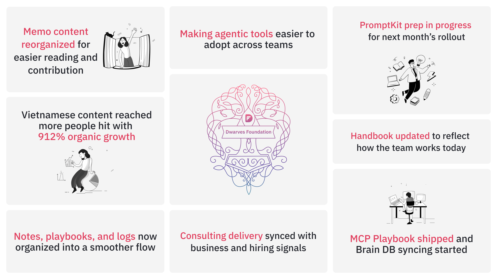
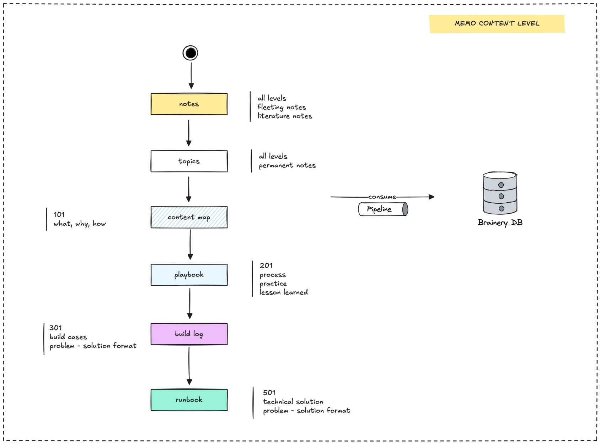
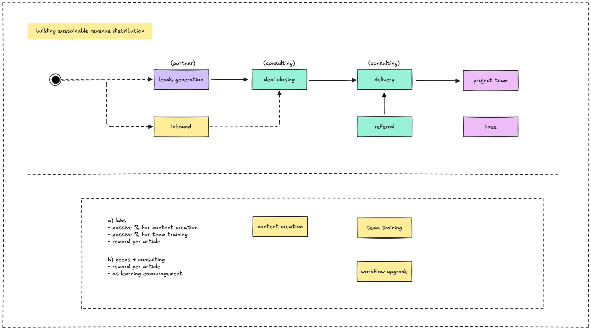

In April, we leveled up Memo from a write-up space into a real knowledge hub. Our internal agent stack became more usable with updated MCP docs, and internal knowledge flows, from consulting to hiring were cleaned up and made easier to share. Highlights from the month at a glance:

- [**Switching to Vietnamese boosted social reach:**](#vietnamese-content-strategy-picked-up-real-traction) With no paid ads, content views jumped 912.1%. Standouts were the March Frontend Report and the guide on selecting vector DBs for LLM apps.
- [**Memo got reorganized, easier to read and contribute to:**](#memo-got-a-clearer-structure-contributor-profiles-and-a-better-publishing-flow) Content is grouped by topic, key sections are pinned, and contributor info is live. Publishing also runs on checklists.
- [**We cleaned up how our internal tools fit together:**](#clarifying-our-internal-agent-stack-with-mcp-docs-and-brain-db-syncing) MCP Playbook got documented, prompts are now synced centrally, and team chats are starting to turn into reusable knowledge blocks in Brain db.
- [**Consulting delivery aligns better with hiring and external plans:**](#aligning-consulting-delivery-with-hiring-signals-and-new-partnership-pilots) The delivery structure is now synced with BD and hiring signals. A pilot program is being prepped to support developers in NGO/NPO projects.
- [**Making internal output more visible and reusable:**](#making-internal-work-more-visible-and-reusable-across-the-board) Engineering and market updates now live in one place. Monthly build logs and learning notes help track growth.
- [**Updated handbook to reflect how we really work:**](#updated-handbook-to-reflect-how-we-work-today) Clearer company vision, role focus split, and refreshed policies for side projects, moonlighting, and open-source support.

 

## Vietnamese content strategy picked up real traction

April marked our move to Vietnamese-first content on socials. It clicked. Without spending a cent on ads, we saw a significant bump across the board:

- 141.9K views, up 912.1% from March.
- 453.5% increase in content interactions.
- All organic traffic.

Two posts stood out in particular:

- [Frontend Report (March)](https://www.facebook.com/share/p/1LjHQgtRiA/) got the most interactions.
- [Select Vector Database for LLM apps](https://www.facebook.com/share/p/1AcMs3Zffn/) has gained strong traction in the dev community.

## Memo got a clearer structure, contributor profiles and a better publishing flow

Memo is shifting from a place for write-ups into a proper knowledge base. We focused on reorganizing how content is grouped, credited, and match how we actually search and learn:

- Pinned sections like Brainery, Data Engineering, Prompt Engineering now lead the way for hands-on learning.
- Content is grouped into themes like AI Ops, Productivity, and Engineering to help readers browse more easily.
- Each piece of content moves through four levels: from quick notes to polished insights. This gives the team a clear path to document and reuse knowledge.
- Contributor profiles are live. Posts now show who’s behind the work, paired with a consistent visual style and on-chain minting for visibility and ownership.
- An audit checklist and content calendar are in place to keep everything timely, no more relying on memory or manual follow-ups.

→ Visit: https://memo.d.foundation/handbook/memo/content-levels/

## Clarifying our internal agent stack with MCP docs and Brain db syncing

We worked on making our internal agent-based tools easier to understand and adopt across the team. The goal is to help the team see what powers our AI-first workflows, how to contribute, and how to apply these tools in projects.

- The MCP playbook server is now documented and shipped. It helps agents organize project knowledge into structured folders, like specs, changelogs, ADRs and save chat logs to the right places.
- We started syncing insights from internal chats into Brain db, turning casual discussions into structured knowledge that teams can build on.
- A new Playbook format is being drafted to help guide how we use internal tools throughout the software delivery cycle (SDLC).
- PromptKit and Prompt Playground are being prepared behind the scenes. A proper update is planned for May.

→ Repo: [MCP Playbook](https://github.com/dwarvesf/mcp-playbook)

## Aligning consulting delivery with hiring signals and new partnership pilots

Last month, we worked on tightening the link between how we deliver projects and how we grow the team. The focus was on making expectations clearer, surfacing hiring trends, and setting up better ways to support external work:

- Rolled out a new consulting delivery structure, in sync with aligned with the business team, so execution matches client direction from the start.
- Restarted signal tracking for hiring, especially in AI/data, so our hiring plans reflect where the demand is.
- Kicked off an internal pilot for NGO/NPO developer partnerships, exploring what support and impact can look like outside of client work.
- Began standardizing case study rewards for partnerships, so good work gets documented and recognized properly.

## Making internal work more visible and reusable across the board

We put effort into closing the gap between what gets built and how that work gets shared internally. A few structure changes are now in place to make team efforts easier to surface and connect:

- Merged engineering and market reports into a shared forward-engineering format, so what we ship lines up with the signals we track.
- Started logging build updates and monthly learning highlights in one place to keep track of our output and how we grow.
- Experimented with data contribution incentives to encourage team members to document insights that others can learn from or build on.

## Updated handbook to reflect how we work today

The Employee Handbook got a meaningful update this month, less about rules, more about clarity on how we work and where we’re heading together:

- Company vision now emphasizes co-creation: we build the future with the team, not just for it.
- Career growth structure added clearer expectations: 90% of your time is for your current role, 10% for long-term career bets.
- Open-source and venture support now better aligned: clarified how we backside projects that align with our values.
- NDA & moonlighting policies got an update to match the reality of cross-project and part-time collaboration.

→ Read the Handbook: https://memo.d.foundation/tags/handbook/

