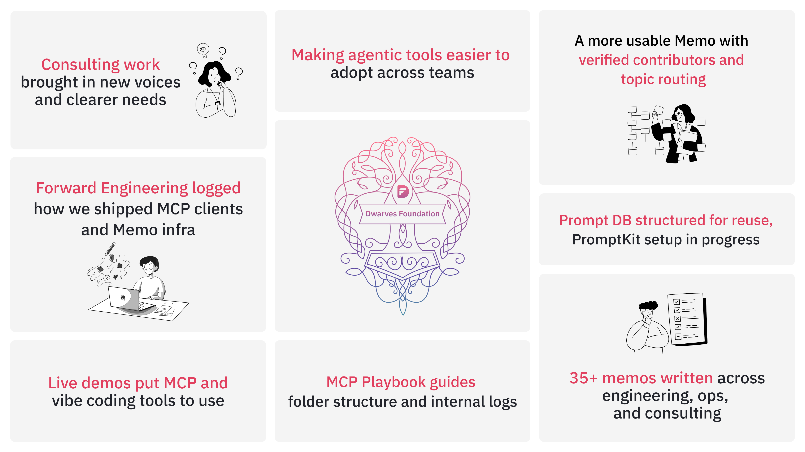
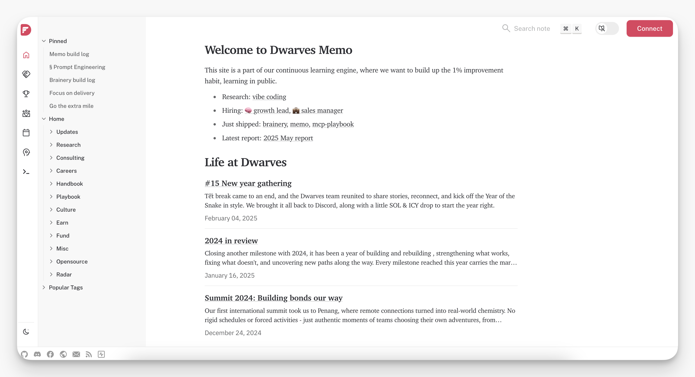
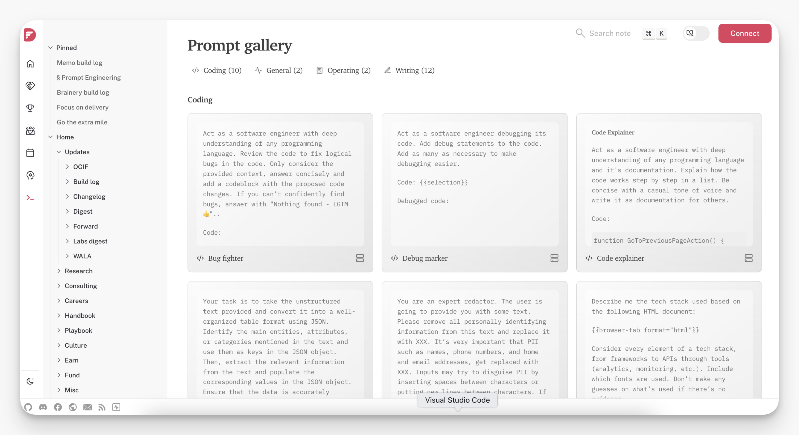
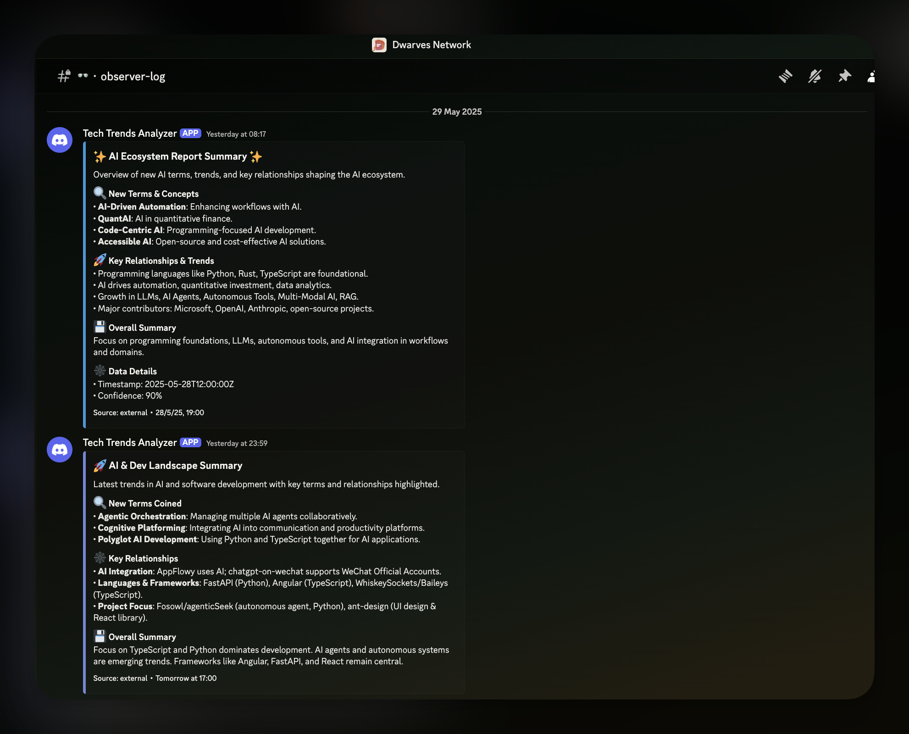
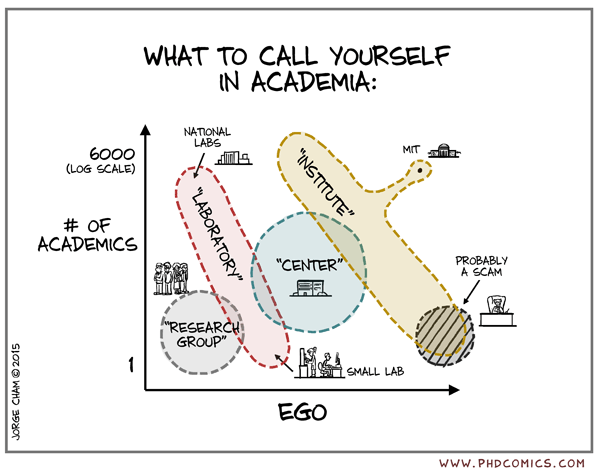

May was the month we finally shipped the stuff we've been promising ourselves for ages. You know that feeling when you've been talking about reorganizing your desk for months, and then you actually do it? That's what happened with Memo, MCP Playbook, and honestly, how we work as a team.

**Major updates:**

- [**Memo got rebuilt with contributor profiles and on-chain proof**](#memo-ui-overhaul-and-contributor-system-cleaned-up): New homepage, updated TOC, sidebar redesign, visible author info, and NFT minting support. Memo now reflects how we work and who's writing.
- [**MCP Playbook became operational**](#mcp-playbook-now-powers-how-we-document-and-log-project-work): Delivery folders now follow structured patterns (docs/, adr/, .chat/), and tools like observer-log and save_and_upload_chat_log work in real projects.
- [**Consulting inquiries picked up significantly**](#consulting-work-became-a-testing-ground): More client interest flowing in compared to early year, with team members like @minhlq and @hieuvd joining client calls and learning the shift from pure engineering to business-focused consulting.
- [**35+ new entries published across engineering, ops, consulting**](#content-ownership-habits-changed-internally): Covering everything from internal tooling and documentation to growth loops and consulting alignment.

**Supporting systems:**

- [**Prompt DB became the team's shared brain, and PromptKit entered prep**](#promptit-and-prompt-db-entered-the-pipeline): Centralized prompts for writing, debugging, and research with version control. PromptKit adds syncing and repeatable usage patterns.
- [**Observer-log bridged Discord and knowledge base**](#observer-log-now-active-on-discord): We shipped an internal Discord bot to quietly collect discussions, terms, and link drops. It's the foundation of a lightweight reporting layer.
- [**Live demos of vibe coding and MCP Discord integration**](#live-demos-of-mcp-discord-integration-and-ai-assisted-development-workflows): Real-time sessions showed AI-first development workflows from planning to implementation, plus team knowledge base querying through Discord bot integration.
- [**Forward Engineering: May edition**](#capturing-engineering-decisions-through-mcp-builds-and-publishing-infra): Shipped updates include MCP client builds, static site infra, Memo quality pipeline, and site build strategy documentation.

## Memo UI overhaul and contributor system cleaned up

The biggest shift this month is the new Memo interface. The homepage now reflects what we're actually publishing. Sidebar structure was updated to highlight real usage flows. Topic folders are no longer buried. Memo now feels like a proper working wiki, not just a dumping ground.

- Table of contents structure was revised to reflect reading intent.
- Contributor names are now visible at the top of each post. This small tweak changed internal habits. More people now care about what they publish.
- We cleaned up visual consistency and spacing between sections, making browsing smoother.
- On-chain NFT minting now works for every published memo with a verified wallet. Minting is optional but adds visibility and ownership tracking.
- Tags and topic routing were made more reliable so content doesn't get lost in the archive.
- A dozen system-level articles were added to explain how Memo actually works: architecture, build log, deployment, static site choices, Git submodules, and more.

Here's a list of documents detailing the development of Memo: https://memo.d.foundation/build-log/memo/

### Content ownership habits changed internally

Publishing workflows shifted from individual efforts to integrated team processes.

- With clearer contributor visibility and article grouping, publishing is starting to feel less like a side-task and more like part of our workflow.
- Contributors now regularly track from ideation to final drafts, helped by better publishing tooling and contributor listing features on Memo.
    

## MCP Playbook now powers how we document and log project work

- The MCP server ecosystem grew throughout May. Discord integration, database queries, GitHub automation, file processing. Each server handles specific workflows our team uses regularly.
- Chat logs sync to the right places without manual copying. Discord webhook integration captures insights from tech channels and stores them as searchable knowledge blocks.
- Used to structure delivery folders with /docs, /specs, /adr, and .chat directories.
- Early team usage shows tools like observer-log and save_and_upload_chat_log working well.
- Prompt syncing to prompt-db and changelog generation now feel more integrated with project flow.

→ Repo: [MCP Playbook](https://github.com/dwarvesf/mcp-playbook)

## Consulting work became a testing ground

Consulting inquiries picked up significantly in May compared to early year. More interesting than the volume increase was how we approached these projects differently.

Team member like @minhlq started joining client calls, learning the shift from pure engineering to business-focused consulting. The challenge isn't technical complexity - it's learning to understand what clients actually need versus what they initially request.

As @minhlq put it during our community call: "You have to guess what they really want. Sometimes they don't even know themselves." This requires a completely different skill set from traditional development work, shifting perspective from pure technical focus to understanding business value and client success metrics. Instead of treating consulting as separate from research work, we're using client projects to validate and refine the tools we're building.

## Article contributions picked up across ops, engineering, and consulting

Content output reached new levels with broader team participation across all functions. More than 35 memos were published this month, spanning:

- System and infra decisions (Makefiles, static sites, Git submodules).
- Product and consulting patterns (growth loops, agency structure, client-side vs team-side models): https://memo.d.foundation/consulting/
- Operational thinking (wealth studies, engagement models, planning frameworks): https://memo.d.foundation/handbook/
- Forward-thinking topics like inefficiency arbitrage, market cycles, and delivery signals

→ Browse all: [memo.d.foundation/updates](http://memo.d.foundation/updates) 

## Promptit and prompt-db entered the pipeline

We moved prompt management from ad-hoc sharing to structured systems and version control:

- PromptKit prep work began with content structure planning and internal syncing systems set up.
- prompt-db now lists operating prompts, templates, and synced prompts to help teams write and track more repeatable LLM patterns.
- The repo doubles as both a prompt library and version history for how prompt thinking evolves over time.

→ Repo: [Prompt DB](https://github.com/dwarvesf/prompt-db)

→ Memo: https://memo.d.foundation/prompts/ 

## Observer-log now active on Discord

We deployed automated knowledge capture to track team discussions and shared resources.

- Our new Discord-based bot now logs tech activity, from shared links to concept discussions.
- Captures key context like terms, timestamps, and summary insights without disrupting team flow.
- Feeds into our internal reporting and documentation structure, acting as a passive knowledge collector.

→ Join our network and check it out at **👓・observer-log**: [discord.gg/dfoundation](http://discord.gg/dfoundation) 

## Live demos of MCP Discord integration and AI-assisted development workflows

In our last community call included live demos that showed the tools in actual use, we proved our tools work by using them live during the community call. Real queries, real implementations, real feedback when things didn't work perfectly.

**MCP Discord bot querying team knowledge base:**

- Real-time querying of team knowledge base through Discord interface.
- Search functionality across prompt databases and documentation repos.
- Integration with multiple MCP servers (Playbook, GitHub, Context7).
- Live data retrieval showing actual response times and query results.
- User management with encrypted API keys and authorization headers.

**Complete planning workflow with AI:**

- Live coding session from initial brief to implementation using Gemini 2.5.
- Automated generation of overview.md and feature.md specification files.
- Project structure documentation using tree commands for context loading.
- MCP Playbook integration creating ADRs, changelogs, and specification templates.
- Real-time context building with 25+ tool calls for comprehensive understanding.
- Document-first approach showing planning before coding implementation.

These were working sessions that showed both what works and what still needs improvement. When the bot took time to initialize or queries didn't return perfect results, that provided valuable feedback for the next iteration.

## Capturing engineering decisions through MCP builds and publishing infra

We shipped the May edition of [Forward Engineering](https://memo.d.foundation/updates/forward/2025-05/), covering internal experiments like:

- Building MCP clients for Discord.
- Streamlining site deployment with Makefile.
- Memo quality pipelines and Git submodule structure.

The radar this month included key developments: MCP ecosystem expansion, agent-first workflows, vibe-coding approaches, and AI-powered IDE trends. Microsoft's decision to open-source VS Code's backend is particularly interesting - it democratizes AI coding tools and removes the need to fork entire editors just to add AI capabilities.

The format now includes more technical deep dives, meant to be reusable by others across teams. Instead of just tracking market trends, we're documenting what we're actually building and how others can use it.

## We're building a different kind of company

The changes in May show we're not building a traditional consulting or product company. The shift from consulting-first to research-first is already changing how we allocate resources, approach hiring, and prioritize work.

Our hiring strategy has started leaning toward specific traits: data intuition, architectural thinking, and a sense of aesthetic judgment. We're also preparing for an apprenticeship model to grow these capabilities internally over time.

Knowledge capture through tools like MCP Playbook, Observer Log, and runbooks lays the foundation for smart scaling. When operational knowledge lives in systems instead of people's heads, growth multiplies instead of getting lost.

On the infrastructure side, treasury protocols and automation systems are doing the heavy lifting. When admin runs itself, people can focus on problems that actually require human judgment.

Read more: https://memo.d.foundation/build-log/company

## What's next in June

June's looking interesting: expanding MCP server capabilities, finalizing vibe coding course materials, continuing to build tools that solve real problems. The apprenticeship program is taking shape, and we're seeing what AI-first consulting actually looks like in practice.

The next phase is moving from AI workflows to AI agents - systems that can orchestrate multiple tools and handle complex planning autonomously. We're already seeing early patterns of what this looks like through our MCP ecosystem and vibe coding approaches.