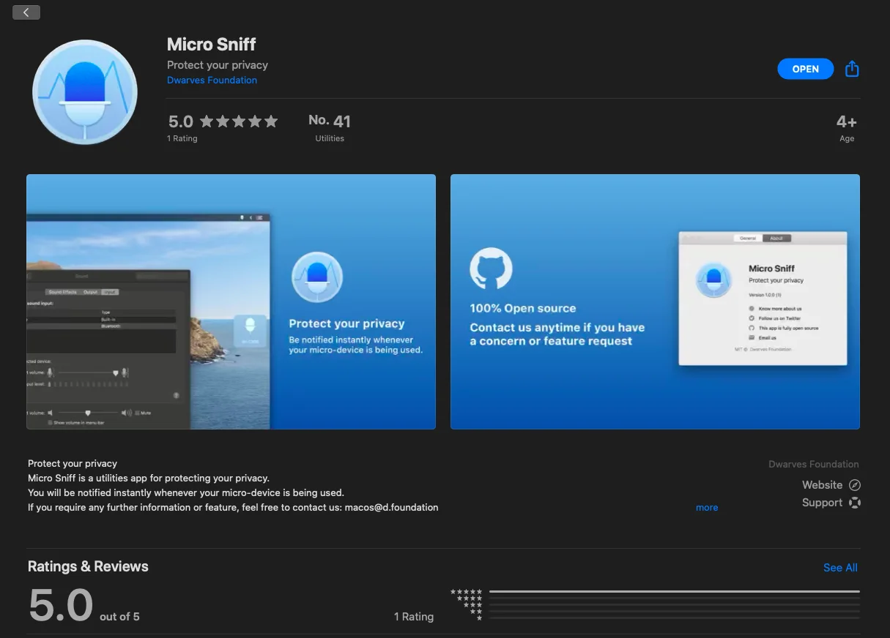
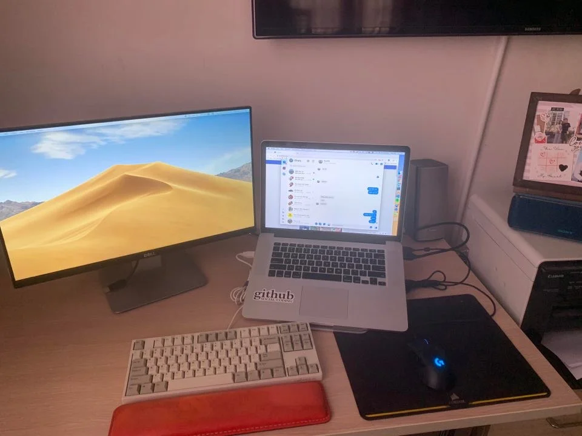

## Team Jacket Deposit? Done

---

So here are some quick checks I've notices the past week

- We rolled out the 1st #DFOnAir - a series where we interview our in-house Dwarves and
- A new site to mix up programming music x ambience
- A brand new released 'bits' from macOS team
-

A bit much to process, isn't? Take your time!

### #DFOnAir: Huy N - How I end up being here

# DFOnAir is a type of quick interview for our Dwarves. Van and Duy is taking care of it. In the first episode, we brought Huy N "on-air" and spent 30 minutes listening to how he decided to become a part of us. It's quite mainstream at first, but the more we talked about it, the more it got real

Interviewing during Covid-19 outbreak is fun. We conducted it through a casual Zoom meeting and recorded it. Since Huy is famous for his could-not-be-more-loud-and-clear voice, Duy is still on her way embellishing the transcript. In the meantime, you can find the record video here in Team Drive.

### sudo.fm - coding vibe x rainy mood

Ever imagined listening to Spotify's favorite under the rain? Guess what, we got that covered even in this sweltering April!

It's hard to lift up the mood or productivity without music. As a result, we came up with a site that combines both our favorite playlists and a twist of ambience noice.

Check out the 1st version at sudo.fm. Minh Luu is currently working on it so feel free to ping him if you have any question, or a cool playlist to add up the fun.

### Latest Update on Dwarves Handbook

<https://github.com/dwarvesf/handbook/blob/master/who-does-what.md>

A few write up on our latest role definition. Thought we have mentioned this a ton, I know, but the team keeps changing and we gotta make it up-to-date as much as possible.

### Team Jacket Deposit

A great way to wrap up our March. We've had a deposit for our team Jacket and the supplier is dping their job. It took us a few times to finalize the demo sample, but we love it.

### 1st Release of Micro Sniff

The latest "bits" from MacOS team. Micro Sniff helps us to recognize the current in-use microphone by display a vague icon with the name of that microphone on your desktop screen.

### New Hires

Looks like the team is getting bigger day by day. We welcomed another Frontend Engineer last Wednesday.

It's Van Tran's first time to work remotely, and he is very interested to join our remote system by dropping his home desk shot at our Snap shot campaign!

