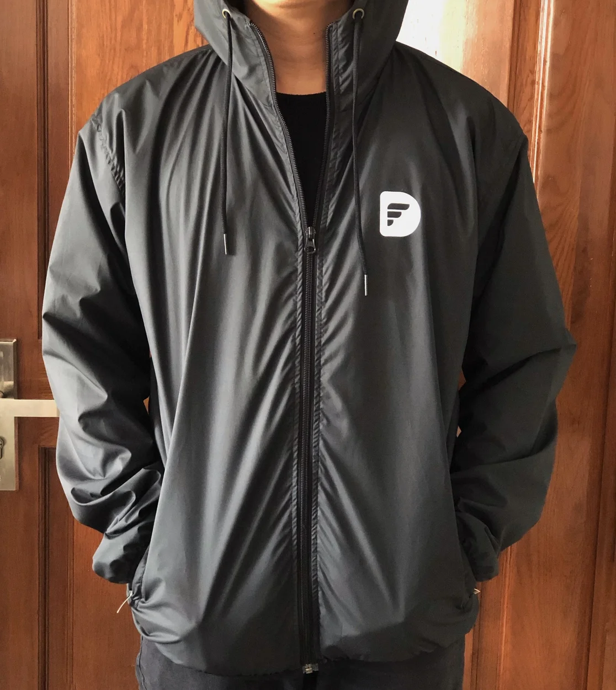
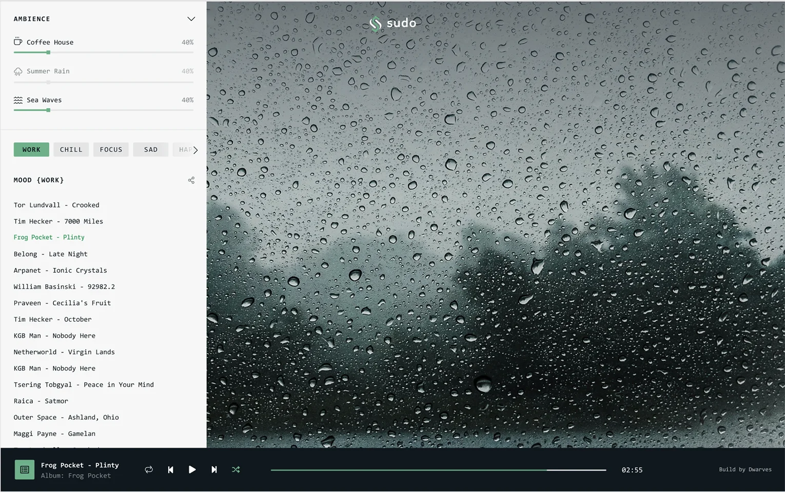

## Your Team Jacket is ready to pick

---

There's just too much to tell in a recap. Hope this week's news makes your Saturday like it did to mine.

### Orientation Slide for Newbie 🔦

From now on, introducing our company won't be as hard as it used to. Having a slide for newbie orientation makes it easier to explain our system, code of conduct and our daily workflow. We keep a PDF version here in team Drive.

### Team Jacket 🙌

Finally, the wait is over. Our Team Jacket has been delivered yesterday. If you're still in the city, stop by block B to grab yours, don't forget to ping Duy in advance so she can track the amount onto our system.

We're having 4 sizes in total: M-L-XL-XXL

### sudo.fm 🎧 - listening without thinking

sudo.fm is a music site that combines our chilling playlists with a theme of ambience noise. Currently, Thunder Rain and River stream are the first two that the team came up with. Hope to see more of the likes. The Breath and Life x Thunder Rain combo has been my most favorite so far 👽

### #DFUncensored - Huy N. 📟

The transcript from our quick talkshow last week with Huy N., on his journey to get where he is now, his perspective towards the industry and some advices for the juniors.

A brief intro on yourself and how you choose Dwarves Foundation in the first place?

My name is Huy. I’ve worked as a Backend Engineer for three years already. Back then, I got introduced to Dwarves Foundation through Thach, an old friend and also a former Dwarf. I've been staying here ever since.

What keeps you here this long?

At DF, I got to work overlap on different types of work and up to several domains. Other companies might tie me to backend work only, which is sucks. What sticks me here is the chance to experience. One other reason is the environment I’m surrounded by: Supportive teammates and a BOD who recognizes even the tiniest effort.

You also work as an Engineering Ops, so how is your typical workday looks like?

I barely count the hours. But my recent routine starts at 8AM due to a remote working schedule. It took me an hour for breakfast and got prepared. Then I start the work at 9, stop for a 30-minute lunch at 12, and get back to work until 6PM. Then I take a long break for dinner and family gathering, get back to clean up some small task, and finish by 10PM. I guess my day transpires for 10 to 11 hours.

Sounds pretty long. Have you ever thought that you’ve been forced to OT?

There is a formula for this. Distance = Speed x Time. By distance, I mean the year we are willing to spend for this job. For example, I’ve been in this industry for 3 years, but another Engineer has been here for 10 years already. Technically, I can never compare that time to him. To reach the distance he has gone, I must put double, maybe triple of the time to speed up. That’s how we shorten the distance and grow up faster. 8 hours a day is still good, as long as you make every minute count.

Say, a product crashes in the middle of the night and must be fixed in short notice. If your team happens to deal with that, and your teammate requests an OT payment to get the job done. What would you do?

Being in charge of a product means it’s your responsibility to make it work. That is off the negotiation. If my teammate refuses to work without an OT, that reveals his poor work ethic. I don’t mind the hot-fixes. As a leader, my responsibility for the product is bigger than anyone else. But that will change my judgment on that teammate, and in future cases, I might refuse to work with that guy.

I can tell your mindset is quite different from other developers at your age. Do you think that what helps you earn what you’re having now?

I think attitude and mindset play vital parts at the early stage of every career. It even outweighs the skills. Skills upgrade your ability up to 20%, but attitude and effort bring you to wherever you want. Effort doesn’t work unless your attitude towards the job is positive. Skills become useless once your attitude is out of control.

Between an intern with a good background and an intern with a proactive mindset, your choice?

Lol, needless to say, I’ll go with a cool mindset. For the record, my background didn’t stand out. I started from the network then turned into programming, and I made it happen. Education can’t speak much for a person. Processing an open mindset is easier than working with someone who refuses to think out of the box. My team is an example, I picked out the right heads, and they still stick with me through the times.

Why Software Engineering (SE) instead of other majors?

Because SE makes a killing, I’m telling you. Back in college, I had 2 options. One was to follow Chemistry, and the other was IT. But after full consideration, IT seemed to bring more chances to earn a better living. I’ve always wanted to be financially autonomous since I was a little kid, so I’ll grab any opportunity that stops by.

Have you ever had a second thought on SE after a long time running with it?

I always tell the juniors, chasing after money is not a wrong choice. It's a solid motivation. But I hope they can find other targets to make the job more meaningful. It doesn't have to be a huge one, but it should be inspiring enough to push them to grow. At this moment, I'm happy with what I do. Build useful tools that bring impact to others. Of course, I still make money out of it, but it'll be more fun once you know your work matters to people.

I heard you mentioned the real meaning of being a SE. Can you give us a broader view?

The meaning of SE is to support other industries, I believe. It tackles their problem and makes it better, such as reducing operating costs or resolves social issues. For me, SE means more than just a mundane programming service. Once you develop a product, it should come with long-term value. It’s our job to advise the best solution and must be customer-oriented, rather than being a short-term service provider.

In your view, what makes an excellent engineer?

Logic must be the most essential qualification. The nature of SE is all about coding and data processing, which requires logical thinking and the ability to catch-up quickly. Software changes really fast. Programming languages and industry trends move constantly. If you can’t adapt, the chance of being left out is inevitable.

Would you prefer to work with an experienced engineer with 1 language only or a flexible one with the knowledge of multiple languages?

Each language solves a different problem. That depends on the need of projects. For instance, Golang helps developers to collaborate effectively. Software written in Golang can be pushed on Cloud and better make its way to the open-source market.

Ruby or Node.JS is simpler and faster to code a product. These languages will be used for projects with a short development time. So basically, I don’t care how many languages an engineer can code. Their logic and their roadmap for the project will raise my eyebrows. I’ll give a pass if a CV portraits the person’s level of professionalism. A direct interview will reveal more about the person himself.

Many developers out there compare their paycheck from different companies. Some of them claim that the income of engineers is higher than in other jobs. Do you agree?

IT indeed makes more money than other jobs, due to its high demand for product development. But for the comparison part, I think it’s better to think this way. Focus on the income we earn from now until retirement, instead of the monthly payroll number. Some choose a different job because they wish to optimize their current payroll. Others, like me, will prefer to maximize the final income. My first years after graduation were spent on learning, experiencing, and skill upgrading to better boost up the self-value. Depending on the goal, people have their type of approach.

So what if you’re put between a company with a great offer; and a company with a lower paycheck but more chance for self-development?

Damn, this is hard. I guess if the value of the 2nd company is bigger than their offer, I’ll go for them. But if at that time, my goal is to earn as much as I can, the 1st one will be my option.

During your time as a leader, do you have any difficulties working with teammates who are older than you?

I’ll be lying if I say there is no pressure. There is. As I’m younger than them, sometimes it’s hard to give feedback and judgment. But people are very open to receiving feedback since they know that it's for good cause. Personally, I don’t care much about their age
