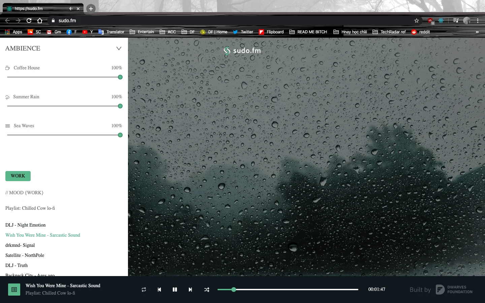
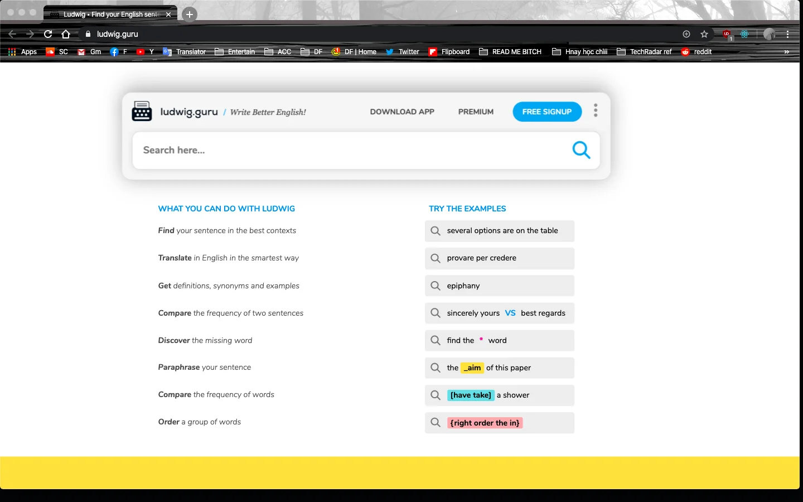
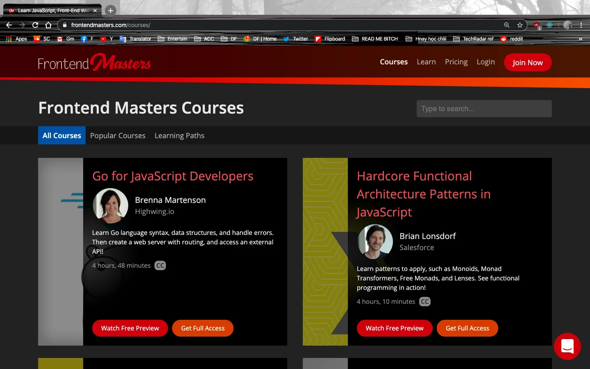
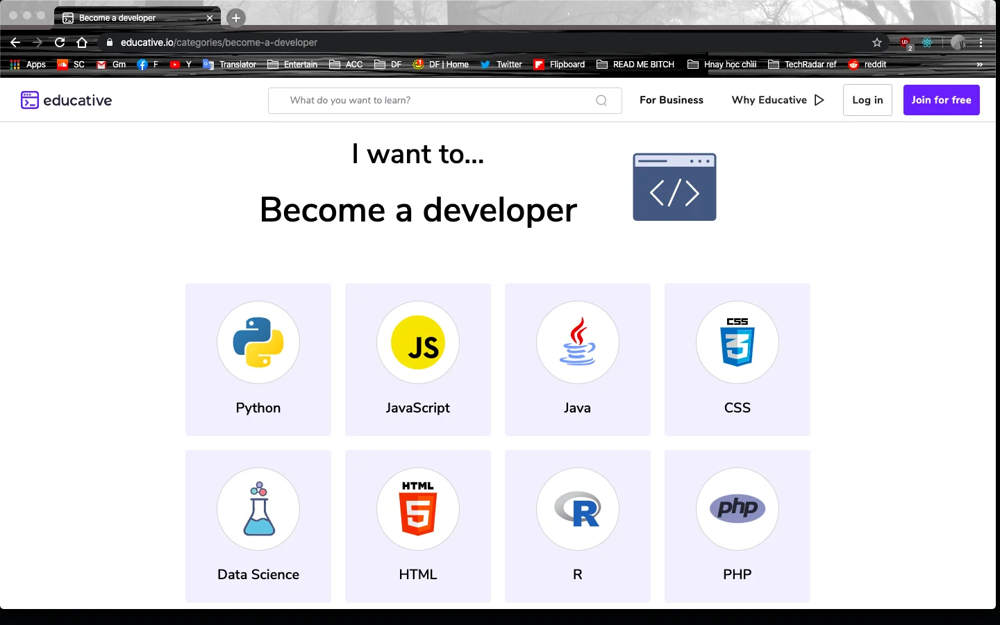
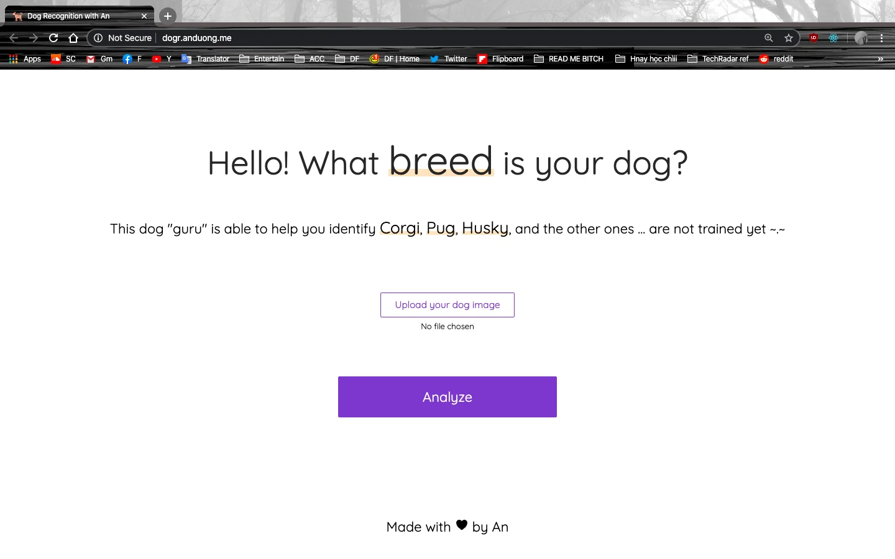
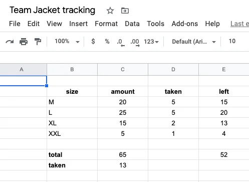

## This is mail subject

---

First Micro Sniff, then sudo.fm, now Readify and other macOS bits are still queuing on the list. This quarantine leaves us with too many products, I can't help sharing.

Enjoy this week's article. Happy Saturday ✔️

### Next version of sudo.fm 🎧

We brought sudo.fm back this week due to its brand new UI, more ambience options and especially, the music list from ChilledCow. Lo-fi is always the choice to combine focus and relaxation.

Click on the icon of the ambience you prefer, and select a song below. I still miss the Thunder rain ambience from the previous version, hope to have it back soon.

### Team Accounts for Knowledge Hub 👥

To further meet your demand in knowledge expansion, Van has created some accounts for these essential needs

- Ludwig Guru: Ludwig helps to select the best sentence for your paragraph by providing suitable contexts. Some of us have been using Grammarly for a while, but that only works for word choices. We know that.
  

- Frontend Masters: to all Frontend geeks, this one is for your. The in-depth courses frontend advanced skills from Practical Guide to Hardcore.,
  

- Educative: Another Interactive coding skills course for different languages. Unlike Frontend Masters, courses from Educative are laid out in rich text, allows you to practice as you learn with no set-up required.
  

All the accounts are saved in Team 1Password, for those who haven't get familiarized with it, take a look here.

### What's your fun in Quarantine? 🐶

An came up with this during the quarantine, a self-built site to identify your kind of dog. Upload a photo of your dog, or your best friend, and the site will suggest whether it's a Corgi, Pug or Husky.

### Team jacket pick-up

Some of the Dwarves have grabbed their jacket home. It's good to know they're all happy with the size and the model. Duy has a record of stock. So far, here are what we have left in numbers and sizes.

### DF's Bookstore 📚

We're gathering the books to create a better team library, or a mini bookstore - as they usually call. For newbies or current Dwarves, you can see the book list in alphabetical order here

If you're happen to borrowing one, drop Huy N a message so he can log it into the system.
