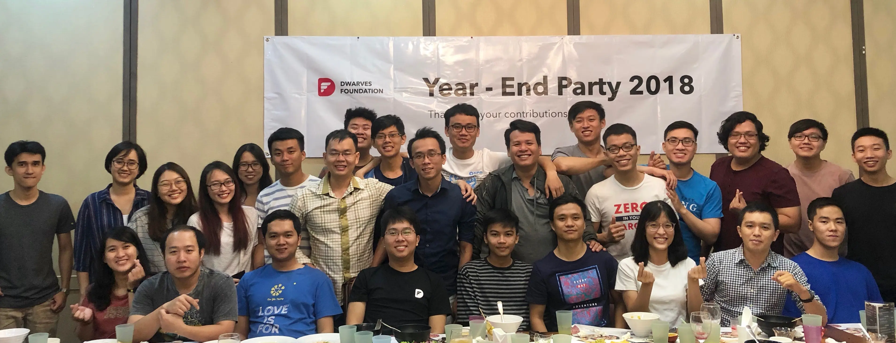

2018 was the memorable year with lots of achievements.

We adapted the new team structure.
We defined things we value and live that culture tediously.
We moved to new office. We welcomed the new dwarves to join us.

We scaled up from 15 to 30ish with all the smart people gathering around and commit to the dream of building our first global software company.

We learned how to do things right and started using it to help deliver quality software.

Everything is just the beginning of our first chapters and it couldn't be that good without you. I'm very thankful for all the contributions that you have made and looking forward to 2019 with all of you.

-Han
