Started with 3 engineers working in different coffee shops because we didn't have an office back then, we are gearing up for the second coming in our journey with over 40 clients and partners worldwide, +1M lines of code later throughout more than 7 years.

It's like building software - we call it Dwarves 2.0 - our latest major movement.

## Wrapping up Dwarves 1.0

2021 is full of changes and challenges, but our can-do mindset makes us gritty. We don't have all the answers, so we try and do. As we state in our [**Agile Minifesto**](https://dwarves.foundation/manifesto): Fail fast, learn often, and it's okay to start over.

The results are way beyond our expectations. We work with several great clients and partners. We automate most of our operations using Notion, Basecamp, and our very own Fortress. We form a team specialized in blockchain & web3.

And along with everything, we do everything we can to level up our team.

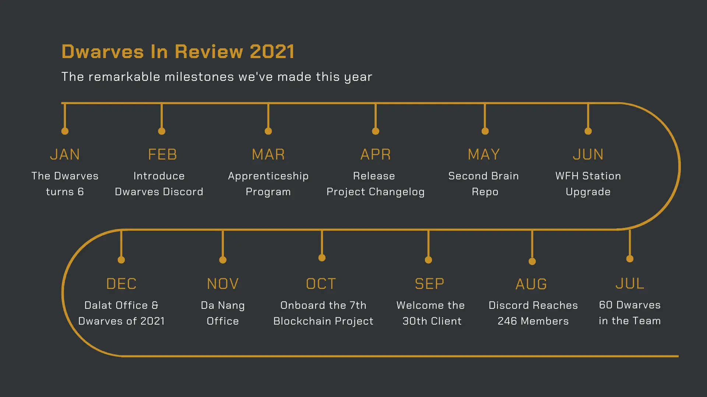

## A few things worth celebrating

### The team benefits go up

The Dwarves are our greatest asset. Most of our effort goes into hiring the right ones, giving them absolute support to grow with us.

- The Dwarves recently enjoyed a significant raise in compensation.
- With Dwarves Token, everyone contributing to our growth gets rewarded a portion of the company.
- The engineer career ladder was refined with 1-1 mentoring.
- We offer more internal training, and the team keeps inputting their valuable piece of Knowledge.

By launching [Dwarves Discord](https://discord.gg/dfoundation), we're able to connect and interchange our knowledge with the people who care about tech as much as we do.

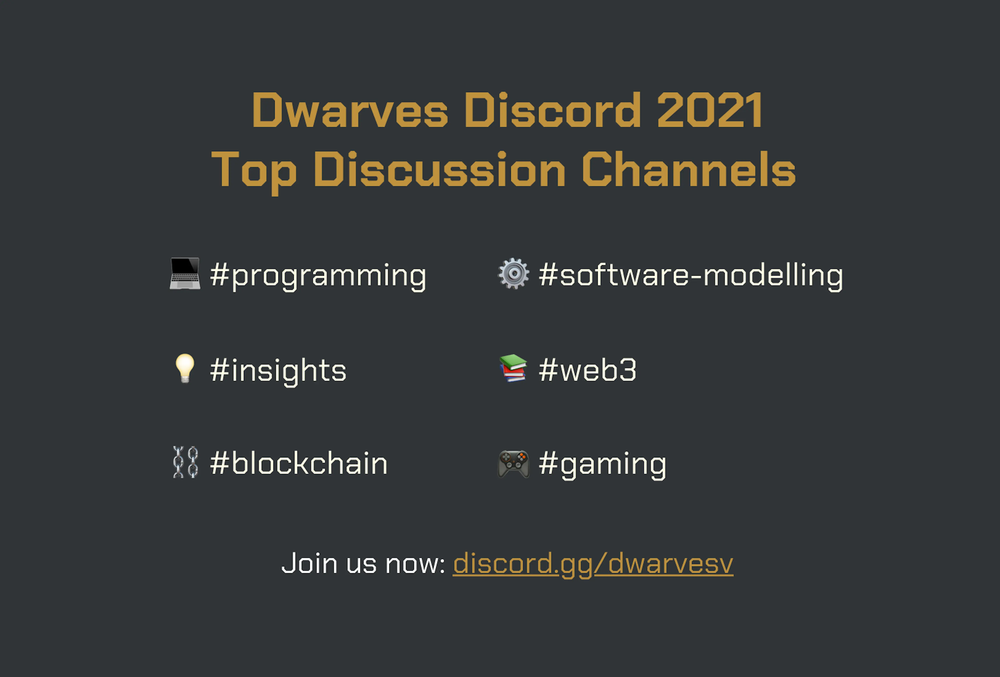

### Making our marks in new tech

New technologies shape the future. It's our all-time belief. Within this year, our bet is on the Web3, the Open Internet, and the next-gen automation software using AI and Big Data.

- A blockchain-specialized & web3 team was formed.
- **Multiple study groups** within the team focusing on: Blockchain & Web3, Metaverse, AI & ML, Data Science, Automation.

We attract the same DNA. Our clients are organizations that put tech at great importance to their businesses. It's always a proud feeling when our clients share their achievements with us, knowing we play a part in it.

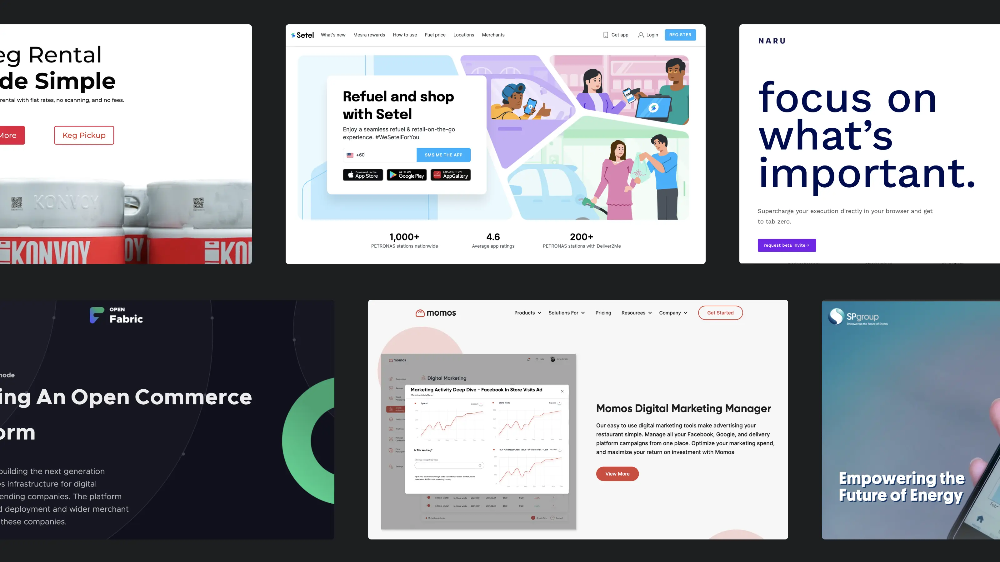

### Our vision and belief stays the same

Even with everything we managed to pull through and achieve, we are still makers at heart. [Our vision and belief](https://github.com/dwarvesf/handbook/) are built to stay.

[Engineering is still our culture](https://github.com/dwarvesf/playbook/blob/master/engineering/README.md). Software craftsmanship is still our end goal. We are still putting in hard work every day. It's the spirit to build a company where everyone enjoys their work and stays proud of everything they ship.

## We are growing fast

### Bigger & borderless team

Remote working shaped into our culture. Our engineers have the full support they need to perform at their best. People were granted options to upgrade their WFH station. Everything is going smoothly as a 100% remote team across 4 different time zones.

**The Dwarves seek for more teammates in 2022**

Our team is currently at 60 mems and we road for a double number. The list is opening at [Dwarves Career](https://memo.d.foundation/careers/hiring/) - but we will find you the best fit if we're having the same core value.
And we'd love to onboard like-minded people to our Discord Network: [**discord.gg/dfoundation**](http://discord.gg/dfoundation).

### Forming the getaway chalets

Though the Dwarves can work anywhere they want, we still have offices in 3 different cities in Vietnam.

- **HCM**: Our first official office, sitting in the heart of HCM
- **Dalat**: The built-in-office cafe intended for work-cations. Whenever our engineers feel like getting away from bustling cities, they can spend their days here. Our clients and partners are welcomed too.
- **Hanoi** (_coming very soon_): An office located in the tech district of the capital of Vietnam helps us be more available for more talents in the country.

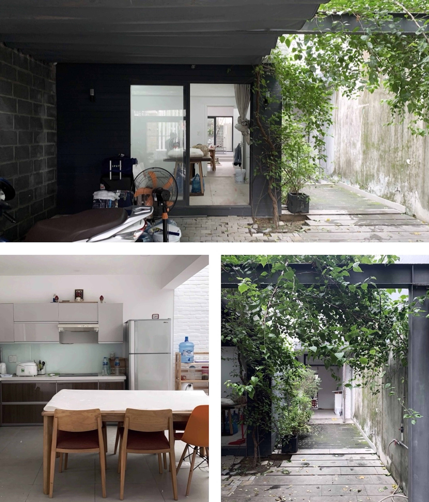

## Expanding the Community

- **[Dwarves Discord Network](http://discord.gg/dfoundation)** hit 200 users in <4 months of launching in public. We offer various channels for the community to take part in, and a weekly 101 Tech session every Monday - 5PM.
- **[WeBuild](http://webuild.community/)**: WeBuild Day 2021 turned out with +100 attendees. It was a sum up of what's been trending in tech, from Build in Public, Developers in Covid Support, and the so-called NFT hype.
- **[Vietcetera](http://vietcetera.com/)**: Techie Story has now landed a new space on this fast-growing media platform, officially marking a new milestone for us to keep spreading the inspiring tech stories.
- **[Techie Story](http://techiestory.net/)**
- **[Golang Vietnam](http://golang.org.vn/)**
- **[Startup.vn](https://startup.vn/)**

## Dwarves 1.0 In Numbers

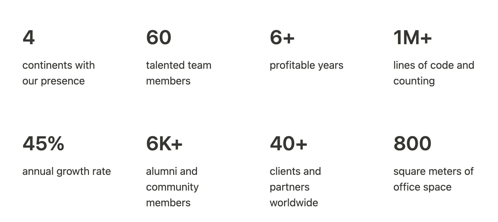

## Highlighted Dwarves of 2021

We couldn't go this far without the teammate's hard work. To tribute all the effort our team has made to keep this woodland going further - we continue the annual tradition Dwarves of The Year.

With the subtotal prize value up to $10.000 - we equip the nominees with what they need to level up the game in 2022.

### Dwarves of 2021

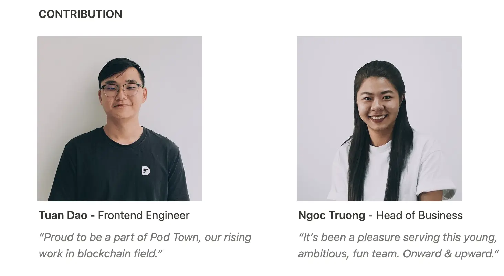

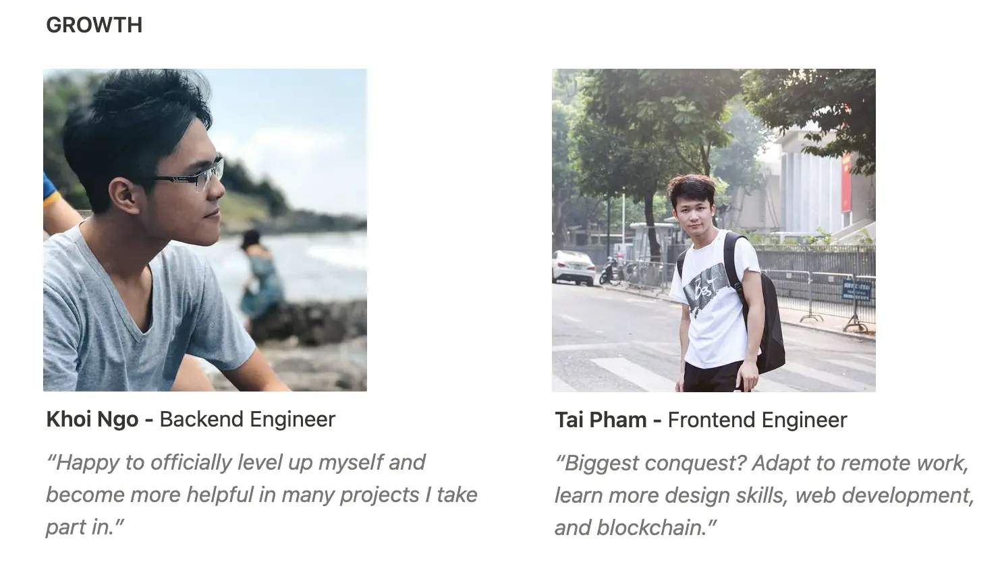

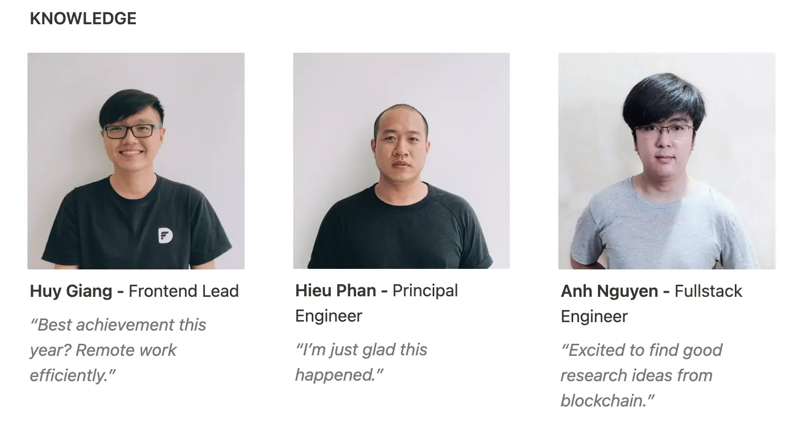

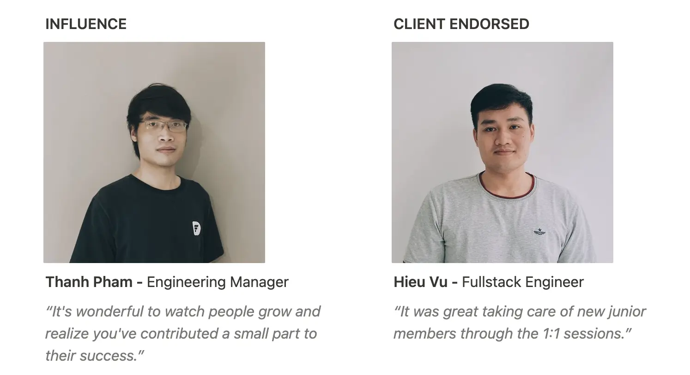

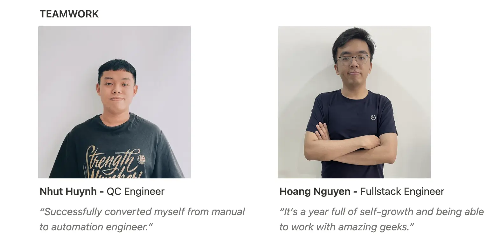

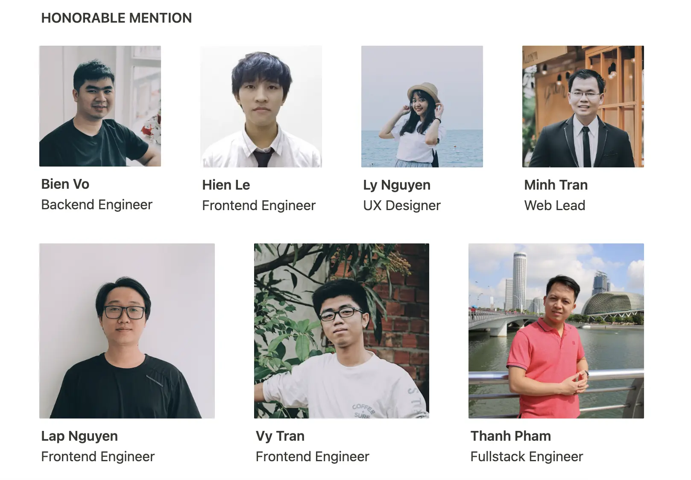

## New Iconic Items

