Successfully went through 2022, a year that we might say - a new record: team reached highest growth record, kickstarted community engagement, home, compliance training & individual development are speeding up, and a whole new place to call Dwarves.

We've achieved to this year's resolution: A team that cares about how to build software right and can teach others on that.

## TEAM GROWTH

### 30 New Team Members

**[2022 matched us with the 80th Dwarves](https://github.com/dwarvesf/handbook)**. A notable highlight, and we're ready to have more. It's not easy finding like-minded people. It takes true & solid seeks. Even though people come and go, the spirits stay.

Expanding the team doesn't mean we have to disregard our culture. We have launched [a mechanism](https://memo.d.foundation/playground/_memo/passing-the-probation-get-3-upvotes/#the-talent-pool) to help us protect our culture and co-create our future using tech. For us, approval happens when someone is accepted by the team, not by management.

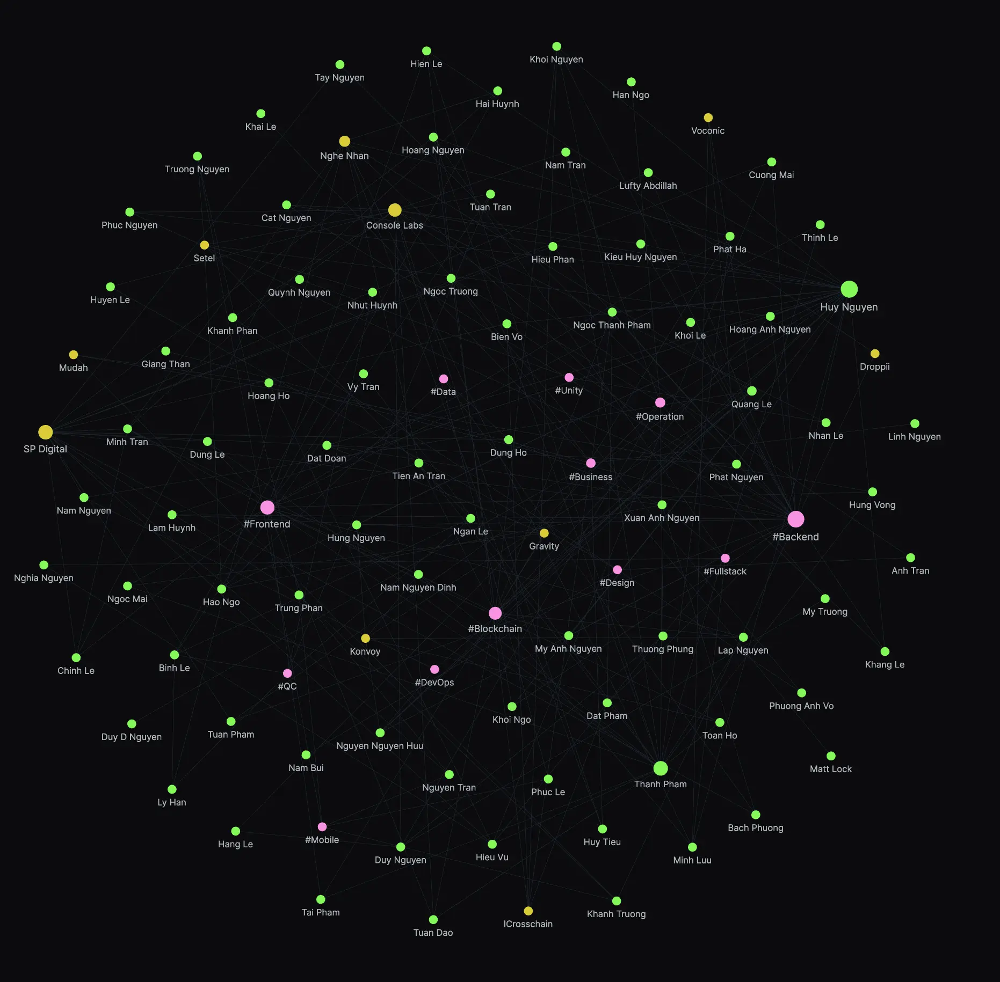
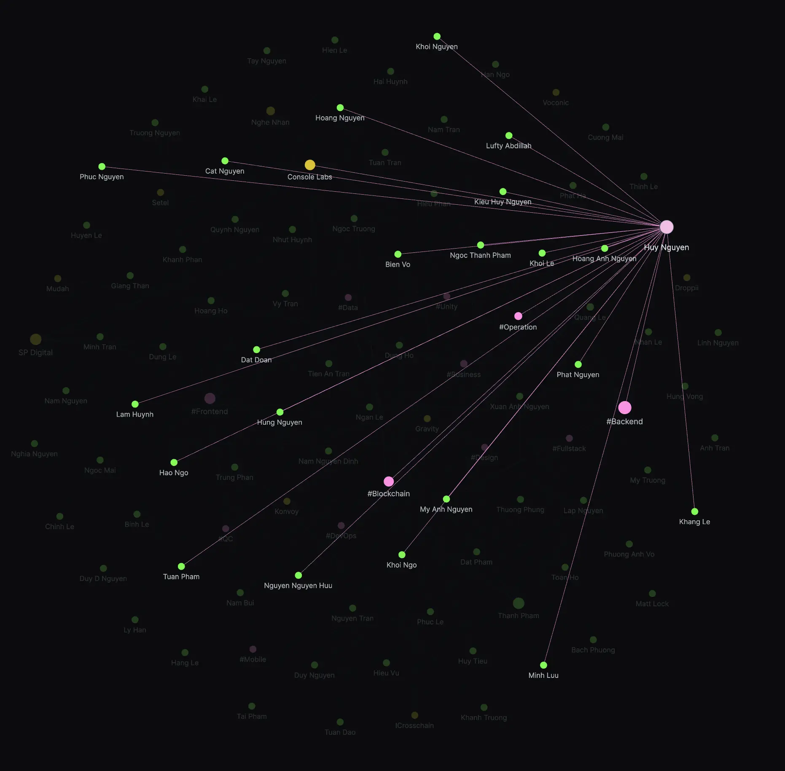

_The Dwarves Collective, using markdown to visualize bonds between members._

### The Next Leading Chairs

Launching 3 offices across the country - Saigon, Danang, and Dalat, more initiatives to distribute our software know-how, and a **46% growth** in team scale calls for a different way to run the business. Shifting from a remote working model to a hybrid working model is a must, but it wasn't easy.

The bigger team and the new model require more hands on deck. Instead of the old-school Board of Directors, we divide our leadership team based on what each member delivers.

### R&D Team

Research and Development (R&D) came about as a collective department for solving common problems we encounter across all of our projects. As an innovative software firm, we found that the foundations for creating software are vital to making them successful.

After its launch, the R&B has completed the first challenge: **Feature Flags**

Feature Flags tackled a concern spanning across our DevOps, Management, and Engineering domains.

- **Feature flags**: Options to enable/disable a feature in the application to help developers have a good experience and improve performance in the development process. We have discovered 3 solutions to resolve this challenge. With a wide range of solutions, we have the ability to serve any type of usage and project in development life.

- **The detailed solutions:**
- [https://viblo.asia/p/feature-toggle-BQyJK33QJMe#\_introduction-0](https://viblo.asia/p/feature-toggle-BQyJK33QJMe#_introduction-0)
- [https://dwarvesf.hashnode.dev/common-challenges-feature-flag](https://dwarvesf.hashnode.dev/common-challenges-feature-flag)
- [https://medium.com/dwarves-foundation/design-a-feature-flag-system-7986b4a080cc](https://medium.com/dwarves-foundation/design-a-feature-flag-system-7986b4a080cc)

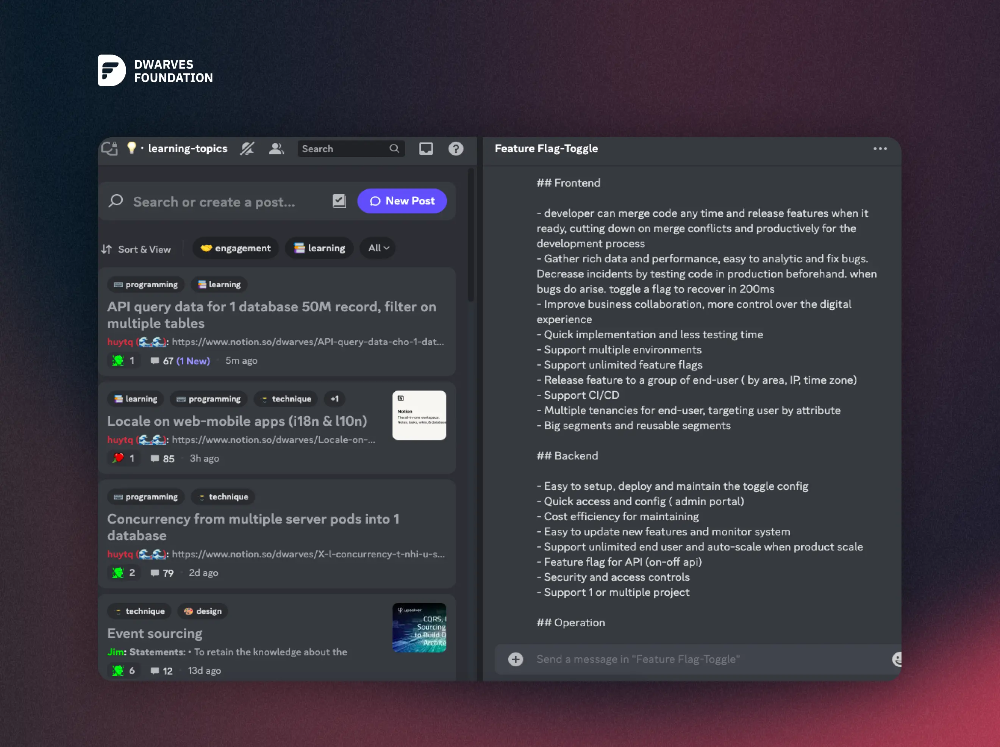

### Learning As The North-star Metric

_A 2022 look back on our Brainery timeline, with a total of 128 notes contributed._

The concept of **"The Fastest Learners Win"** has always been big between the Dwarves. 2022 though, we opened our learning initiatives to the tech community. Everyone can join in to learn with us, sharing their experience with us, then get rewarded in return for their contribution.

The response so far has been amazing. We got words saying peeps get to upgrade their skills and work smoother in their projects.

Just a bit of research on new tech could mean a job opportunity, or perhaps a turning point in their life that make them leaders in a new segment of an industry.

- [Brainery](https://brain.d.foundation/): our knowledge hub, where we share what we learn with the world.
- [Engage & Earn](https://memo.d.foundation/): our system recognizes people who put in the effort to share knowledge.
- [Dwarves Tech Radar Volume 4](https://www.facebook.com/photo.php?fbid=833917351164701&set=pb.100036393316096.-2207520000.&type=3): a place for our engineers to trial and evaluate emerging technologies, and to help set the direction for Dwarves' tech stack.
- [Engineering Publication](https://memo.d.foundation/): our extra effort goes into learning and researching on how we can get better with technology.

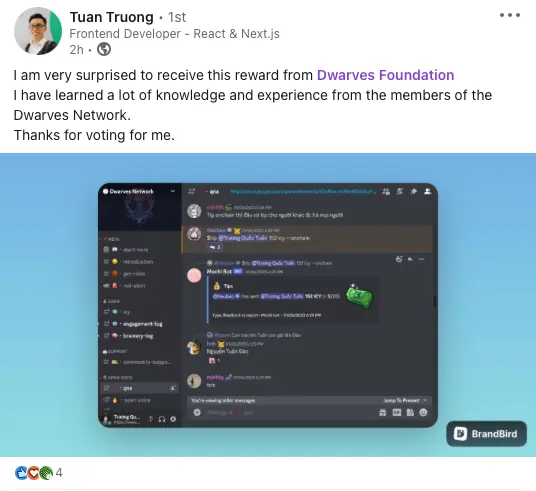

## Business Growth

### Revenue Growth

Despite the economic uncertainties across the globe in 2022, Dwarves has seen amazing growth and we are a profitable company. **Our revenue hits a new milestone, while the growth rate is estimated at 198% compared to the previous year.**

Striving to create and go the extra mile for a generation of new tech enthusiasts, we build quality software and learn new things that generate a solid groundwork, receive good feedback from clients, robust growth, and everyone gets more profit sharing from the efforts.

### Investment in Console, Chumbi and Tatsu

On our engineering journey in creating decentralized crypto applications, our partnership with **[Console Labs](https://console.so/)** has paved the way for new undertakings in creating scalable systems.

Along with encompassing know-how on designing system architectures, we've also helped with blockchain integrations, smart contract development, NFT launches, and greenfield development on blockchain tools. We're growing further with blockchain technology by investing i **[Chumbi Valley](https://chumbivalley.com/)**, and **[Tatsu](https://tatsu.gg/)** - NFT-based projects.

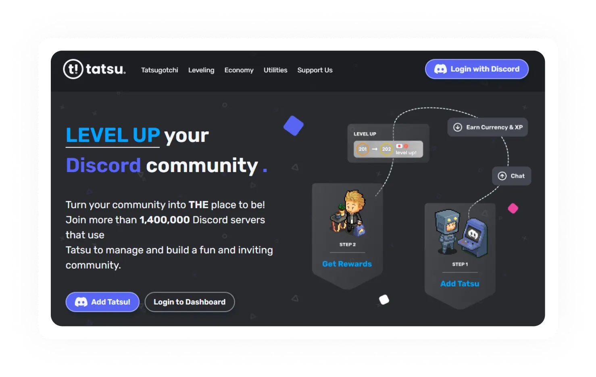

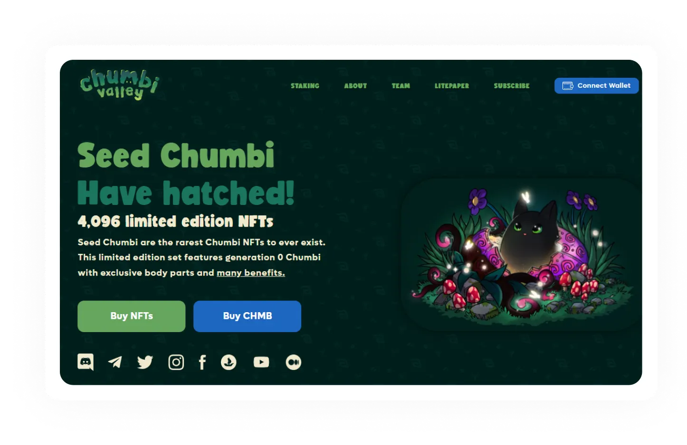

### Level up Security & Cyber Protection

We are putting in place the security measures necessary to protect our clients. Bringing security setups to the next level for us means we are confident now safe and protected in terms of:

- Device management
- Network security
- Location security
- NDA (Non-disclosure agreement)
- ACL (access control list) checklist to onboard / off-board

### Game Department

Came after [Summit 2022](https://memo.d.foundation/changelog/2022-dwarves-summit-engineering-a-good-time/), we've piloted a few games such as [Hunger Game](https://df-hunger-game.netlify.app/) and [Treasure Hunt](https://hunt.d.foundation/)apps. Heading toward the engineering-driven vision, we founded a game department to create more engaging activities that offer our engineers and community a thrilling and adventurous gaming experience.

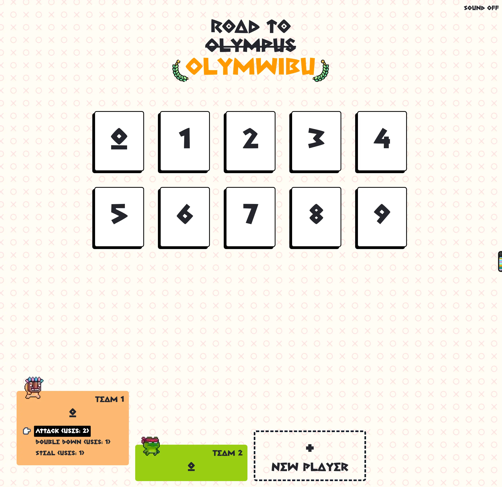

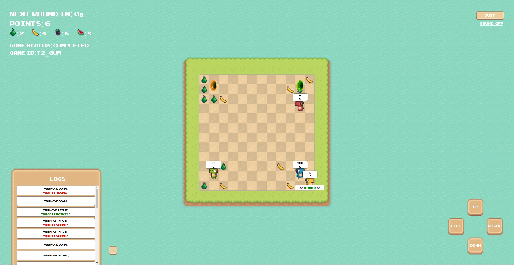

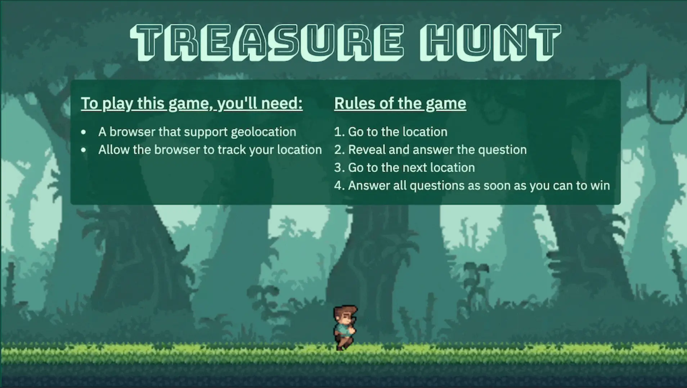

## Community Growth

### Online Omni-channels

The Dwarves actively take part in developer networks to bring makers and tech enthusiasts together. Below is the list of [social channels](https://index.d.foundation/) that you can access for Dwarves sharing.

- Social Media: **[LinkedIn](https://www.linkedin.com/company/dwarvesf/)**, **[Facebook](https://www.facebook.com/dwarvesf)**, **[Instagram](https://www.instagram.com/dwarves.foundation/)**, **[Twitter](https://twitter.com/dwarvesf)**, **[Memo](https://memo.d.foundation/)**
- Streamline: **[Youtube](https://www.youtube.com/@dwarvesfoundation2350)**, **[Let's Hear IT](https://spoti.fi/3xi92yY)[Podcast](https://rss.com/podcasts/dwarvestechevent/)**

A variety of things, from lessons learned in a well-written format to Radio Talk live every Monday on Youtube and hanging out with techies at [Dwarves Discord Network](https://discord.gg/dfoundation) where we talk about technology and life as developers can help you stay tuned with us.

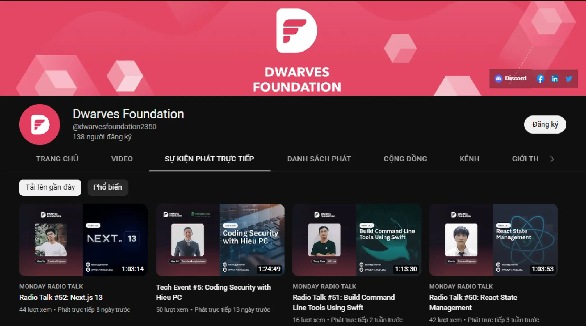

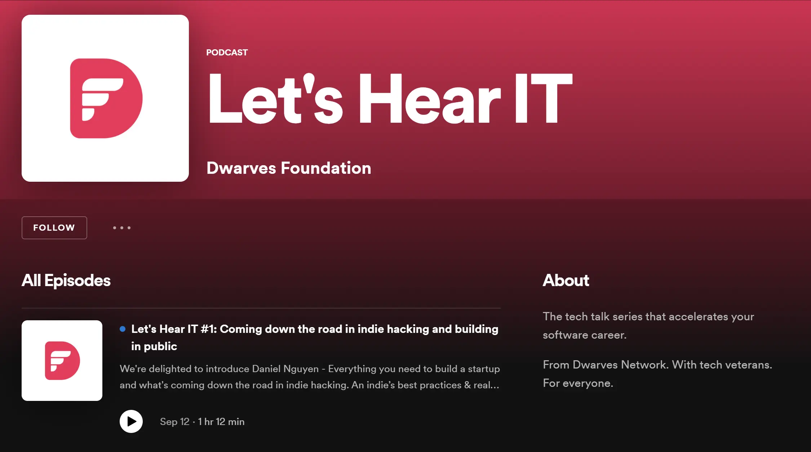

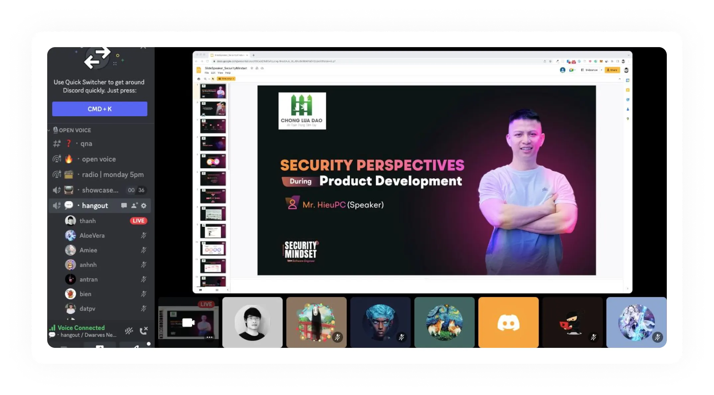

### Offline Contests

**[Coding Camp](https://codingcamp.so/)** of Solana Vietnam was an incredible success, with over 2000 applications for the 8-week workshop, 200 selected developers, 51 projects on Demo Day, and nearly 100,000$ for the system of prizes.

**[Mochi](https://mochi.gg/)**, a product we build in partnership with Console Labs, won the 2nd prize; **[Triple Pod](https://tripod-web.vercel.app/)**- Gamefi project won the excellent UX/UI and **[iCrosschain](https://icrosschain.io/)** - transaction platforms built on multichain won the second prize in Defi at Solana Vienam Coding Camp 2022 - Build Your Own Web Kingdom.

We are proud to be a part of the movement toward blockchain-based technology and become a web3-centric tech firm. Keep up the spirit of building, expanding, and evolving!

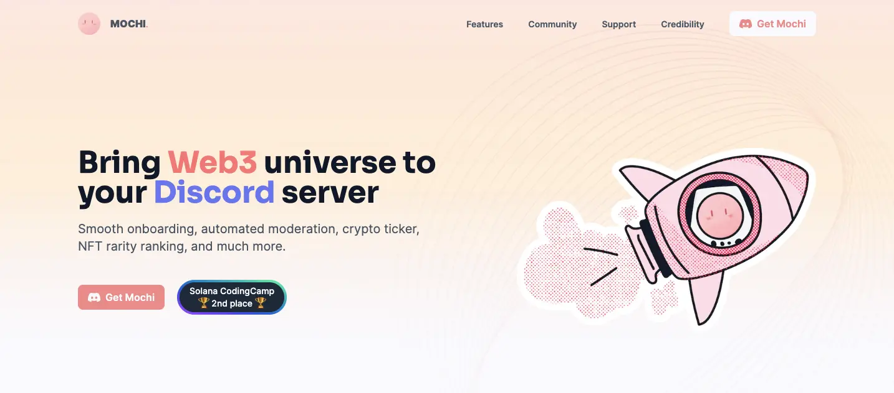

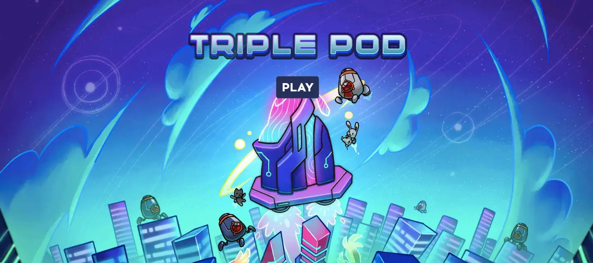

## Workplace growth

### Launching Home-like Dwarves Hubs in Danang and Dalat

Since June 2020, we've been planning on a new office, a cozy studio in Da Lat and a summer house in Danang. It's our **second initiative**: Dwarves Hubs should be placed across the country to offer our team a comfy remote experience when they need it. After the pandemic, as a new chapter, we're proud of how it turned out, our first time went from sketches to reality - Danang and Dalat Hub.

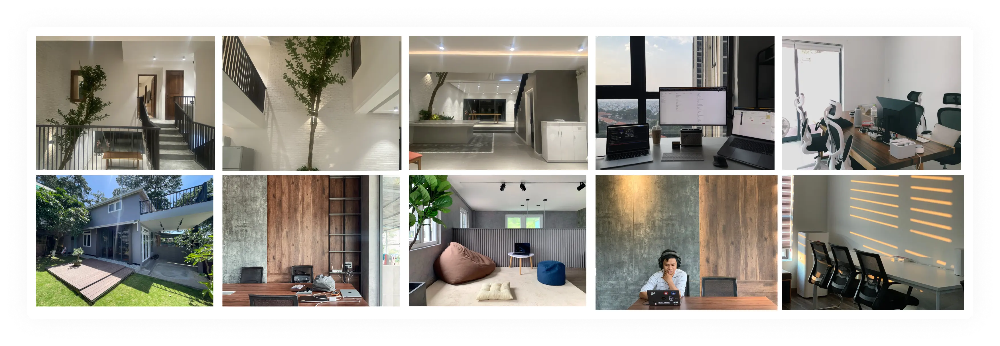

### 1-way Flight Ticket

We provide a package of flight tickets **4 times a year,** with a **maximum amount of 2.000.000 VND for each travel time**. With a borderless software firm, it's our mission to provide flexibility and support their will to go there.

These benefits supporting [#WFA](https://github.com/dwarvesf/handbook/blob/master/benefits-and-perks.md) culture:

- **Flight Tickets Packaging:** Covering flying fees and commute fees for employees.
- **Accommodation:** Equipping the office in ways that allow employees to stay at.
- **Project team dinner:** Sponsoring monthly meetups for people working on the same projects.

With the new policies set out, our people can meet, work and bond with one another at any of those 3 locations. This will create a sense of inclusion and connection, regardless of the distance.

### Summit 2022

After 2 years of COVID together, we were able to finally able to organize our company trip to Phu Quoc. Hosting company trips was certainly on our To-do list, but there weren't many opportunities to organize it during the pandemic. While trying to balance remote working, we realized everyone was long due for a fun break.

Since we're engineers, we thought it would be fun to create apps and games as a way to bond as a company outside physical activities. It was definitely a challenge to organize the games for everyone, but we certainly had fun doing it.

For the games, we offered a total reward of **150,000,000 VND (~$6,361.32)** to our winning teams to help motivate everyone to participate.

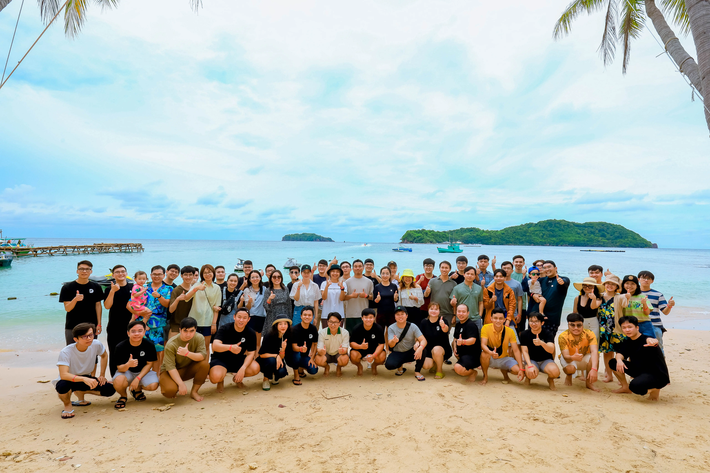

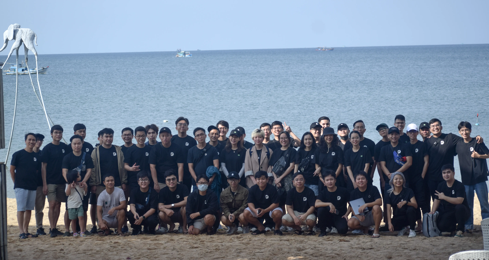

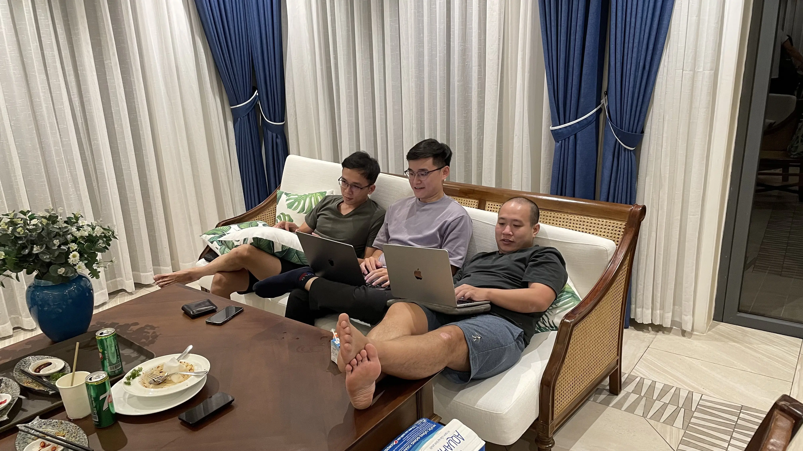

### Dwarves Apprenticeship

**[The wrap-up of Dwarves Foundation Apprenticeship 2022](https://memo.d.foundation/careers/apprentice/dwarves-foundation-apprenticeship-batch-of-2022/)** scaled us with a new well-trained squad. After the program, all of our apprentices are now working on client projects and constantly learning new things along the way.

Another great outcome we got from this program: more seniors who participated in mentoring and training for the program moved forward into leadership.

The signal was clear, it was time we offered proper training and coaching for leadership, our next leadership batch consists of engineers who have seniority in client-facing experience, work discipline, domain expertise, quality management, and are ready to apply that into powering up the next generation at Dwarves.

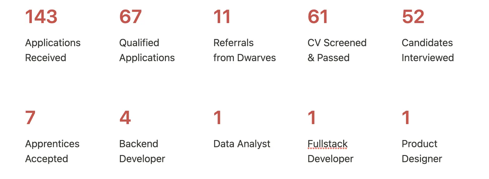

## Employee Experience

### Launching $ICY for Dwarves' Engage & Earn System

We're big on **continuous improvements**: learning, sharing, and building a community of tech lovers. Hence, the launch of $ICY, [Dwarves' official token](https://memo.d.foundation/playbook/community/icy-in-2024/) to give back to everyone who contributes to our culture and activities.

Built on Polygon, $ICY takes co-creation within Dwarves Network to the next level. Our monthly budget for rewarding ICY is around **500 ICY per month**, and will increase based on [community contribution](https://brain.d.foundation/Rewards+and+Recognition). If you're interested in any of the cutting-edge activities within the Dwarves Network and want to contribute, we're all for it.

### Going Crypto Native, Pay Via USDT

Our business builds and moves alongside the industry, so we know what it takes to become a crypto-native firm, our moves shift accordingly. It starts with two things:

- **Selective in project deployment**: Block-chain based projects - [Cyber Nekos](http://pod.so/), [Triple Pod](https://tripod-web.vercel.app/)
- **New option for monthly salary:** The team just rolled out a new option to receive monthly salaries through Binance.

### Employee Referral Model

The team size has increased by 46%, a big part of the growth comes from people referring people. Our [referral program](https://github.com/dwarvesf/handbook/blob/master/how-we-hire.md#referral) is in place and open to everyone, not just the Dwarves. The suggestion, then, appears more valuable that you already know who the missing piece is.

A quick suggestion on the talent pool:

- Colleagues
- University friends
- High school peeps

We want to spend the bonus on you rather than the headhunting agency. Once the referral gets successfully converted into a full-time position and deployed to a project, the referrer will receive **2.5%** of the project service fee.

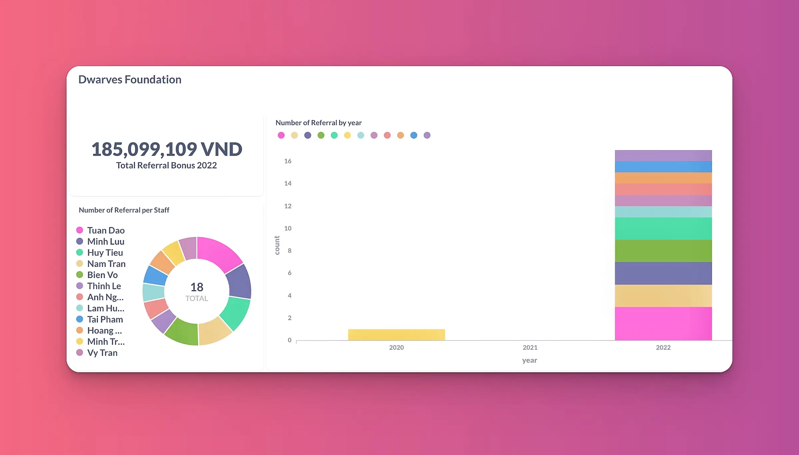

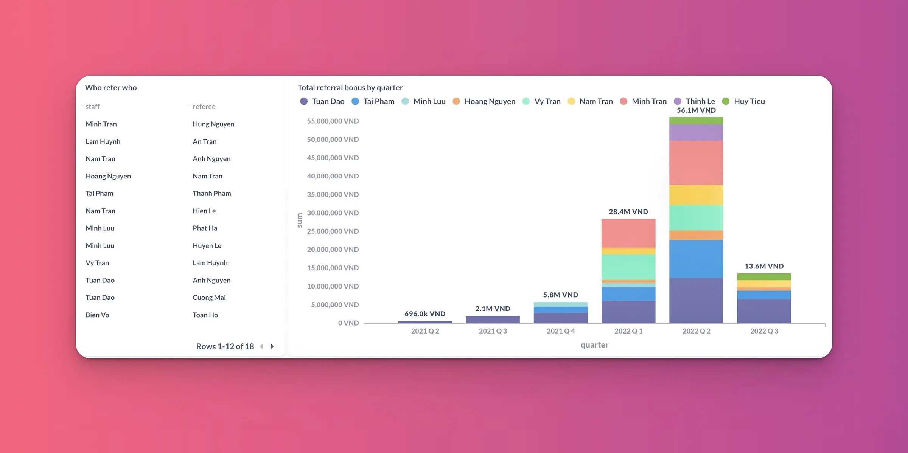

## Onto the Dwarves 3.0

The future of Dwarves is a place where people are empowered to make decisions, where they can be confident in their abilities, and where they are working towards positive outcomes.

Our centric world will thrive the Dwarves themselves are focused, trained and empowered. All of us will grow with Mastery, Meaning and Autonomous. Shaping the team day by day with the core values that move towards the engineering culture.

- **Mastery:** we head toward craftsmanship, putting responsibility, professionalism, pragmatism and pride back into software development. Thereby contributing further to the quality of the outcome.
- **Meaning:** the desire to do a software that has meaning and is important. We understand our place in the grand scheme of things, and that scheme has value and purpose, then we perform well.
- **Autonomous:** provides employees with a sense of collective ownership. We aim to build a flat, transparent organization where everything runs around the mission.

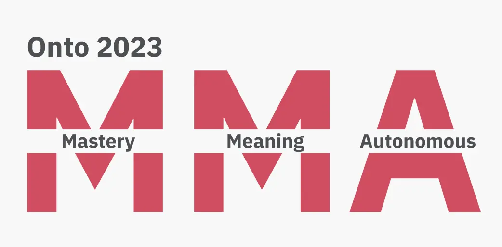

2022 brought us to a new great height, with Dwarves seeing growth in multiple aspects. This year has been one of the most memorable moments in our history.

With this momentum, this is only the start.

As we continue to extract the possible from the impossible, this year taught us, above all, that our voices , no matter how big or small , with the belief that software keeps changing the world.

We wish for all of you to have a great start for your journeys ahead.

