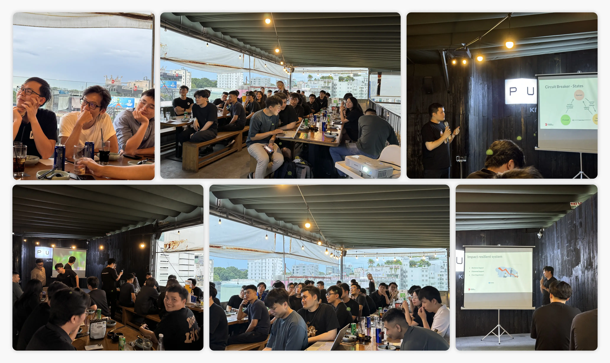

At the end of May, we had the pleasure of hosting our second community meet-up. With over 50 folks, including notable community members @jack, @congiomat, and @tannhatcms, it was a meaningful gathering.

A key part of the meet-up was a discussion on "Building a Resilient System" led by @hoangnguyen and @hieuthu2. Their insights encouraged thoughtful conversations and provided design system knowledge to everyone present. We also caught up with the latest happenings at Dwarves.

After the discussion, we had a chance to bond and share stories over a casual dinner and drinks, creating a warm and supportive atmosphre within our community.

At the same time, feedback from members gave the team more motivation to improve for the next offline session. @congiomat shared that he was happy with the meeting content and found everyone very friendly. He saw the second meet-up was already a great success.

We organize these meet-ups every three months to share knowledge and connect people. Whether you're a partner, an alumni, or simply interested in what we do, you're always welcome to join us.

We are grateful to our operations team for ensuring the event went smoothly. We look forward to our next gathering and hope to see even more of you there.

If you'd like to be a part of the Dwarves network, we'd love to have you at our [discord](discord.gg/dfoundation).

See you next time.

